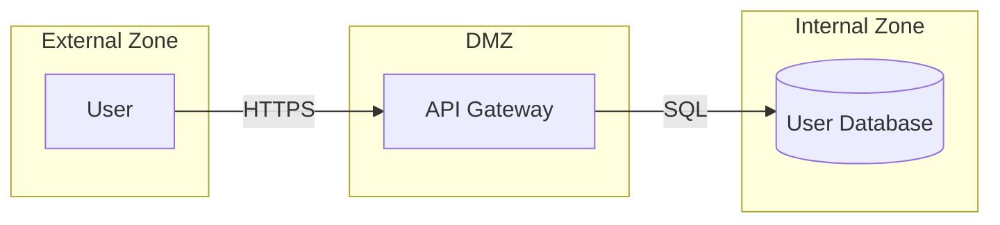
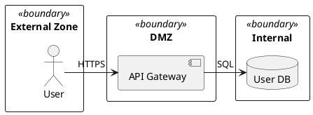

# Trust Boundary Identification Reference

After extracting components and data flows, identify trust boundaries in the architecture input. Trust boundaries define zones where the security posture changes. This reference describes how the orchestrator identifies trust boundaries in each supported input format.

---

## Trust Boundary Data to Capture

For each architecture input, capture:

- **Zone names**: The named regions or groupings in the architecture.
- **Zone components**: Which components belong to each zone.
- **Boundary crossings**: Data flows that cross from one trust zone to another.

---

## Format-Specific Trust Boundary Notation

### Mermaid

Trust boundaries are defined by `subgraph` blocks. Each `subgraph` name is a trust zone. Components (nodes) within the `subgraph ... end` block belong to that zone. Data flows (edges) connecting nodes in different subgraphs are boundary crossings.

**Example**:


In this example:
- Zones: "External Zone", "DMZ", "Internal Zone"
- Components: User (External Zone), API Gateway (DMZ), User Database (Internal Zone)
- Boundary crossings: User -> Gateway (External Zone to DMZ), Gateway -> DB (DMZ to Internal Zone)

### ASCII

Trust boundaries are indicated by dashed lines (`- - -` or `---`) or labeled zones. Look for labels such as "Trust Boundary", "DMZ", "Internal Network", or similar zone descriptors near dashed-line separators. Components above and below the dashed line belong to different trust zones.

**Example**:
```
  [User]
- - - - - - Trust Boundary - - - - - -
  [API Gateway]  -->  [Auth Service]
- - - - - - Internal Network - - - - -
  [User DB]
```

In this example:
- Zones: External (above first boundary), DMZ (between boundaries), Internal Network (below second boundary)
- Boundary crossings: User -> API Gateway (external to DMZ)

### PlantUML

Trust boundaries are defined by the `boundary` keyword or `rectangle` blocks with `<<boundary>>` stereotype. Components declared within a boundary block belong to that trust zone. Data flows connecting components in different boundary blocks are boundary crossings.

**Example**:


### C4

Trust boundaries are defined by `System_Boundary(...)` or `Enterprise_Boundary(...)` function calls. Components declared within a boundary block belong to that trust zone. Data flows (`Rel(...)`) connecting components across boundaries are boundary crossings.

**Example**:
```c4
System_Boundary(b1, "External") {
  Person(user, "User")
}
System_Boundary(b2, "Internal") {
  Container(api, "API Gateway")
  ContainerDb(db, "User Database")
}
Rel(user, api, "HTTPS")
Rel(api, db, "SQL")
```

### Free-text

Trust boundaries are indicated by section headers (e.g., "Internal Network", "DMZ"), explicit markers (e.g., "Trust boundary:", "A trust boundary exists between..."), or descriptive phrases that delineate zones (e.g., "the external zone and the internal network"). Parse the prose to identify which components belong to which zones.

**Prose patterns to look for**:
- "The system has a DMZ containing the API Gateway and a load balancer."
- "Trust boundary between the public internet and the internal services."
- "External users access the system through the gateway, which sits in the perimeter zone."
- Section headers like "## Internal Network" or "### External Services"

---

## No Trust Boundaries

If the architecture input contains no explicit trust boundaries, include the Trust Boundaries section (Section 2) in the output with the Trust Zones and Boundary Crossings table headers but no data rows. Add a note: "No trust boundaries were identified in the architecture input." Do not omit the section.

This ensures the output document always has a consistent structure regardless of input completeness.

---

## Output Assembly

Using the extracted trust boundary data, assemble Section 2 (Trust Boundaries) of the output document. Section 2 contains two tables:

### Trust Zones Table

| Zone | Trust Level | Components |
|------|-------------|------------|

- **Zone**: The zone name as identified in the architecture input
- **Trust Level**: `Untrusted`, `Semi-Trusted`, or `Trusted` -- assigned based on the zone's position and description
- **Components**: Comma-separated list of components belonging to this zone

### Boundary Crossings Table

| Crossing | From Zone | To Zone | Components | Controls |
|----------|-----------|---------|------------|----------|

- **Crossing**: Description of the boundary crossing
- **From Zone**: The source trust zone
- **To Zone**: The destination trust zone
- **Components**: The components involved in the crossing
- **Controls**: Any security controls noted at the boundary (e.g., "TLS encryption", "Authentication required")

Both tables use the structures defined in the output schemas reference for Section 2.
