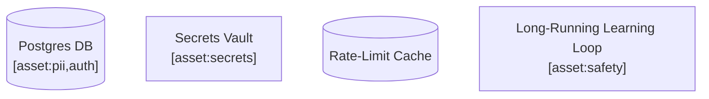

# Asset-Sensitivity Modifier Reference

Apply optional CVSS impact-bit floors to a finding based on tags declared on its target component in the architecture description. Closes the asset-value gap in the four-dimensional composite — the existing reachability dimension scores how exposed a component is, and this dimension scores what would be lost if it were compromised.

> **Status**: prototype for [Issue #260](https://github.com/davidmatousek/tachi/issues/260). The tag vocabulary and exact application order are pinned during architect review when the formal spec opens. Modifier ceiling pinned at `9.2` during PR #262 architect review (2026-05-06). Until the formal spec opens, treat the rest as illustrative.

## Where This Sits in the Pipeline

The modifier pass is the final step of Section 3 (CVSS 3.1 Base Scoring), executed **after** the `score_bounds` +/-1.0 clamp from `schemas/risk-scoring.yaml -> category_defaults`:

1. Assess the finding's CVSS vector and base score against the category default.
2. **Clamp** to `[category_default - 1.0, category_default + 1.0]` for `delta_status: NEW` findings (Phase 2 bounded discovery).
3. **Apply asset modifiers** (this reference): force impact bits to `H` when the finding's target component carries asset tags; recompute `cvss_base` from the elevated vector; clamp at `modifier_ceiling`.
4. Continue to Section 4 (Exploitability).

The clamp-then-modify order is deliberate. The clamp encodes "what info-disclosure looks like on average for this category." The modifier's purpose is "this isn't average — the target stores PHI." Clamping after the modifier would defeat it; modifying after the clamp lets a high-asset target's CVSS exceed the category default range as intended.

## Tag Vocabulary

A closed six-value enum at the prototype stage. Each tag forces one or more CVSS impact bits to `H` when the finding's target component carries the tag.

| Tag | Forces | Rationale |
|------|--------|-----------|
| `pii` | `C:H` | Personally Identifiable Information loss is a confidentiality-high event regardless of category default. |
| `phi` | `C:H` | Protected Health Information attracts the same confidentiality floor as PII (HIPAA, GDPR-special-category). |
| `auth` | `C:H` + `I:H` | Authentication material loss compromises both confidentiality (credential disclosure) and integrity (impersonation). |
| `secrets` | `C:H` + `I:H` | Long-lived secrets (API keys, signing keys, vault contents) carry the same C:H + I:H floor as auth material. |
| `financial` | `I:H` | Financial data integrity is the dominant impact axis — unauthorized modification drives losses regardless of confidentiality posture. |
| `safety` | `A:H` | Safety-critical components (life-safety, control loops) treat availability loss as the dominant impact axis. |

Unknown tags are dropped at parser time with a stderr warning and never reach this table. Widening the enum is a minor schema bump on `schemas/risk-scoring.yaml` per ADR-026 Complex-Shape Addition Clarifier.

## Floor-Only Semantics

Modifiers raise impact bits but never lower them. If a category default already specifies `C:H` (e.g., `info-disclosure`), the `pii` tag is a no-op on that bit. The composition rule is simple: take the per-bit max of the assessed vector and every tag's forced bits.

| Category Default | Component Tags | Resulting Impact Bits |
|------------------|----------------|----------------------|
| `C:H/I:N/A:N` (info-disclosure) | `pii` | `C:H/I:N/A:N` (no change — already H on C) |
| `C:N/I:H/A:L` (tampering) | `financial` | `C:N/I:H/A:L` (no change — already H on I) |
| `C:H/I:N/A:N` (info-disclosure) | `secrets` | `C:H/I:H/A:N` (I elevated N→H) |
| `C:N/I:N/A:H` (denial-of-service) | `safety` | `C:N/I:N/A:H` (no change — already H on A) |
| `C:N/I:H/A:L` (tampering) | `pii, auth` | `C:H/I:H/A:L` (C elevated N→H by pii+auth, I already H) |

## Modifier Ceiling

After bit elevation and CVSS base recomputation, clamp the result at `asset_modifiers.modifier_ceiling` (architect-pinned at `9.2` during PR #262 review, 2026-05-06) so a single tag cannot push a finding to `10.0`. The ceiling pin is defensive: it preserves modifier band-crossing for genuinely-elevated findings while requiring non-CVSS signal for Critical-band entry. The full rationale lives in the schema comment block above `asset_modifiers` in `schemas/risk-scoring.yaml`.

```
cvss_base_after_modifier = min(modifier_ceiling, recompute_cvss(elevated_vector))
```

The ceiling applies to the modifier-recomputed score only — findings that organically score above the ceiling without modifiers retain their assessed value.

## Architecture Tag Syntax

Asset tags live inline in Mermaid node labels using the `[asset:tag1,tag2]` syntax. Embed the asset block inside a quoted label so the Mermaid grammar parses cleanly:



Inline placement (vs a sidecar `assets.yaml`) mirrors the existing trust-zone declaration pattern: trust zones are declared inline via Mermaid `subgraph` containment, and asset tags are declared inline via the label suffix. Single source of truth, no diagram-vs-sidecar drift.

### Parsing Rules

| Rule | Behavior |
|------|----------|
| Asset block must live inside a quoted label (`"..."`). | Avoids ambiguity with Mermaid's `[]` bracket grammar. |
| Tag names are case-insensitive. | Stored canonical lowercase. |
| Multiple tags separated by commas. | Whitespace around commas tolerated. |
| Unknown tags produce a stderr warning and are dropped. | Valid tags from the same node are still retained. |
| Multiple node declarations for the same component merge tag sets. | Stable warning emitted on merge so authors can collapse duplicates. |
| Components with no asset block produce no map entry. | Absence == default behavior, no modifier. |
| Outside of `` ```mermaid `` fences, `[asset:...]` text is ignored. | Avoids false matches in prose paragraphs. |

The reference parser is `parse_component_asset_map()` in `scripts/tachi_parsers.py` (stdlib-only per PAT-014).

## component_asset_map Shape

Mirrors `component_zone_map` from Trust Zone Extraction so the modifier pass can join the two on display name:

```python
component_asset_map = {
    "Postgres DB": ["auth", "pii"],
    "Secrets Vault": ["secrets"],
    "Long-Running Learning Loop": ["safety"],
}
```

Keys are component display names (label content with the asset block and `<br/>` removed) — same lookup contract as `component_zone_map`. Tag lists are sorted, lowercase, and deduplicated.

## Per-Finding Application

For each scored finding:

1. **Look up the target component** in `component_asset_map` using the same case-insensitive + fuzzy-match cascade as Reachability Analysis Section 6f. If no match, skip — the finding is unmodified.
2. **Collect forced bits** by unioning `asset_modifiers.tags[<tag>].forces` across every tag the component carries.
3. **Elevate the assessed vector** by taking the per-bit max with the forced bits (`H > L > N`).
4. **Recompute** `cvss_base` from the elevated vector using the standard CVSS 3.1 formula.
5. **Clamp** at `asset_modifiers.modifier_ceiling`.
6. **Update** `cvss_vector` to the elevated string and overwrite `cvss_base` with the recomputed score.

Record the original (pre-modifier) score in the finding's dimensional breakdown narrative (Section 9d of `risk-scores.md`) so the modifier's effect is auditable.

## Worked Example

Finding `I-3` is an info-disclosure threat against the `Knowledge Base` component. The Knowledge Base node label declares `[asset:pii]`.

- **Category default**: `info-disclosure` -> `CVSS:3.1/AV:N/AC:L/PR:L/UI:N/S:U/C:H/I:N/A:N`, base `6.5`.
- **Assessed vector**: `CVSS:3.1/AV:N/AC:L/PR:L/UI:N/S:U/C:H/I:N/A:N`, base `6.5` (within +/-1.0 of the category default).
- **Asset tags on Knowledge Base**: `["pii"]`.
- **Forced bits**: `{C:H}`.
- **Elevated vector**: `CVSS:3.1/AV:N/AC:L/PR:L/UI:N/S:U/C:H/I:N/A:N` — no change, the category default already has `C:H`.
- **Final `cvss_base`**: `6.5`. The modifier was a no-op.

Now consider finding `T-2`, a tampering threat against the same `Knowledge Base` component.

- **Category default**: `tampering` -> `CVSS:3.1/AV:N/AC:L/PR:L/UI:N/S:U/C:N/I:H/A:L`, base `7.1`.
- **Assessed vector**: `CVSS:3.1/AV:N/AC:L/PR:L/UI:N/S:U/C:N/I:H/A:L`, base `7.1`.
- **Asset tags**: `["pii"]` -> forces `{C:H}`.
- **Elevated vector**: `CVSS:3.1/AV:N/AC:L/PR:L/UI:N/S:U/C:H/I:H/A:L`.
- **Recomputed `cvss_base`**: `8.3` (CVSS 3.1 calculator).
- **Ceiling**: `9.5` — no clamp needed.
- **Final `cvss_base`**: `8.3`. Tampering on a PII store now scores higher than tampering on the same component without the tag, reflecting the asset value.

The composite score (Section 7) reflects this elevated CVSS base via the `0.35` weight, which propagates to the severity band and SARIF `security-severity` per finding.

## When This Phase Is Skipped

The modifier pass is a no-op (and silently skipped) under any of these conditions:

- The architecture description does not contain `[asset:...]` blocks (`component_asset_map` is empty).
- The finding's component does not appear in `component_asset_map`.
- The finding has `delta_status: UNCHANGED` or `RESOLVED` — those inherit baseline scores verbatim and never re-enter the dimensional scoring pipeline.
- The finding has `score_source: inherited` — same reason.

`UPDATED` and `NEW` findings receive modifier treatment.
