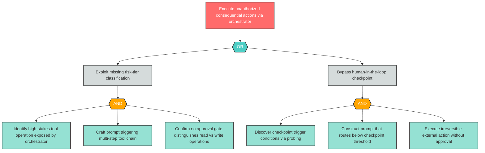
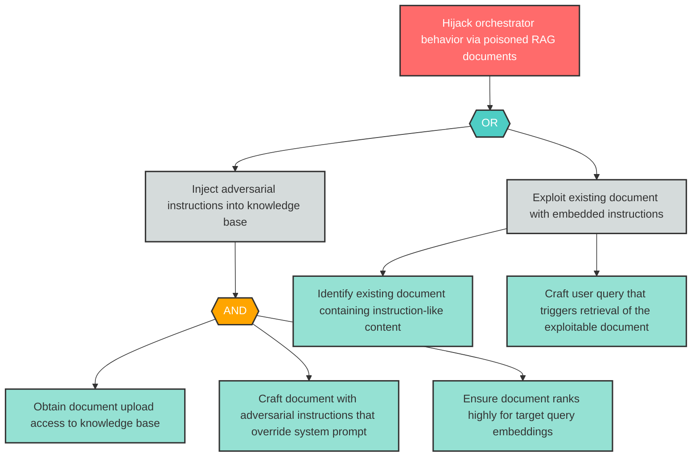

# Attack Tree Examples

Reference attack tree implementations demonstrating correct Mermaid syntax, node naming, gate logic, color styling, and decomposition depth. Use these as patterns when generating trees for actual findings.

---

## Example 1: Critical Finding -- Autonomous Execution Without Approval (AG-1 Pattern)

This example demonstrates a 3-level Critical finding tree with both AND and OR gates, based on an agentic threat pattern where an orchestrator executes consequential actions without human approval.

### What This Example Demonstrates

- **3 levels of decomposition** (root -> sub-goals -> leaf actions) meeting Critical minimum depth
- **OR gate** at level 2: attacker can exploit missing classification OR bypass checkpoints
- **AND gates** at level 3: each sub-goal requires multiple coordinated actions
- **Node ID convention**: `AG1_root`, `AG1_or1`, `AG1_sub1`, `AG1_and1`, `AG1_leaf1`, etc.
- **Quoted labels**: All labels use `["..."]` syntax
- **classDef/class styling**: Four color classes applied to all nodes
- **12 total nodes**: Well within the ~20 node readability limit
- **Realistic leaf actions**: Each leaf requires specific skill or access (probing, prompt crafting, identifying exposed operations)

---

## Example 2: High Finding -- Indirect Prompt Injection via RAG (LLM-2 Pattern)

This example demonstrates a 2-level High finding tree with an OR gate, based on an LLM threat pattern where adversarial content in retrieved documents hijacks the orchestrator.

### What This Example Demonstrates

- **2+ levels of decomposition** meeting High minimum depth (root -> sub-goals -> leaf actions)
- **Asymmetric tree**: Left branch (inject) uses AND gate with 3 leaves; right branch (exploit existing) has 2 direct leaves
- **OR gate**: Attacker can inject new malicious documents OR exploit existing ones
- **AND gate**: Injection path requires upload access AND adversarial crafting AND embedding ranking
- **Node ID convention**: `LLM2_root`, `LLM2_or1`, `LLM2_sub1`, `LLM2_leaf1`, etc.
- **10 total nodes**: Compact tree appropriate for High severity
- **Realistic leaf actions**: Each leaf represents a distinct attacker capability (credential access, adversarial prompt engineering, embedding manipulation, query crafting)
