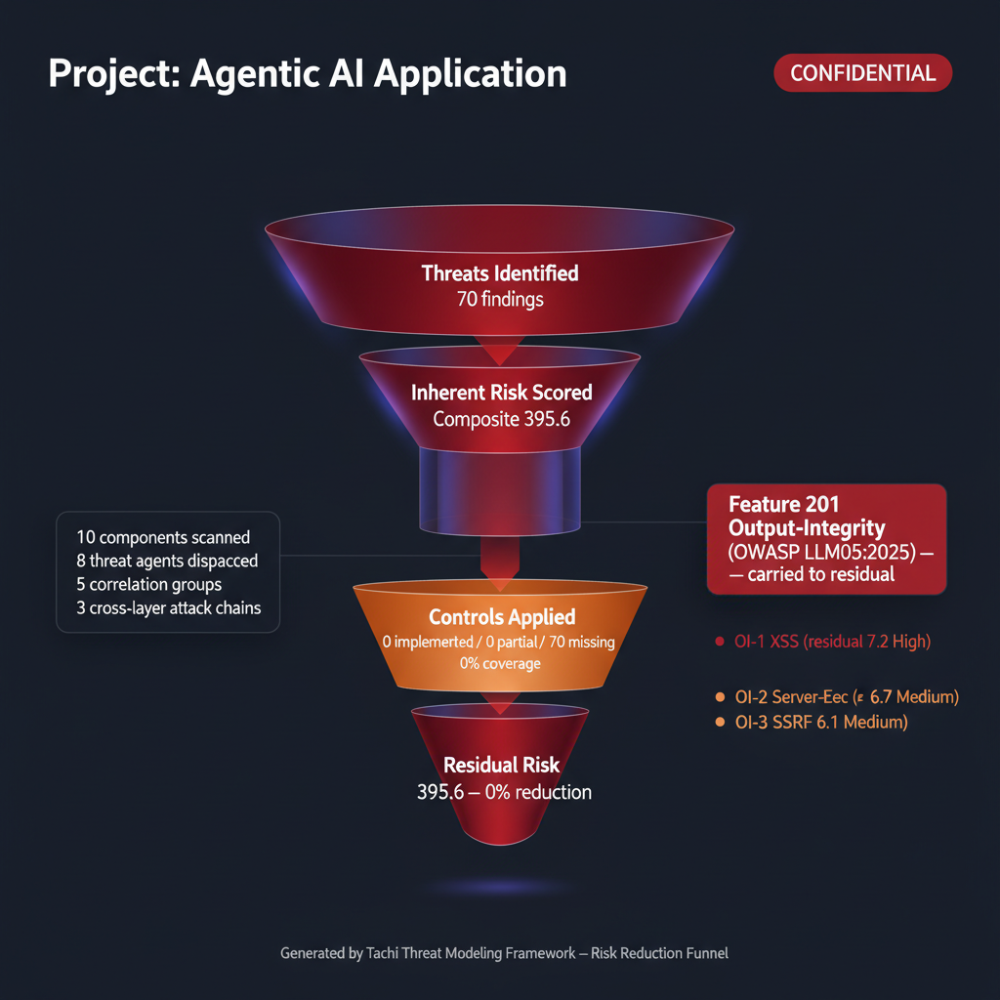
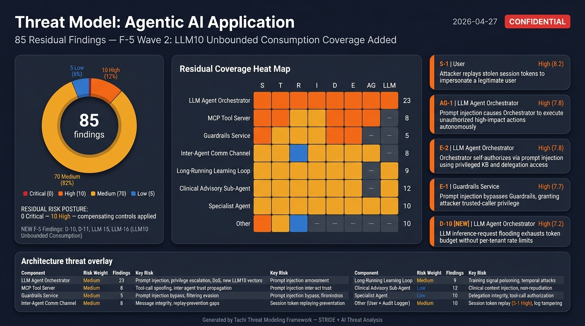
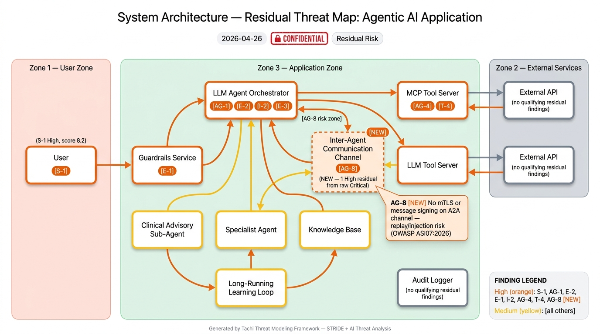

# tachi

**Automated threat modeling sidecar for your projects.**

[](LICENSE)
[](https://github.com/davidmatousek/tachi/releases)
[](https://github.com/davidmatousek/agentic-oriented-development-kit)

**Get started**: [Quick Start](#quick-start) | [Developer Guide](docs/guides/DEVELOPER_GUIDE_TACHI.md) (full walkthrough with worked examples)

---

## What is tachi?

tachi is a threat modeling sidecar that you add to any project. It dispatches 12 specialized threat agents against your architecture description and produces a complete threat model in one command. Five post-pipeline commands enrich your results: `/tachi.risk-score` for quantitative scoring, `/tachi.compensating-controls` for codebase control analysis, `/tachi.infographic` for visual risk diagrams, `/tachi.security-report` for a professional PDF assessment booklet, and `/tachi.architecture` for automated architecture description generation.

- **14 threat categories**: 6 STRIDE + 5 LLM-specific + 3 Agentic
- **OWASP coverage**: 50/50 across five frameworks (LLM Top 10:2025, Agentic Top 10:2026, ML Top 10:2023, Mobile Top 10:2024, Web/API Top 10:2021/2023)
- **MAESTRO layer mapping**: CSA seven-layer taxonomy (L1-L7) for agentic AI threat classification
- **5 input formats**: Mermaid, free-text, ASCII, PlantUML, C4
- **6 commands, 20+ artifacts**: structured findings, SARIF, narrative report, attack trees, risk scores, compensating controls, 5 infographic templates, PDF security report
- **Baseline delta tracking**: Compare runs to track new, resolved, and unchanged findings over time
- **Works with any stack**: tachi analyzes architecture, not code

tachi is built with the [Agentic Oriented Development Kit (AOD Kit)](https://github.com/davidmatousek/agentic-oriented-development-kit), a governance framework for AI agent-assisted development.



---

## Community

- **Questions, ideas, and feature requests** → [GitHub Discussions](https://github.com/davidmatousek/tachi/discussions)
- **Reproducible bugs** → [GitHub Issues](https://github.com/davidmatousek/tachi/issues)
- **Security vulnerabilities** → [private advisory](https://github.com/davidmatousek/tachi/security/advisories/new) (do not post publicly)
- **Real-world usage** → [In the Wild](https://github.com/davidmatousek/tachi/discussions/categories/in-the-wild) — tell me how you're using tachi, anonymized is fine

If you're new here, start with the [Welcome thread](https://github.com/davidmatousek/tachi/discussions) for how the board is organized.

---

## Prerequisites

tachi requires two external CLIs for full functionality. Both are required — `typst` compiles the PDF security report and `@mermaid-js/mermaid-cli` (`mmdc`) renders attack path diagrams. See [ADR-022](docs/architecture/02_ADRs/ADR-022-mmdc-hard-prerequisite.md) for the rationale.

**macOS**:

```bash
brew install typst
npm install -g @mermaid-js/mermaid-cli
```

**Linux** (Debian/Ubuntu):

```bash
apt install typst   # or: cargo install typst-cli / dnf install typst on Fedora
npm install -g @mermaid-js/mermaid-cli
```

**WSL** (use your distro's package manager, same as Linux):

```bash
apt install typst
npm install -g @mermaid-js/mermaid-cli
```

`/tachi.security-report` aborts at preflight with a clear install command if either CLI is missing when attack-trees are present.

---

## Quick Start

### 1. Clone tachi (one-time)

```bash
git clone https://github.com/davidmatousek/tachi.git ~/Projects/tachi
```

### 2. Add tachi to your project

From your project root:

```bash
~/Projects/tachi/scripts/install.sh
```

To install a specific version:

```bash
~/Projects/tachi/scripts/install.sh --version v4.27.0 # x-release-please-version
```

If tachi is cloned to a non-default location:

```bash
~/Projects/tachi/scripts/install.sh --source /path/to/tachi
```

<details>
<summary>Manual install (alternative)</summary>

```bash
# Agents (threat analysis engine)
cp -r ~/Projects/tachi/.claude/agents/tachi/ .claude/agents/tachi/

# Commands (6 slash commands)
mkdir -p .claude/commands
for cmd in tachi.threat-model tachi.risk-score tachi.compensating-controls tachi.infographic tachi.security-report tachi.architecture; do
  cp ~/Projects/tachi/.claude/commands/$cmd.md .claude/commands/
done

# Schemas, templates, references, and brand assets
cp -r ~/Projects/tachi/schemas/ schemas/
cp -r ~/Projects/tachi/templates/ templates/
mkdir -p adapters/claude-code/agents
cp -r ~/Projects/tachi/adapters/claude-code/agents/references/ adapters/claude-code/agents/references/
cp -r ~/Projects/tachi/brand/ brand/

# Developer guide
mkdir -p docs/guides
cp ~/Projects/tachi/docs/guides/DEVELOPER_GUIDE_TACHI.md docs/guides/
```

</details>

See [`INSTALL_MANIFEST.md`](INSTALL_MANIFEST.md) for the full list of distributable files.

### 3. Restart Claude Code

After copying the files, **restart Claude Code** (close and reopen the VS Code window, or start a new CLI session) so it picks up the new agents and commands.

If you want infographic images (`.jpg`), set the `GEMINI_API_KEY` environment variable with a key from [Google AI Studio](https://aistudio.google.com/apikey). This is optional — all text-based outputs work without it.

### 4. Create your architecture file (or let Claude Code do it)

Create `docs/security/architecture.md` describing your system. You can write it yourself or ask Claude Code:

```
Investigate this repository's architecture -- source code, config files, infrastructure
definitions, READMEs -- and create docs/security/architecture.md as a Mermaid flowchart
with all major components, data flows, protocols, and trust boundaries.
```

tachi auto-detects the format. Mermaid, free-text, ASCII, PlantUML, and C4 are all supported.

### 5. Run your first threat model

```
/tachi.threat-model
```

That's it. One command. tachi validates the setup, reads your architecture, dispatches 12 threat agents, and writes everything to a timestamped folder under `docs/security/`.

### 6. Review your results

| File | Source | What It Contains |
|------|--------|-----------------|
| `threats.md` | `/tachi.threat-model` | Primary threat model -- findings, coverage matrix, MAESTRO layers, risk summary |
| `threats.sarif` | `/tachi.threat-model` | SARIF 2.1.0 for GitHub Code Scanning and CI/CD integration |
| `threat-report.md` | `/tachi.threat-model` | Narrative report with executive summary and remediation roadmap |
| `attack-trees/` | `/tachi.threat-model` | One Mermaid attack tree per Critical/High finding |
| `risk-scores.md` | `/tachi.risk-score` | Quantitative risk scores with CVSS, exploitability, scalability, reachability |
| `risk-scores.sarif` | `/tachi.risk-score` | SARIF 2.1.0 with composite scores as `security-severity` per finding |
| `compensating-controls.md` | `/tachi.compensating-controls` | Detected codebase controls, residual risk, missing control recommendations |
| `compensating-controls.sarif` | `/tachi.compensating-controls` | SARIF 2.1.0 with residual risk as `security-severity` per finding |
| `threat-baseball-card.jpg` | `/tachi.infographic` | Baseball Card risk dashboard (requires `GEMINI_API_KEY`) |
| `threat-system-architecture.jpg` | `/tachi.infographic` | Annotated architecture diagram with finding legend |
| `threat-risk-funnel.jpg` | `/tachi.infographic` | Risk distribution funnel by severity |
| `threat-maestro-stack.jpg` | `/tachi.infographic` | MAESTRO layer stack visualization (agentic systems only) |
| `threat-maestro-heatmap.jpg` | `/tachi.infographic` | MAESTRO layer x severity heat map (agentic systems only) |
| `security-report.pdf` | `/tachi.security-report` | Professional PDF booklet with all artifacts assembled |

Start with `threats.md` Section 7 -- Recommended Actions. Then run `/tachi.risk-score` for quantitative prioritization, `/tachi.compensating-controls` to detect existing defenses, `/tachi.infographic` for visual risk diagrams, and `/tachi.security-report` to assemble everything into a PDF booklet. Work through Critical findings first, then High.

> **Full Walkthrough**: The [Developer Guide](docs/guides/DEVELOPER_GUIDE_TACHI.md) covers the complete 5-step risk lifecycle with worked examples, advanced options, and CI/CD integration.

---

## Command Options

### /tachi.threat-model

Runs the 5-phase threat modeling pipeline: scope, determine threats, determine countermeasures, assess, and report. Produces `threats.md`, `threats.sarif`, `threat-report.md`, `attack-trees/`, and `attack-chains.md` (conditional, when cross-layer chains are detected). Findings include MAESTRO layer classification for agentic AI components. Phase 3.5 cross-layer correlation detects attack chains spanning multiple MAESTRO layers with chain-breaking control recommendations. Automatically detects baseline from previous runs for delta tracking.

```bash
# Default -- uses docs/security/architecture.md
/tachi.threat-model

# Specify architecture file
/tachi.threat-model path/to/my-architecture.md

# Custom output directory
/tachi.threat-model docs/security/architecture.md --output-dir reports/security/

# Version-tagged output for a release
/tachi.threat-model docs/security/architecture.md --version v1.0.0

# Explicit baseline for delta comparison
/tachi.threat-model docs/security/architecture.md --baseline docs/security/2026-03-01/threats.md
```

### /tachi.risk-score

Enriches threat model output with four-dimensional quantitative risk scores (CVSS 3.1, exploitability, scalability, reachability) and governance fields (owner, SLA, disposition, review date). Produces `risk-scores.md` and `risk-scores.sarif`.

```bash
# Score threats in the default location
/tachi.risk-score

# Score threats in a specific directory
/tachi.risk-score docs/security/2026-03-27/

# Custom output directory
/tachi.risk-score docs/security/2026-03-27/ --output-dir reports/risk/
```

### /tachi.compensating-controls

Scans a target codebase against scored threats to detect existing security controls, calculate residual risk, and recommend missing controls. Requires `/tachi.risk-score` output as input. Produces `compensating-controls.md` and `compensating-controls.sarif`.

```bash
# Scan current project against risk scores in the default location
/tachi.compensating-controls

# Scan against risk scores in a specific directory
/tachi.compensating-controls docs/security/2026-03-27/

# Scan a different codebase
/tachi.compensating-controls docs/security/2026-03-27/ --target ~/Projects/my-app/

# Custom output directory
/tachi.compensating-controls docs/security/2026-03-27/ --output-dir reports/controls/
```

### /tachi.infographic

Generates visual threat infographic specifications and presentation-ready images. Auto-detects the richest data source in the output directory (prefers `compensating-controls.md` > `risk-scores.md` > `threats.md`). Produces spec markdown and `.jpg` images (images require `GEMINI_API_KEY`).

**Templates**: `baseball-card`, `system-architecture`, `risk-funnel`, `maestro-stack`, `maestro-heatmap`, `all`

```bash
# Generate all templates (auto-includes MAESTRO if data present)
/tachi.infographic

# Generate from a specific directory
/tachi.infographic docs/security/2026-03-27/

# Generate a specific template
/tachi.infographic docs/security/2026-03-27/ --template baseball-card
/tachi.infographic docs/security/2026-03-27/ --template risk-funnel

# Generate both MAESTRO templates
/tachi.infographic docs/security/2026-03-27/ --template maestro
```

### /tachi.security-report

Assembles all pipeline artifacts into a professional multi-page PDF security assessment booklet. Auto-detects available artifacts and conditionally includes pages. Requires `typst` CLI for PDF compilation and `mmdc` (Mermaid CLI) for attack path and attack chain diagram rendering (hard prerequisite per ADR-022 when diagrams are present).

**Page types** (conditional, based on available artifacts):
Cover, Disclaimer, Table of Contents, Risk Methodology, Assessment Scope, Executive Summary, Attack Path Analysis, Attack Chain Diagrams, MAESTRO Findings, Infographic pages (full-bleed), Findings Detail, Control Coverage, Remediation Roadmap

```bash
# Generate PDF from the default location
/tachi.security-report

# Generate from a specific directory
/tachi.security-report docs/security/2026-03-27/

# Custom output path
/tachi.security-report docs/security/2026-03-27/ --output reports/assessment.pdf
```

---

## How It Works

tachi uses a multi-agent orchestration pattern. The orchestrator parses your architecture, identifies components and data flows, then dispatches the right combination of 14 threat agents per component:

| Component Type | STRIDE Agents | AI Agents |
|---------------|---------------|-----------|
| External Entity (users, APIs) | S, R | -- |
| Process (servers, agents) | S, T, R, I, D, E | LLM + AG if AI keywords detected |
| Data Store (databases, caches) | T, I, D | -- |
| Data Flow (API calls, messages) | T, I, D | -- |

AI agents activate when component names or descriptions contain keywords like "LLM", "agent", "orchestrator", "MCP", "tool server", "embedding", "RAG", etc.

After all agents report, the orchestrator deduplicates findings, runs cross-agent correlation, computes risk ratings, and generates the output suite.

### MAESTRO Layer Classification

For agentic AI systems, tachi maps each finding to the [CSA MAESTRO](https://cloudsecurityalliance.org/) seven-layer taxonomy:

| Layer | Name | Scope |
|-------|------|-------|
| L1 | Foundation Model | Pre-trained LLMs, inference engines |
| L2 | Data Operations | Vector stores, RAG pipelines, embeddings |
| L3 | Agent Framework | Orchestrators, tool servers, MCP |
| L4 | Deployment Infrastructure | API gateways, containers, networking |
| L5 | Evaluation and Observability | Audit logging, monitoring, anomaly detection, forensics |
| L6 | Security and Compliance | Auth, guardrails, rate limiting, encryption, IAM |
| L7 | Agent Ecosystem | Multi-agent coordination, delegation, chat UIs, API endpoints |

MAESTRO layers appear in `threats.md`, propagate through all downstream commands, and power the `maestro-stack` and `maestro-heatmap` infographic templates.

### Agentic Pattern Synthesis

For multi-agent architectures, tachi's Phase 3.6 Pattern Synthesis Engine (per [ADR-026](docs/architecture/02_ADRs/ADR-026-pattern-classification-mechanism.md)) classifies findings into the six canonical CSA MAESTRO cross-cutting agentic patterns:

| Pattern | Canonical Definition |
|---------|----------------------|
| `agent_collusion` | Multiple compromised agents coordinate to achieve malicious objectives |
| `emergent_behavior` | Unpredictable behaviors arising from multi-agent interactions (cascades, feedback amplification, drift) |
| `temporal_attack` | Persistent-state exploits: sleeper agents, gradual corruption, seasonal exploitation |
| `trust_exploitation` | Inter-agent identity spoofing, reputation manipulation, trust chain attacks |
| `communication_vulnerability` | Inter-agent message interception, protocol manipulation, routing attacks |
| `resource_competition` | Resource monopolization, priority manipulation, coordination disruption |

Each finding receives a new `agentic_pattern` enum field (schema 1.4) during Phase 3.6 — gated by the multi-agent predicate (≥2 agentic/LLM components, inter-agent data flow, or explicit multi-agent keywords in the architecture description). Pattern assignments appear in `threats.md` Section 7 (Pattern column), Section 4b (Findings by Agentic Pattern), `threat-report.md` Section 7 (Agentic Pattern Analysis narrative), and SARIF `maestro-pattern:<name>` tags mirroring the existing `maestro-layer:<L#>` convention. The deterministic classification rule table and the multi-agent gate predicate live in [`maestro-agentic-patterns-shared.md`](.claude/skills/tachi-shared/references/maestro-agentic-patterns-shared.md).

Previously-uncovered patterns (Agent Collusion, Temporal Attacks, Emergent Behavior) that are not captured by any individual detection agent surface via net-new findings with the `AGP-NN` id prefix, generated deterministically when the architecture satisfies a rule's topology preconditions but no existing finding carries the pattern label.

### Baseline Delta Tracking

When you run `/tachi.threat-model` on a system that already has a previous run, tachi automatically detects the baseline and computes a delta: new findings, resolved findings, unchanged findings, and updated findings. This lets you track risk posture changes over time without manual diffing.

---

## Threat Categories

### STRIDE (6 categories)

| Category | Threat | Example |
|----------|--------|---------|
| **S**poofing | Identity impersonation | Stolen API key used to make authenticated requests |
| **T**ampering | Unauthorized data modification | SQL injection modifying database records |
| **R**epudiation | Missing accountability | User denies triggering an expensive operation, no logs exist |
| **I**nformation Disclosure | Data exposure | Error messages leaking internal architecture details |
| **D**enial of Service | Availability attacks | Request flooding exhausting connection pools |
| **E**levation of Privilege | Unauthorized access | Regular user accessing admin endpoints |

### AI-Specific (8 categories)

| Category | Threat | Example |
|----------|--------|---------|
| **Prompt Injection** (LLM) | Adversarial inputs hijacking LLM behavior | Hidden instructions in a document causing the LLM to leak its system prompt |
| **Data Poisoning** (LLM) | Corrupted training/RAG data | Attacker modifying knowledge base documents to spread misinformation |
| **Model Theft** (LLM) | Model extraction or unbounded consumption | Competitor reverse-engineering your fine-tuned model via API queries; cost-amplification denial-of-wallet |
| **Output Integrity** (LLM) | Improper handling of LLM output flowing into execution sinks | LLM-generated SQL passed to a database client without parameterization; markdown XSS in a rendered chat reply |
| **Misinformation** (LLM) | Factually incorrect or fabricated LLM output reaching humans/decisions | Clinical advisory LLM hallucinating drug dosages without RAG grounding |
| **Agent Autonomy** (AG) | Insufficient oversight | AI agent sending 500 emails without human approval |
| **Tool Abuse** (AG) | Tool misuse or manipulation | Malicious MCP plugin exfiltrating source code when invoked; insecure inter-agent communication |
| **Human-Agent Trust Exploitation** (AG) | Communication-axis trust manipulation toward human users | Wellness chatbot subtly claiming medical authority while concealing AI authorship |

---

## OWASP Coverage

tachi ships at full coverage across five OWASP frameworks (50/50 items covered). Every finding can carry an optional [`source_attribution`](docs/architecture/02_ADRs/ADR-028-source-attribution-schema-extension.md) field citing OWASP / MITRE ATT&CK / MITRE ATLAS / NIST AI RMF / CWE items, and the `tachi.security-report` PDF emits a per-architecture **Coverage Attestation** page aggregating coverage across cited frameworks.

| Framework | Items Covered | Detection Surface |
|-----------|---------------|-------------------|
| OWASP Top 10 for LLM Applications 2025 | 10/10 | LLM agents (`prompt-injection`, `data-poisoning`, `model-theft`, `output-integrity`, `misinformation`) |
| OWASP Agentic Top 10 2026 | 10/10 | Agentic agents (`agent-autonomy`, `tool-abuse`, `human-trust-exploitation`) |
| OWASP ML Top 10 2023 | 10/10 | `tampering` + `data-poisoning` + `model-theft` enrichment for predictive ML |
| OWASP Mobile Top 10 2024 | 10/10 | `spoofing` + `tampering` + `info-disclosure` + `privilege-escalation` + `repudiation` enrichment for mobile |
| OWASP Top 10:2021 + API Security Top 10:2023 | 10/10 | STRIDE detection agents with cross-framework `source_attribution` populator wiring |

See [`schemas/taxonomy/`](schemas/taxonomy/README.md) for the cross-framework crosswalk catalog (38 ATT&CK + 7 ATLAS + 41 CWE references currently cited, plus NIST AI RMF mappings).

---

## Examples

The [`examples/`](examples/) directory contains complete threat models across different input formats and architectures:

| Example | Input Format | Architecture | Threat Categories |
|---------|-------------|-------------|-------------------|
| [Agentic App](examples/agentic-app/) | Mermaid | LLM orchestrator + MCP tools | STRIDE + AI + MAESTRO |
| [Mermaid Agentic App](examples/mermaid-agentic-app/) | Mermaid | Multi-agent system | STRIDE + AI |
| [Web App](examples/web-app/) | Mermaid | Traditional web application | STRIDE |
| [Microservices](examples/microservices/) | Mermaid | Cross-service architecture | STRIDE |
| [ASCII Web API](examples/ascii-web-api/) | ASCII | REST API with database | STRIDE |
| [Free-text Microservice](examples/free-text-microservice/) | Free-text | Event-driven microservice | STRIDE |

The agentic-app example includes a [complete sample report](examples/agentic-app/sample-report/) showing every artifact the pipeline produces -- structured findings, SARIF, narrative report, attack trees, cross-layer attack chains, risk scores, compensating controls, and infographics:






---

## Integration Reference

| Resource | Location | Purpose |
|----------|----------|---------|
| Interface Contract | [`docs/INTERFACE-CONTRACT.md`](docs/INTERFACE-CONTRACT.md) | Input formats, invocation protocol, output structure |
| Output Templates | [`templates/tachi/`](templates/tachi/) | Canonical output structures and Typst PDF templates |
| Schemas | [`schemas/`](schemas/) | Machine-readable contracts ([finding.yaml](schemas/finding.yaml), [input.yaml](schemas/input.yaml), [output.yaml](schemas/output.yaml), [risk-scoring.yaml](schemas/risk-scoring.yaml)) |
| Taxonomy Crosswalk | [`schemas/taxonomy/`](schemas/taxonomy/README.md) | Machine-readable catalog of OWASP/MITRE/NIST/CWE IDs + cross-framework crosswalk (Feature 180 F-A1) |
| Source Attribution | [`docs/architecture/02_ADRs/ADR-028-source-attribution-schema-extension.md`](docs/architecture/02_ADRs/ADR-028-source-attribution-schema-extension.md) | Optional `source_attribution` finding field (schema 1.5) citing F-A1 framework IDs — contract only (Feature 189 F-A2) |
| Threat Agents | [`.claude/agents/tachi/`](.claude/agents/tachi/) | 12 threat agents (7 STRIDE + 3 LLM + 2 Agentic) + utility agents |
| Commands | [`.claude/commands/`](.claude/commands/) | 6 slash commands: tachi.threat-model, tachi.risk-score, tachi.compensating-controls, tachi.infographic, tachi.security-report, tachi.architecture |
| Developer Guide | [`docs/guides/DEVELOPER_GUIDE_TACHI.md`](docs/guides/DEVELOPER_GUIDE_TACHI.md) | Full walkthrough with worked examples |

---

## Known Issues

### Finding count variance between runs

Successive threat model runs on the same architecture may produce slightly different finding counts (typically +/- 10%). This is expected behavior with LLM-based analysis.

**What's consistent**: Core findings across all STRIDE and AI categories. The same high-severity threats will appear in every run.

**What varies**: Borderline findings in the long tail -- a Medium-severity finding like "missing correlation ID on external API calls" may appear in one run but not the next, depending on how the agent reasons through the architecture.

**Why this happens**: Each of the 12 threat agents makes independent LLM calls. LLM output is non-deterministic by nature, so agents may surface slightly different findings on each invocation.

**If you need higher consistency**:
- Run twice and diff the results to catch edge cases
- Use a previous run's `threats.md` as a baseline for comparison
- Treat the threat model as a living document that improves with each run

---

## Built with AOD Kit

tachi is built with the [Agentic Oriented Development Kit (AOD Kit)](https://github.com/davidmatousek/agentic-oriented-development-kit), a governance framework for AI agent-assisted development. AOD Kit provides the SDLC Triad methodology (PM + Architect + Team Lead sign-offs), quality gates, and structured workflows that govern how tachi itself is developed and maintained.

---

## Releases

Releases are automated via [release-please](https://github.com/googleapis/release-please). When conventional commits (`feat:`, `fix:`, `docs:`, etc.) are merged to `main`, release-please creates a **Release PR** with auto-generated CHANGELOG entries and the next semantic version. Merging the Release PR creates the git tag and GitHub Release.

To install a specific version: `install.sh --version v4.27.0` <!-- x-release-please-version -->

---

## Running Tests

tachi uses pytest for Python script tests under `tests/scripts/`. To run the test suite:

```bash
pip install -r requirements-dev.txt
make test
```

This runs `pytest tests/scripts/ --cov=scripts --cov-report=term-missing`. Tests are required by Constitution Principle VI (Testing Excellence, ≥80% coverage).

---

## Contributing

We welcome contributions. See [CONTRIBUTING.md](CONTRIBUTING.md) for guidelines.

---

## License

Apache 2.0 License. See [LICENSE](LICENSE) for details.
