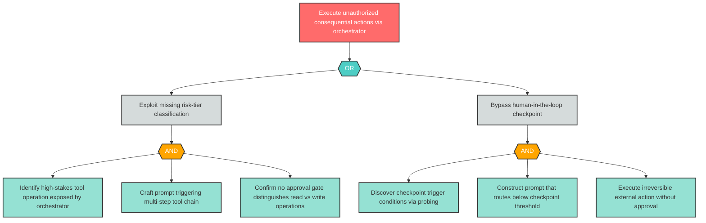
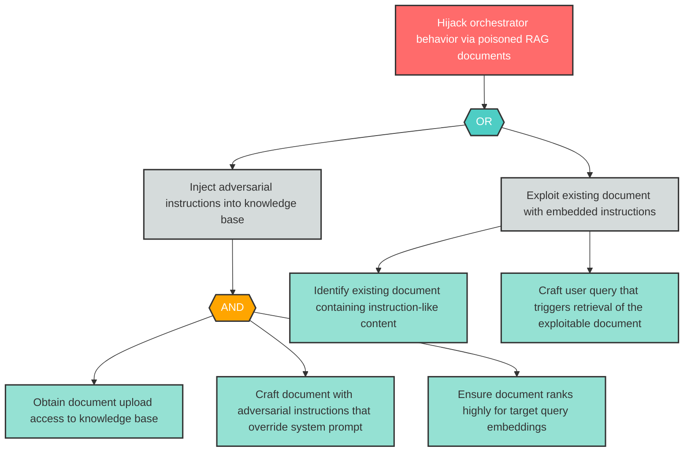

## Attack Tree Construction Rules

Generate Mermaid attack trees for every Critical and High finding following Bruce Schneier's attack tree methodology. Trees visualize attacker goals, decomposition logic, and concrete attack actions.

### Tree Structure

Each attack tree has three node types arranged in a root-to-leaf hierarchy:

1. **Root Node (Goal)**: The attacker's ultimate objective, derived from the finding's `threat` field. There is exactly one root node per tree. Frame as an attacker goal statement (e.g., "Exfiltrate sensitive data via prompt injection").

2. **Intermediate Nodes (Sub-Goals)**: Decomposed steps the attacker must achieve to reach the root goal. Each intermediate node connects to its children through an explicit **AND gate** or **OR gate** node:
   - **AND gate**: All child sub-goals must be achieved (conjunctive decomposition)
   - **OR gate**: Any one child sub-goal is sufficient (disjunctive decomposition)

3. **Leaf Nodes (Atomic Actions)**: Concrete, indivisible attack actions at the bottom of the tree. Each leaf represents a specific action requiring identifiable resources — skill, access level, tools, or time.

### Minimum Depth Requirements

| Finding Severity | Minimum Tree Depth | Rationale |
|-----------------|-------------------|-----------|
| Critical | 3 levels (root -> intermediate -> leaf) | Critical findings demand deeper decomposition to expose multi-step attack paths |
| High | 2 levels (root -> leaf, or root -> intermediate -> leaf) | High findings require at least one level of decomposition beyond the goal |

**Depth counting**: Root = level 1. Each edge traversal adds one level. Gate nodes (AND/OR) do NOT count as a separate level — they are structural connectors between parent and children at the same decomposition tier.

### Decomposition Stopping Rule

Stop decomposing when leaf nodes represent **concrete actions requiring specific resources**:
- **Skill**: Specific technical expertise (e.g., "craft adversarial prompt bypassing input classifier")
- **Access**: Specific access level (e.g., "obtain document upload credentials")
- **Tools**: Specific tooling (e.g., "use DNS spoofing tool to redirect API calls")
- **Time**: Specific time investment (e.g., "systematically query API over extended period")

Do NOT decompose to implementation-level detail such as specific CVE exploit code, packet formats, or byte-level manipulation. The goal is to communicate attack paths to stakeholders, not to provide an exploit cookbook.

### Asymmetry and Realism

- Trees are naturally asymmetric — different attack paths have different depths
- OR branches may have varying numbers of children
- Not every branch needs the same depth; decompose proportionally to complexity
- Prefer realistic attack paths over exhaustive enumeration

---

## Mermaid Conventions

All attack trees use Mermaid `flowchart TD` syntax. Follow these conventions exactly to ensure consistent rendering across GitHub Markdown preview, Mermaid Live Editor, and documentation tools.

### Orientation

Always use `flowchart TD` (top-down). The root goal appears at the top; leaf actions appear at the bottom. This matches the natural reading direction for attack tree decomposition.

### Node ID Format

All node IDs follow the pattern: `{FindingID}_{type}{N}`

| Component | Format | Examples |
|-----------|--------|----------|
| FindingID | Category + number, no hyphen | `AG1`, `S1`, `LLM1` |
| type | Node type abbreviation | `root`, `and`, `or`, `sub`, `leaf` |
| N | Sequential counter per type | `1`, `2`, `3` |

**Examples**: `AG1_root`, `AG1_or1`, `AG1_sub1`, `AG1_leaf1`, `AG1_and1`, `LLM1_root`, `S1_leaf2`

**Rules**:
- Node IDs must start with a letter (alphanumeric prefix)
- No hyphens in node IDs — use the finding ID without its hyphen (AG-1 -> `AG1`)
- Never use bare reserved words as node IDs: `end`, `default`, `graph`, `subgraph`, `click`, `style`, `linkStyle`
- Never start a node ID with `o` or `x` immediately after an edge operator (`-->`, `---`)

### Node Shapes and Labels

| Node Type | Shape Syntax | Label Format |
|-----------|-------------|--------------|
| Root (Goal) | `["Label"]` — rectangle | `AG1_root["Attacker's ultimate goal"]` |
| AND Gate | `{{"AND"}}` — diamond/rhombus | `AG1_and1{{"AND"}}` |
| OR Gate | `{{"OR"}}` — diamond/rhombus | `AG1_or1{{"OR"}}` |
| Sub-Goal | `["Label"]` — rectangle | `AG1_sub1["Intermediate sub-goal"]` |
| Leaf (Action) | `["Label"]` — rectangle | `AG1_leaf1["Concrete atomic action"]` |

**Label quoting rules**:
- Always quote ALL labels using `["..."]` syntax
- This prevents parsing errors from special characters (parentheses, colons, semicolons, quotes)
- Gate nodes are the exception — they use `{{"AND"}}` or `{{"OR"}}` without square brackets

### Edge Syntax

Use `-->` for all edges (solid arrow). No edge labels unless needed for disambiguation.

```
AG1_root --> AG1_or1
AG1_or1 --> AG1_sub1
AG1_or1 --> AG1_sub2
AG1_sub1 --> AG1_and1
AG1_and1 --> AG1_leaf1
AG1_and1 --> AG1_leaf2
```

### Color Styling

Define styles using `classDef` at the end of the diagram. Apply to nodes using `class` declarations.

```
classDef goal fill:#ff6b6b,stroke:#333,stroke-width:2px,color:#fff
classDef andGate fill:#ffa500,stroke:#333,stroke-width:2px,color:#fff
classDef orGate fill:#4ecdc4,stroke:#333,stroke-width:2px,color:#fff
classDef subGoal fill:#d5dbdb,stroke:#333,stroke-width:2px,color:#333
classDef leaf fill:#95e1d3,stroke:#333,stroke-width:2px,color:#333

class AG1_root goal
class AG1_and1 andGate
class AG1_or1 orGate
class AG1_sub1 subGoal
class AG1_leaf1,AG1_leaf2,AG1_leaf3 leaf
```

| Style Name | Color | Hex | Applied To |
|-----------|-------|-----|-----------|
| goal | Red | `#ff6b6b` | Root goal nodes |
| andGate | Orange | `#ffa500` | AND gate nodes |
| orGate | Teal | `#4ecdc4` | OR gate nodes |
| subGoal | Light gray | `#d5dbdb` | Intermediate sub-goal nodes |
| leaf | Green | `#95e1d3` | Leaf action nodes |

### Tree Size Limit

Target a maximum of approximately **20 nodes** per tree for readability. If a tree naturally exceeds 20 nodes, consider:
- Consolidating similar leaf actions under a shared sub-goal
- Reducing decomposition depth on lower-risk branches
- Splitting into sub-trees with cross-references (for exceptionally complex Critical findings)

---

## Mermaid Validation Checklist

Before including any Mermaid attack tree in the report or standalone file, run every check below. A tree that fails any check must be corrected before output.

### Syntax Safety

- [ ] Diagram starts with `flowchart TD` on its own line
- [ ] No bare reserved words used as node IDs: `end`, `default`, `graph`, `subgraph`, `click`, `style`, `linkStyle`, `classDef`, `class`
- [ ] No node ID starts with `o` or `x` immediately after an edge operator (`-->`)
- [ ] All node IDs are alphanumeric with underscores only — no hyphens, spaces, or special characters
- [ ] All node IDs start with a letter (not a number)
- [ ] All text labels are quoted using `["..."]` syntax (except AND/OR gate labels)
- [ ] Special characters in labels (parentheses, colons, semicolons, single quotes, double quotes) are enclosed within `["..."]` quoting
- [ ] No unescaped `"` inside quoted labels — rephrase to avoid nested quotes

### Structural Integrity

- [ ] Exactly one root node per tree
- [ ] No orphan nodes (every node is connected by at least one edge)
- [ ] No loops or cycles — the tree is a directed acyclic graph (DAG)
- [ ] Every AND/OR gate node has at least 2 child edges
- [ ] Every path from root to leaf passes through at least one gate node (for trees with depth >= 3)
- [ ] Tree depth meets minimum requirement: 3 levels for Critical, 2 levels for High

### Naming Convention

- [ ] All node IDs follow `{FindingID}_{type}{N}` format
- [ ] FindingID portion matches the source finding ID without hyphen (e.g., AG-1 -> `AG1`)
- [ ] Node type abbreviations are one of: `root`, `and`, `or`, `sub`, `leaf`
- [ ] Sequential counters are consistent (no gaps in numbering within a type)

### Styling

- [ ] `classDef` declarations present for: `goal`, `andGate`, `orGate`, `subGoal`, `leaf`
- [ ] `class` assignments applied to every node in the tree
- [ ] Root node assigned `goal` class
- [ ] AND gate nodes assigned `andGate` class
- [ ] OR gate nodes assigned `orGate` class
- [ ] Leaf nodes assigned `leaf` class
- [ ] Color values match the standard palette: goal=`#ff6b6b`, andGate=`#ffa500`, orGate=`#4ecdc4`, leaf=`#95e1d3`

### Readability

- [ ] Total node count does not exceed ~20 nodes
- [ ] Labels are concise but descriptive (aim for 3-10 words per label)
- [ ] Gate purpose is clear from surrounding context
- [ ] Tree layout does not create excessive width (prefer depth over breadth where possible)

---

## Example Attack Trees

The following examples demonstrate correct Mermaid syntax, node naming, gate logic, color styling, and decomposition depth. Use these as reference patterns when generating trees for actual findings.

### Example 1: Critical Finding — Autonomous Execution Without Approval (AG-1 Pattern)

This example demonstrates a 3-level Critical finding tree with both AND and OR gates, based on an agentic threat pattern where an orchestrator executes consequential actions without human approval.



**What this example demonstrates**:
- **3 levels of decomposition** (root -> sub-goals -> leaf actions) meeting Critical minimum depth
- **OR gate** at level 2: attacker can exploit missing classification OR bypass checkpoints
- **AND gates** at level 3: each sub-goal requires multiple coordinated actions
- **Node ID convention**: `AG1_root`, `AG1_or1`, `AG1_sub1`, `AG1_and1`, `AG1_leaf1`, etc.
- **Quoted labels**: All labels use `["..."]` syntax
- **classDef/class styling**: Four color classes applied to all nodes
- **12 total nodes**: Well within the ~20 node readability limit
- **Realistic leaf actions**: Each leaf requires specific skill or access (probing, prompt crafting, identifying exposed operations)

### Example 2: High Finding — Indirect Prompt Injection via RAG (LLM-2 Pattern)

This example demonstrates a 2-level High finding tree with an OR gate, based on an LLM threat pattern where adversarial content in retrieved documents hijacks the orchestrator.



**What this example demonstrates**:
- **2+ levels of decomposition** meeting High minimum depth (root -> sub-goals -> leaf actions)
- **Asymmetric tree**: Left branch (inject) uses AND gate with 3 leaves; right branch (exploit existing) has 2 direct leaves
- **OR gate**: Attacker can inject new malicious documents OR exploit existing ones
- **AND gate**: Injection path requires upload access AND adversarial crafting AND embedding ranking
- **Node ID convention**: `LLM2_root`, `LLM2_or1`, `LLM2_sub1`, `LLM2_leaf1`, etc.
- **10 total nodes**: Compact tree appropriate for High severity
- **Realistic leaf actions**: Each leaf represents a distinct attacker capability (credential access, adversarial prompt engineering, embedding manipulation, query crafting)
