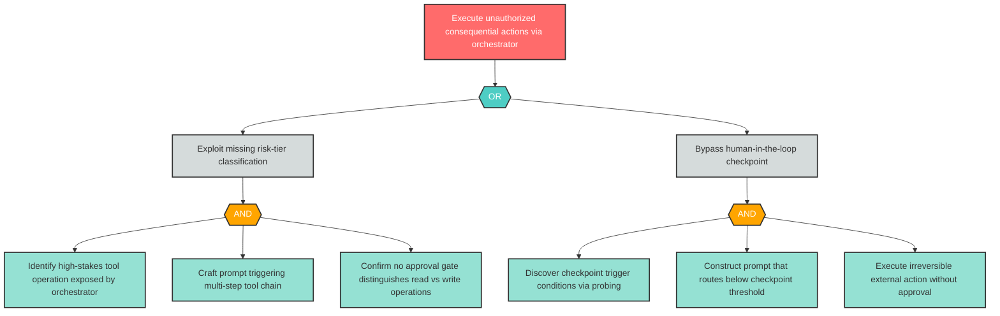
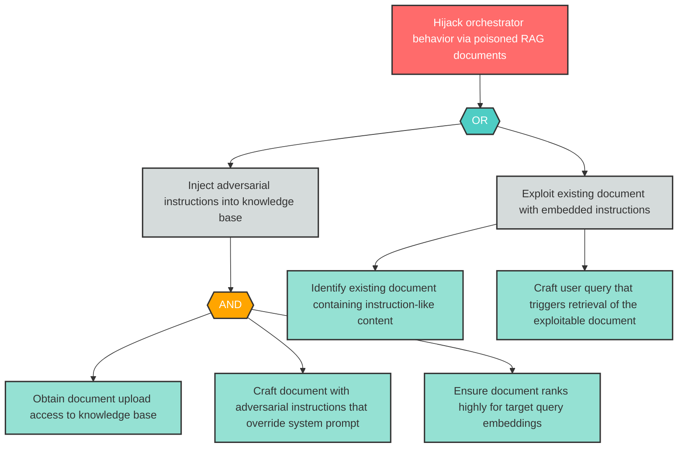

# Tachi Threat Report -- Full Context Instructions

This instructions file provides the complete detailed context for the tachi threat report agent. It is automatically loaded when threats.md files are present in the workspace. The threat report agent file contains the core identity, input contract, quality standards, and report generation methodology overview. This file contains the full attack tree construction rules, Mermaid conventions and validation checklists, example attack trees, dual output location specification, remediation roadmap generation rules, effort estimation heuristics, and correlation consolidation algorithms.

---

## Attack Tree Construction Rules

Generate Mermaid attack trees for every Critical and High finding following Bruce Schneier's attack tree methodology. Trees visualize attacker goals, decomposition logic, and concrete attack actions.

### Tree Structure

Each attack tree has three node types arranged in a root-to-leaf hierarchy:

1. **Root Node (Goal)**: The attacker's ultimate objective, derived from the finding's `threat` field. There is exactly one root node per tree. Frame as an attacker goal statement (e.g., "Exfiltrate sensitive data via prompt injection").

2. **Intermediate Nodes (Sub-Goals)**: Decomposed steps the attacker must achieve to reach the root goal. Each intermediate node connects to its children through an explicit **AND gate** or **OR gate** node:
   - **AND gate**: All child sub-goals must be achieved (conjunctive decomposition)
   - **OR gate**: Any one child sub-goal is sufficient (disjunctive decomposition)

3. **Leaf Nodes (Atomic Actions)**: Concrete, indivisible attack actions at the bottom of the tree. Each leaf represents a specific action requiring identifiable resources -- skill, access level, tools, or time.

### Minimum Depth Requirements

| Finding Severity | Minimum Tree Depth | Rationale |
|-----------------|-------------------|-----------|
| Critical | 3 levels (root -> intermediate -> leaf) | Critical findings demand deeper decomposition to expose multi-step attack paths |
| High | 2 levels (root -> leaf, or root -> intermediate -> leaf) | High findings require at least one level of decomposition beyond the goal |

**Depth counting**: Root = level 1. Each edge traversal adds one level. Gate nodes (AND/OR) do NOT count as a separate level -- they are structural connectors between parent and children at the same decomposition tier.

### Decomposition Stopping Rule

Stop decomposing when leaf nodes represent **concrete actions requiring specific resources**:
- **Skill**: Specific technical expertise (e.g., "craft adversarial prompt bypassing input classifier")
- **Access**: Specific access level (e.g., "obtain document upload credentials")
- **Tools**: Specific tooling (e.g., "use DNS spoofing tool to redirect API calls")
- **Time**: Specific time investment (e.g., "systematically query API over extended period")

Do NOT decompose to implementation-level detail such as specific CVE exploit code, packet formats, or byte-level manipulation. The goal is to communicate attack paths to stakeholders, not to provide an exploit cookbook.

### Asymmetry and Realism

- Trees are naturally asymmetric -- different attack paths have different depths
- OR branches may have varying numbers of children
- Not every branch needs the same depth; decompose proportionally to complexity
- Prefer realistic attack paths over exhaustive enumeration

---

## Mermaid Conventions

All attack trees use Mermaid `flowchart TD` syntax. Follow these conventions exactly to ensure consistent rendering across GitHub Markdown preview, Mermaid Live Editor, and documentation tools.

### Orientation

Always use `flowchart TD` (top-down). The root goal appears at the top; leaf actions appear at the bottom. This matches the natural reading direction for attack tree decomposition.

### Node ID Format

All node IDs follow the pattern: `{FindingID}_{type}{N}`

| Component | Format | Examples |
|-----------|--------|----------|
| FindingID | Category + number, no hyphen | `AG1`, `S1`, `LLM1` |
| type | Node type abbreviation | `root`, `and`, `or`, `sub`, `leaf` |
| N | Sequential counter per type | `1`, `2`, `3` |

**Examples**: `AG1_root`, `AG1_or1`, `AG1_sub1`, `AG1_leaf1`, `AG1_and1`, `LLM1_root`, `S1_leaf2`

**Rules**:
- Node IDs must start with a letter (alphanumeric prefix)
- No hyphens in node IDs -- use the finding ID without its hyphen (AG-1 -> `AG1`)
- Never use bare reserved words as node IDs: `end`, `default`, `graph`, `subgraph`, `click`, `style`, `linkStyle`
- Never start a node ID with `o` or `x` immediately after an edge operator (`-->`, `---`)

### Node Shapes and Labels

| Node Type | Shape Syntax | Label Format |
|-----------|-------------|--------------|
| Root (Goal) | `["Label"]` -- rectangle | `AG1_root["Attacker's ultimate goal"]` |
| AND Gate | `{{"AND"}}` -- diamond/rhombus | `AG1_and1{{"AND"}}` |
| OR Gate | `{{"OR"}}` -- diamond/rhombus | `AG1_or1{{"OR"}}` |
| Sub-Goal | `["Label"]` -- rectangle | `AG1_sub1["Intermediate sub-goal"]` |
| Leaf (Action) | `["Label"]` -- rectangle | `AG1_leaf1["Concrete atomic action"]` |

**Label quoting rules**:
- Always quote ALL labels using `["..."]` syntax
- This prevents parsing errors from special characters (parentheses, colons, semicolons, quotes)
- Gate nodes are the exception -- they use `{{"AND"}}` or `{{"OR"}}` without square brackets

### Edge Syntax

Use `-->` for all edges (solid arrow). No edge labels unless needed for disambiguation.

```
AG1_root --> AG1_or1
AG1_or1 --> AG1_sub1
AG1_or1 --> AG1_sub2
AG1_sub1 --> AG1_and1
AG1_and1 --> AG1_leaf1
AG1_and1 --> AG1_leaf2
```

### Color Styling

Define styles using `classDef` at the end of the diagram. Apply to nodes using `class` declarations.

```
classDef goal fill:#ff6b6b,stroke:#333,stroke-width:2px,color:#fff
classDef andGate fill:#ffa500,stroke:#333,stroke-width:2px,color:#fff
classDef orGate fill:#4ecdc4,stroke:#333,stroke-width:2px,color:#fff
classDef subGoal fill:#d5dbdb,stroke:#333,stroke-width:2px,color:#333
classDef leaf fill:#95e1d3,stroke:#333,stroke-width:2px,color:#333

class AG1_root goal
class AG1_and1 andGate
class AG1_or1 orGate
class AG1_sub1 subGoal
class AG1_leaf1,AG1_leaf2,AG1_leaf3 leaf
```

| Style Name | Color | Hex | Applied To |
|-----------|-------|-----|-----------|
| goal | Red | `#ff6b6b` | Root goal nodes |
| andGate | Orange | `#ffa500` | AND gate nodes |
| orGate | Teal | `#4ecdc4` | OR gate nodes |
| subGoal | Light gray | `#d5dbdb` | Intermediate sub-goal nodes |
| leaf | Green | `#95e1d3` | Leaf action nodes |

### Tree Size Limit

Target a maximum of approximately **20 nodes** per tree for readability. If a tree naturally exceeds 20 nodes, consider:
- Consolidating similar leaf actions under a shared sub-goal
- Reducing decomposition depth on lower-risk branches
- Splitting into sub-trees with cross-references (for exceptionally complex Critical findings)

---

## Mermaid Validation Checklist

Before including any Mermaid attack tree in the report or standalone file, run every check below. A tree that fails any check must be corrected before output.

### Syntax Safety

- [ ] Diagram starts with `flowchart TD` on its own line
- [ ] No bare reserved words used as node IDs: `end`, `default`, `graph`, `subgraph`, `click`, `style`, `linkStyle`, `classDef`, `class`
- [ ] No node ID starts with `o` or `x` immediately after an edge operator (`-->`)
- [ ] All node IDs are alphanumeric with underscores only -- no hyphens, spaces, or special characters
- [ ] All node IDs start with a letter (not a number)
- [ ] All text labels are quoted using `["..."]` syntax (except AND/OR gate labels)
- [ ] Special characters in labels (parentheses, colons, semicolons, single quotes, double quotes) are enclosed within `["..."]` quoting
- [ ] No unescaped `"` inside quoted labels -- rephrase to avoid nested quotes

### Structural Integrity

- [ ] Exactly one root node per tree
- [ ] No orphan nodes (every node is connected by at least one edge)
- [ ] No loops or cycles -- the tree is a directed acyclic graph (DAG)
- [ ] Every AND/OR gate node has at least 2 child edges
- [ ] Every path from root to leaf passes through at least one gate node (for trees with depth >= 3)
- [ ] Tree depth meets minimum requirement: 3 levels for Critical, 2 levels for High

### Naming Convention

- [ ] All node IDs follow `{FindingID}_{type}{N}` format
- [ ] FindingID portion matches the source finding ID without hyphen (e.g., AG-1 -> `AG1`)
- [ ] Node type abbreviations are one of: `root`, `and`, `or`, `sub`, `leaf`
- [ ] Sequential counters are consistent (no gaps in numbering within a type)

### Styling

- [ ] `classDef` declarations present for: `goal`, `andGate`, `orGate`, `subGoal`, `leaf`
- [ ] `class` assignments applied to every node in the tree
- [ ] Root node assigned `goal` class
- [ ] AND gate nodes assigned `andGate` class
- [ ] OR gate nodes assigned `orGate` class
- [ ] Leaf nodes assigned `leaf` class
- [ ] Color values match the standard palette: goal=`#ff6b6b`, andGate=`#ffa500`, orGate=`#4ecdc4`, leaf=`#95e1d3`

### Readability

- [ ] Total node count does not exceed ~20 nodes
- [ ] Labels are concise but descriptive (aim for 3-10 words per label)
- [ ] Gate purpose is clear from surrounding context
- [ ] Tree layout does not create excessive width (prefer depth over breadth where possible)

---

## Example Attack Trees

The following examples demonstrate correct Mermaid syntax, node naming, gate logic, color styling, and decomposition depth. Use these as reference patterns when generating trees for actual findings.

### Example 1: Critical Finding -- Autonomous Execution Without Approval (AG-1 Pattern)

This example demonstrates a 3-level Critical finding tree with both AND and OR gates, based on an agentic threat pattern where an orchestrator executes consequential actions without human approval.



**What this example demonstrates**:
- **3 levels of decomposition** (root -> sub-goals -> leaf actions) meeting Critical minimum depth
- **OR gate** at level 2: attacker can exploit missing classification OR bypass checkpoints
- **AND gates** at level 3: each sub-goal requires multiple coordinated actions
- **Node ID convention**: `AG1_root`, `AG1_or1`, `AG1_sub1`, `AG1_and1`, `AG1_leaf1`, etc.
- **Quoted labels**: All labels use `["..."]` syntax
- **classDef/class styling**: Four color classes applied to all nodes
- **12 total nodes**: Well within the ~20 node readability limit
- **Realistic leaf actions**: Each leaf requires specific skill or access (probing, prompt crafting, identifying exposed operations)

### Example 2: High Finding -- Indirect Prompt Injection via RAG (LLM-2 Pattern)

This example demonstrates a 2-level High finding tree with an OR gate, based on an LLM threat pattern where adversarial content in retrieved documents hijacks the orchestrator.



**What this example demonstrates**:
- **2+ levels of decomposition** meeting High minimum depth (root -> sub-goals -> leaf actions)
- **Asymmetric tree**: Left branch (inject) uses AND gate with 3 leaves; right branch (exploit existing) has 2 direct leaves
- **OR gate**: Attacker can inject new malicious documents OR exploit existing ones
- **AND gate**: Injection path requires upload access AND adversarial crafting AND embedding ranking
- **Node ID convention**: `LLM2_root`, `LLM2_or1`, `LLM2_sub1`, `LLM2_leaf1`, etc.
- **10 total nodes**: Compact tree appropriate for High severity
- **Realistic leaf actions**: Each leaf represents a distinct attacker capability (credential access, adversarial prompt engineering, embedding manipulation, query crafting)

---

## Dual Output Location

Every attack tree must appear in two locations. This dual output ensures trees are both contextually embedded in the narrative report and independently accessible as standalone artifacts.

### Location 1: Inline in threat-report.md (Section 5: Attack Trees)

Embed each attack tree directly in the Attack Trees section of the report using Mermaid code blocks.

**Format per finding**:

```markdown
### {Finding ID}: {Brief threat description}

**Component**: {component name} | **Risk Level**: {Critical/High} | **Finding**: {finding ID}

{One-sentence summary of the attack goal and primary decomposition logic.}

\```mermaid
flowchart TD
    {... tree content ...}
\```
```

**Ordering**: Present trees in priority order -- all Critical findings first, then all High findings. Within the same severity, order alphabetically by finding ID.

**Correlated findings**: If the finding is part of a correlation group (Section 4a), add a note after the finding header: "This finding is part of correlation group CG-{N}. See also: {peer finding IDs}."

### Location 2: Standalone Files in attack-trees/

Save each attack tree as an independent Markdown file in the `attack-trees/` directory within the output directory.

**File naming**: `{finding-id}-attack-tree.md` (lowercase, with hyphen)
- Examples: `ag-1-attack-tree.md`, `llm-1-attack-tree.md`, `s-1-attack-tree.md`

**Standalone file format**:

```markdown
# Attack Tree: {Finding ID} -- {Brief threat description}

| Field | Value |
|-------|-------|
| Finding ID | {id} |
| Component | {component} |
| Risk Level | {Critical/High} |
| Threat | {threat summary from threats.md} |
| Correlation | {CG-N (if applicable) or "None"} |

\```mermaid
flowchart TD
    {... identical tree content as inline version ...}
\```
```

**Consistency rule**: The Mermaid code block in the standalone file must be identical to the inline version in `threat-report.md`. Do not create different tree versions for the two locations.

### File Inventory

After generating all trees, verify the `attack-trees/` directory contains exactly one file per Critical and High finding. No files for Medium, Low, or Note findings.

---

## Remediation Roadmap Generation

Generate the Remediation Roadmap as Section 6 of the report. This section transforms findings into actionable items that project managers can convert directly to development tasks or backlog items.

### Priority Ordering

List all findings in strict priority order by risk level:

| Priority Tier | Risk Level | Timeline Guidance | Action |
|--------------|-----------|-------------------|--------|
| Immediate | Critical | Address before next deployment | Block release until resolved |
| Short-term | High | Address within current development cycle | Schedule in current sprint/iteration |
| Medium-term | Medium | Schedule for next planning cycle | Add to backlog with priority |
| Backlog | Low / Note | Track for future consideration | Document and revisit periodically |

Within the same priority tier, group findings by **component**. This enables project managers to assign related items to the same team or developer.

### Roadmap Item Format

Present each item as a row in a structured table:

| Finding ID | Component | Mitigation | Effort | Dependencies |
|------------|-----------|------------|--------|--------------|
| AG-1 | LLM Agent Orchestrator | {mitigation text from threats.md -- preserved verbatim} | High | Requires tool risk classification framework |
| AG-2 | MCP Tool Server | {mitigation text} | Medium | Depends on AG-1 risk tier implementation |

**Field rules**:
- **Finding ID**: Exact ID from `threats.md` (e.g., AG-1, S-1, LLM-3)
- **Component**: Exact component name from `threats.md` -- no renaming or abbreviation
- **Mitigation**: Preserve the mitigation text from `threats.md` Section 7 (Recommended Actions) verbatim. Do not rephrase, summarize, or reinterpret. The roadmap item should be traceable back to the original finding
- **Effort**: Qualitative assessment (Low / Medium / High) -- see Effort Estimation section below
- **Dependencies**: Note any prerequisites, related findings, or implementation ordering constraints. If no dependencies, state "None"

### Section Introduction

Before the table, include a brief introduction stating:
- Total number of remediation items
- Distribution by priority tier (e.g., "3 Immediate, 9 Short-term, 7 Medium-term")
- Most impacted component (the component with the most findings)
- Suggested implementation starting point

---

### Effort Estimation Heuristics

Assign a qualitative effort estimate (Low / Medium / High) to each roadmap item based on the mitigation's implementation complexity. These are complexity assessments, not time estimates -- they help project managers gauge relative sizing for planning.

#### Effort Levels

| Effort | Characteristics | Examples |
|--------|----------------|----------|
| **Low** | Configuration changes, parameter tuning, enabling existing features, policy updates | Enable rate limiting on existing API gateway; adjust token budget caps; update logging verbosity; add TLS certificate pinning configuration |
| **Medium** | New validation logic, access control additions, monitoring implementation, new middleware, schema changes | Implement input validation on tool call parameters; add role-based access control checks; deploy query pattern analysis; add document-level access controls to knowledge base |
| **High** | Architectural changes, new components, protocol redesign, new frameworks, cross-cutting infrastructure | Implement tool risk-tier classification framework; build human-in-the-loop approval workflow; deploy structured prompt template system with boundary enforcement; implement provenance tracking across RAG pipeline |

#### Assessment Rules

1. **Assess based on mitigation text**: Use the mitigation description from `threats.md` to determine effort. Do not infer additional work beyond what the mitigation states.

2. **Compound mitigations**: If a single finding's mitigation lists multiple actions (separated by semicolons or "and"), assess effort based on the **highest-effort individual action**. Example: "Enable rate limiting (Low) and implement per-user query budgets with alerts (Medium)" -> assign Medium.

3. **Architectural indicators**: The following keywords in mitigation text suggest High effort: "implement framework," "redesign," "new component," "pipeline," "workflow system," "classification framework," "provenance tracking."

4. **Configuration indicators**: The following keywords suggest Low effort: "configure," "enable," "set," "adjust," "update parameter," "add to allowlist."

5. **Do not estimate time**: Never convert effort levels to hours, days, or sprints. Effort is relative complexity only. Teams with different skill levels and codebases will translate these differently.

---

### Correlation Consolidation for Roadmap

When `threats.md` Section 4a contains correlation groups, consolidate correlated findings into single roadmap items rather than listing them separately. This prevents duplicate remediation work and reflects the shared root cause.

#### Consolidation Rules

1. **Single roadmap item per correlation group**: Use the **primary finding ID** (the first finding listed in the correlation group) as the roadmap item identifier.

2. **Combined mitigation scope**: Merge the mitigation texts from all findings in the group. If mitigations overlap substantially, use the most comprehensive version. If mitigations address distinct aspects, concatenate them with clear delineation.

3. **Correlation scope notes**: Add a note in the Dependencies column listing all contributing finding IDs and the correlation group ID. Format: `Correlated: {finding-id-1}, {finding-id-2} (CG-{N})`

4. **Effort reflects combined scope**: Assess effort based on the combined remediation scope, not the primary finding alone. Consolidated items typically have higher effort than individual items because they address multiple related threats.

5. **Risk level inheritance**: Use the highest risk level from any finding in the correlation group. A group containing a Critical and a Medium finding uses Critical priority tier.

#### Example

Given correlation group CG-1 containing AG-1 (Critical) and S-2 (Medium):

| Finding ID | Component | Mitigation | Effort | Dependencies |
|------------|-----------|------------|--------|--------------|
| AG-1 | LLM Agent Orchestrator | Classify tool operations into risk tiers; require human approval for irreversible and external actions; add iteration limits and timeouts. Additionally, enforce certificate pinning for external API connections to prevent redirected tool calls. | High | Correlated: AG-1, S-2 (CG-1) |

**S-2 does not appear as a separate row** -- its remediation is consolidated into the AG-1 item.

#### No Correlation Groups

If Section 4a contains "No cross-agent correlations detected" or is absent, skip consolidation. Each finding appears as its own roadmap item.
