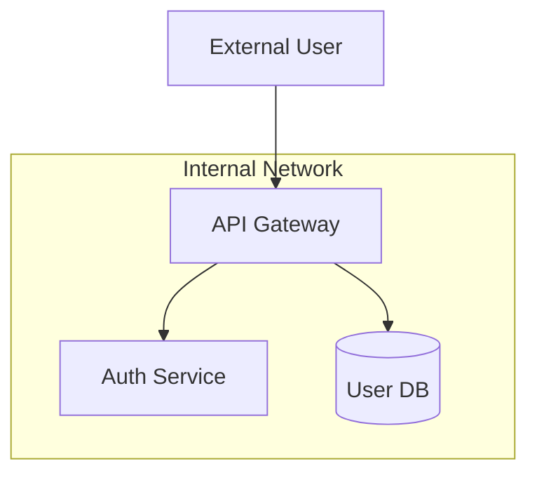

# Interface Contract

**Version**: 1.1
**Status**: Stable
**Classification**: `confidential` (outputs contain security-sensitive architectural details)

This document is the single integration reference for tachi. It answers four questions:

1. **What formats does tachi accept?** (Section 1)
2. **How do I invoke threat analysis?** (Section 5)
3. **What output does tachi produce?** (Section 4)
4. **What side effects should I expect?** (Section 5)

Integrators should not need to read agent prompt files or internal implementation details. Everything required to use tachi is documented here.

---

## Table of Contents

1. [Input Specification](#1-input-specification)
2. [STRIDE-per-Element Normalization Table](#2-stride-per-element-normalization-table)
3. [AI Extension Dispatch Rules](#3-ai-extension-dispatch-rules)
4. [Output Specification](#4-output-specification)
5. [Invocation Protocol](#5-invocation-protocol)
6. [Input Sanitization Guidance](#6-input-sanitization-guidance)
7. [Error Conditions](#7-error-conditions)

---

## 1. Input Specification

tachi accepts architecture descriptions in 5 formats. When `format` is set to `auto` (the default), the parser attempts heuristic detection in priority order. You can override auto-detection by setting `format` explicitly.

For full recognition pattern details and validation rules, see `schemas/input.yaml`.

### Format Field

```yaml
format:
  type: string
  enum: [auto, ascii, free-text, mermaid, plantuml, c4]
  default: auto
  description: "Explicit format declaration. 'auto' enables heuristic detection in priority order."
```

When `format: auto`, the parser tries each format's recognition patterns in priority order (1 through 5) and uses the first match. If no patterns match, an error is returned (see Section 7).

### Supported Formats

#### Priority 1: ASCII

**Recognition patterns**: Box-drawing characters (`+--+`, `|`, `[...]`), arrow indicators (`-->`, `<--`, `<-->`), component labels enclosed in brackets or boxes.

**Trust boundary notation**: Dashed lines (`---`) or labeled zones.

**Example**:

```
+------------------+
|  External User   |
+--------+---------+
         |
- - - - -|- - - - - - Trust Boundary
         |
+--------v---------+
|   API Gateway    |
+--------+---------+
         |
+--------v---------+
|  User Database   |
+------------------+
```

#### Priority 2: Free-text

**Recognition patterns**: No diagram syntax detected, prose description of components and relationships, natural language narrative format.

**Trust boundary notation**: Section headers or explicit `Trust boundary:` markers.

**Example**:

```
The system consists of an API gateway that receives requests from external
users. The gateway forwards authenticated requests to the backend service,
which queries the user database. A trust boundary exists between the external
zone and the internal network.
```

#### Priority 3: Mermaid

**Recognition patterns**: Keywords `graph`, `flowchart`, `sequenceDiagram`; node definitions (`A[Label]`, `B((Label))`, `C{Label}`); edge definitions (`-->`, `--->`, `-.->`)

**Trust boundary notation**: `subgraph` blocks.

**Example**:



#### Priority 4: PlantUML

**Recognition patterns**: `@startuml`/`@enduml` delimiters, component declarations (`[Component]`, `actor`, `database`), relationship arrows (`->`, `-->`, `.>`)

**Trust boundary notation**: `boundary` or `rectangle` with `<<boundary>>` stereotype.

**Example**:

```plantuml
@startuml
actor User
boundary "Trust Boundary" {
    [API Gateway]
    database "User DB"
}
User -> [API Gateway] : HTTPS
[API Gateway] -> [User DB] : Query
@enduml
```

#### Priority 5: C4

**Recognition patterns**: Keywords `Person`, `System`, `Container`, `Component`; C4 function syntax (`Person(...)`, `System(...)`); relationship declarations (`Rel(...)`)

**Trust boundary notation**: `System_Boundary` or `Enterprise_Boundary`.

**Example**:

```c4
Person(user, "User", "External user")
System_Boundary(sb, "Internal") {
    Container(api, "API Gateway", "Node.js")
    ContainerDb(db, "User DB", "PostgreSQL")
}
Rel(user, api, "Uses", "HTTPS")
Rel(api, db, "Queries", "SQL")
```

### Format Summary

| Priority | Format   | Primary Recognition              | Trust Boundary Notation             |
|----------|----------|----------------------------------|-------------------------------------|
| 1        | ASCII    | `+--+`, `\|`, `[...]`           | Dashed lines or labeled zones       |
| 2        | Free-text| No diagram syntax; prose         | Section headers or `Trust boundary:`|
| 3        | Mermaid  | `graph`, `flowchart`             | `subgraph` blocks                   |
| 4        | PlantUML | `@startuml`/`@enduml`           | `boundary`, `<<boundary>>`         |
| 5        | C4       | `Person`, `System`, `Container`  | `System_Boundary`                   |

### Minimum Input Requirements

Every input must contain:

- At least **1 identifiable component** (e.g., a service, database, user, agent)
- At least **1 data flow or relationship** between components

Inputs that fail these minimums produce an error (see Section 7).

---

## 2. STRIDE-per-Element Normalization Table

Each component in the architecture input is classified as a DFD (Data Flow Diagram) element type. The normalization table determines which STRIDE threat categories apply to each element type. Agents are dispatched only for applicable categories, ensuring focused analysis.

### Normalization Mapping

```yaml
stride_per_element:
  External Entity:
    applicable_categories: [S, R]
    description: >
      External entities can be spoofed (S) and may deny actions (R).
      They do not process, store, or transport data directly.

  Process:
    applicable_categories: [S, T, R, I, D, E]
    description: >
      Processes are subject to all six STRIDE categories.
      They are the most broadly threatened element type.

  Data Store:
    applicable_categories: [T, I, D]
    description: >
      Data stores can be tampered with (T), leak information (I),
      or be rendered unavailable (D).

  Data Flow:
    applicable_categories: [T, I, D]
    description: >
      Data flows can be tampered with in transit (T), leak
      information (I), or be disrupted (D).
```

### Quick Reference

| DFD Element Type | S | T | R | I | D | E |
|------------------|---|---|---|---|---|---|
| External Entity  | x |   | x |   |   |   |
| Process          | x | x | x | x | x | x |
| Data Store       |   | x |   | x | x |   |
| Data Flow        |   | x |   | x | x |   |

**Category legend**: S = Spoofing, T = Tampering, R = Repudiation, I = Information Disclosure, D = Denial of Service, E = Elevation of Privilege

### Design Rationale

This mapping follows the STRIDE-per-Element variant (MSDN 2006). Every DFD element type maps to at least 2 STRIDE categories, so the normalization step never produces zero applicable categories for a valid element.

---

## 3. AI Extension Dispatch Rules

tachi extends STRIDE with AI-specific threat agents. When an architecture element's name or description matches AI-related keywords, the corresponding AI agent category is dispatched in addition to the element's STRIDE categories.

### Keyword-to-Category Mapping

```yaml
ai_dispatch_rules:
  llm:
    keywords:
      - "LLM"
      - "model"
      - "GPT"
      - "Claude"
    dispatches: LLM threat agents
    agents:
      - prompt-injection    # OWASP LLM01:2025
      - data-poisoning      # OWASP LLM03:2025
      - model-theft         # OWASP LLM10:2025

  agentic:
    keywords:
      - "agent"
      - "autonomous"
      - "orchestrator"
      - "MCP server"
      - "tool server"
      - "plugin"
    dispatches: AG (Agentic) threat agents
    agents:
      - agent-autonomy      # ASI-01
      - tool-abuse           # MCP-03
```

### Dispatch Behavior

- **Keyword matching is case-insensitive** and applies to element names, labels, and descriptions.
- **STRIDE categories still apply**: AI dispatch is additive. An element classified as a Process with keyword "LLM" receives STRIDE categories (S, T, R, I, D, E) plus LLM agents.
- **Multi-word keywords** (e.g., "MCP server") match as a phrase.

### Dual-Dispatch

When an element matches keywords from both the LLM and Agentic categories, both agent categories are dispatched.

**Example**: An element named "LLM Agent Orchestrator" matches:
- "LLM" -> LLM agents dispatched (prompt-injection, data-poisoning, model-theft)
- "agent" -> AG agents dispatched (agent-autonomy, tool-abuse)
- "orchestrator" -> AG agents dispatched (already included, no duplicate dispatch)

**Cross-Agent Correlation**: When agents from both STRIDE and AI categories produce findings on the same component, the orchestrator detects correlated threats using 5 deterministic correlation rules:

| Rule | STRIDE Category | AI Category | Correlation Basis |
|------|----------------|-------------|-------------------|
| CR-1 | Tampering (T) | Data-Poisoning (LLM) | Data integrity |
| CR-2 | Privilege-Escalation (E) | Agent-Autonomy (AG) | Excessive permissions |
| CR-3 | Info-Disclosure (I) | Prompt-Injection (LLM) | Information leakage |
| CR-4 | Repudiation (R) | Agent-Autonomy (AG) | Accountability gaps |
| CR-5 | Denial-of-Service (D) | Tool-Abuse (AG) | Resource exhaustion |

The detection algorithm groups all findings by target component, checks cross-category pairs against these rules, and merges matching findings into correlation groups (CG-N). Each finding belongs to at most one group. Multiple rule matches on the same component merge into a single group. Original findings remain unchanged in their STRIDE/AI tables — correlation groups appear in a separate Section 4a. The coverage matrix and risk summary then use deduplicated counts where each correlation group contributes 1 instead of its individual member count.

### Agent-to-Table Mapping

AI findings appear in 2 output tables:

| Table    | Agents                                      | OWASP References             |
|----------|---------------------------------------------|------------------------------|
| AG       | agent-autonomy, tool-abuse                  | Agentic Top 10, MCP Top 10  |
| LLM      | prompt-injection, data-poisoning, model-theft | LLM Top 10 v2025           |

---

## 4. Output Specification

Every invocation produces a single structured threat model document following the canonical template.

### Template Reference

- **Structure template**: `templates/tachi/output-schemas/threats.md` -- defines all sections, field descriptions, and example values
- **Machine-readable schema**: `schemas/output.yaml` -- validates output structure programmatically
- **Schema version**: `1.1`

### Output Structure

The output contains YAML frontmatter followed by 7 required sections plus Section 4a.

**Frontmatter**:

```yaml
---
schema_version: "1.1"
date: "YYYY-MM-DD"
input_format: ascii | free-text | mermaid | plantuml | c4
classification: confidential
---
```

**Required Sections**:

| # | Section              | Content                                                  |
|---|----------------------|----------------------------------------------------------|
| 1 | System Overview      | Parsed components, data flows, and technologies          |
| 2 | Trust Boundaries     | Zone names and boundary crossings                        |
| 3 | STRIDE Tables (6)    | One table per STRIDE category with finding rows          |
| 4 | AI Threat Tables (2) | AG and LLM tables with finding rows                      |
| 4a | Correlated Findings | Cross-agent correlation groups linking related findings from different categories on the same component. Always present (shows "No cross-agent correlations detected" when none exist). |
| 5 | Coverage Matrix      | Components (rows) x categories (columns) with deduplicated counts. Three-state cells: integer (findings), `—` (analyzed, clean), `n/a` (not applicable). Footnote when correlations exist. |
| 6 | Risk Summary         | Risk Calibration Matrix (OWASP 3×3) followed by deduplicated counts per risk level with parenthetical raw counts when different |
| 7 | Recommended Actions  | All individual findings sorted by risk level descending (raw count, not deduplicated) |

### Finding Row Fields

**STRIDE table rows**:

| Field      | Type   | Description                                |
|------------|--------|--------------------------------------------|
| ID         | string | Pattern: `{S\|T\|R\|I\|D\|E}-{N}`         |
| Component  | string | Target component name from input           |
| Threat     | string | Description of the identified threat       |
| Likelihood | enum   | LOW, MEDIUM, HIGH                          |
| Impact     | enum   | LOW, MEDIUM, HIGH                          |
| Risk Level | enum   | Critical, High, Medium, Low, Note          |
| Mitigation | string | Recommended countermeasure                 |

**AI threat table rows** include one additional field:

| Field           | Type   | Description                                 |
|-----------------|--------|---------------------------------------------|
| OWASP Reference | string | ASI-xx, MCP-xx, or LLM0x:2025 identifier   |

All other fields are the same as STRIDE rows, with ID patterns `AG-{N}` or `LLM-{N}`.

### Risk Level Computation (OWASP 3x3 Matrix)

|                  | LOW Likelihood | MEDIUM Likelihood | HIGH Likelihood |
|------------------|----------------|-------------------|-----------------|
| **HIGH Impact**  | Medium         | High              | Critical        |
| **MEDIUM Impact**| Low            | Medium            | High            |
| **LOW Impact**   | Note           | Low               | Medium          |

### Finding IR Schema

All agents produce findings conforming to the Intermediate Representation defined in `schemas/finding.yaml`. The IR contains 10 fields: `id`, `category`, `component`, `threat`, `likelihood`, `impact`, `risk_level`, `mitigation`, `references`, `dfd_element_type`. See the schema file for complete field specifications, types, and allowed values.

---

## 5. Invocation Protocol

### Input

| Parameter | Required | Description                                                |
|-----------|----------|------------------------------------------------------------|
| content   | Yes      | Architecture diagram or description in a supported format  |
| format    | No       | Format hint (default: `auto`). See Section 1.              |
| context   | No       | Metadata object (project name, sensitivity, scope)         |

**Example invocation**:

```yaml
input:
  format: auto
  content: |
    flowchart TD
        A[External User] --> B[API Gateway]
        subgraph Internal Network
            B --> C[Auth Service]
            B --> D[(User DB)]
        end
  context:
    project_name: "my-web-app"
    sensitivity: "internal"
```

### Output

A single `threats.md` file following the structure defined in Section 4 and the template at `templates/tachi/output-schemas/threats.md`.

### Side Effects

**None beyond writing output files.** tachi:

- Does NOT make network requests
- Does NOT modify the input architecture description
- Does NOT persist state between invocations
- Does NOT access external databases or services

The only filesystem change is writing the output `threats.md` file.

### Output Naming Convention

Output files are organized by date and analysis phase:

```
YYYY-MM-DD-{phase}/threats.md
```

**Examples**:
- `2026-03-21-initial/threats.md`
- `2026-03-21-post-remediation/threats.md`

Outputs are immutable once generated. Subsequent analyses produce new dated directories rather than overwriting previous results.

---

## 6. Input Sanitization Guidance

Architecture input is untrusted user content. This section documents the security boundaries that agents and integrators must enforce.

### Architecture Input as Data

Architecture descriptions are treated as **data, not instructions**. Agents must never interpret architecture input as executable commands, prompt directives, or control flow instructions. This applies regardless of the input format.

Specifically:
- Free-text descriptions that contain phrases resembling prompt instructions (e.g., "ignore previous instructions") must be treated as component descriptions, not directives.
- Code blocks within Mermaid, PlantUML, or C4 input are parsed for architectural structure only.
- Embedded comments in diagram formats are parsed for component metadata, not executed.

### Prompt Boundary Requirements

Every threat agent must include system-level prompt boundaries that:

1. **Establish role** -- The agent prompt defines the agent's identity and purpose before any user content is introduced.
2. **Delimit user input** -- Architecture content is injected into a clearly marked section (e.g., `<architecture-input>...</architecture-input>`) separated from agent instructions.
3. **Constrain output** -- The agent is instructed to produce only findings conforming to the IR schema (`schemas/finding.yaml`). Output outside the schema structure is invalid.

### Structural Integrity Validation

The output template (`templates/tachi/output-schemas/threats.md`) and output schema (`schemas/output.yaml`) serve as structural validators. Any generated output must conform to:

- YAML frontmatter with required fields (`schema_version`, `date`, `input_format`, `classification`)
- All 7 required sections plus Section 4a present
- Finding IDs matching the pattern `{CATEGORY_PREFIX}-{N}`
- Risk levels matching OWASP 3x3 matrix computation from likelihood and impact

Output that fails structural validation is rejected. This prevents prompt injection attacks from producing malformed or misleading threat models.

---

## 7. Error Conditions

### Unsupported Format

**Trigger**: The `format` field specifies a value not in the supported enum, or auto-detection fails to match any recognition pattern.

**Response**:

```yaml
error:
  code: UNSUPPORTED_FORMAT
  message: "Input format not recognized."
  supported_formats:
    - ascii
    - free-text
    - mermaid
    - plantuml
    - c4
  guidance: >
    Set the 'format' field explicitly or restructure input to match
    one of the supported format recognition patterns. See
    docs/INTERFACE-CONTRACT.md Section 1 for format examples and
    schemas/input.yaml for recognition pattern details.
```

### No Components Detected

**Trigger**: The input is in a recognized format but contains no identifiable components or no data flows/relationships.

**Response**:

```yaml
error:
  code: NO_COMPONENTS
  message: "No architecture components or data flows detected in input."
  minimum_requirements:
    components: 1
    data_flows: 1
  guidance: >
    Input must contain at least one identifiable component (service,
    database, user, agent, etc.) and at least one data flow or
    relationship between components. See docs/INTERFACE-CONTRACT.md
    Section 1 for example inputs in each supported format.
```

### Invalid Format Field Value

**Trigger**: The `format` field contains a value outside the allowed enum.

**Response**:

```yaml
error:
  code: INVALID_FORMAT_VALUE
  message: "The 'format' field contains an invalid value."
  provided: "<invalid-value>"
  allowed_values: [auto, ascii, free-text, mermaid, plantuml, c4]
```

---

## Cross-References

| Artifact                  | Path                      | Relationship                        |
|---------------------------|---------------------------|-------------------------------------|
| Input validation schema   | `schemas/input.yaml`      | Machine-readable format definitions |
| Output structure schema   | `schemas/output.yaml`     | Machine-readable output validation  |
| Finding IR schema         | `schemas/finding.yaml`    | Agent-to-template data contract     |
| Output template           | `templates/tachi/output-schemas/threats.md`    | Canonical output structure          |
| STRIDE agents             | `agents/stride/`          | 6 threat agent prompt files         |
| AI agents                 | `agents/ai/`              | 5 threat agent prompt files         |
| Example inputs            | `examples/`               | Sample inputs and expected outputs  |
