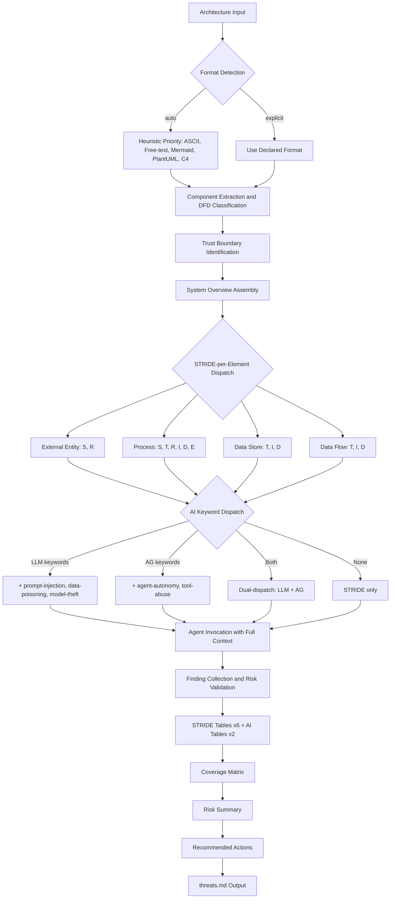
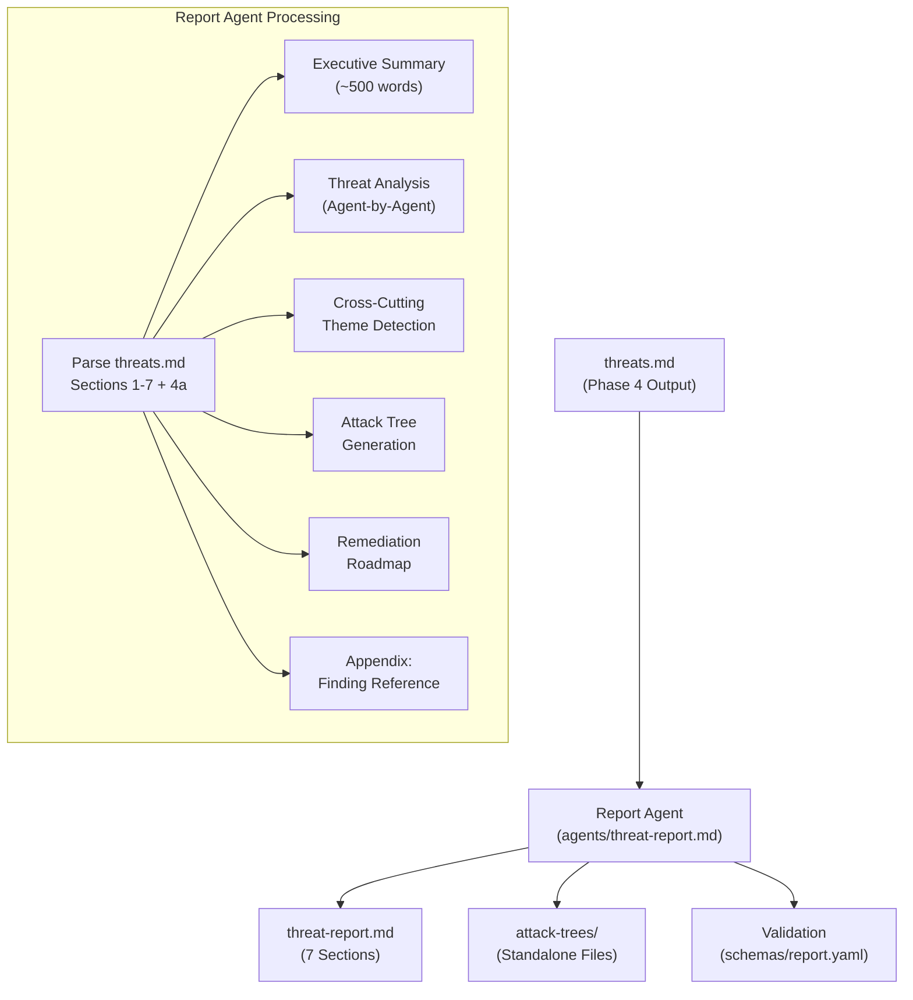
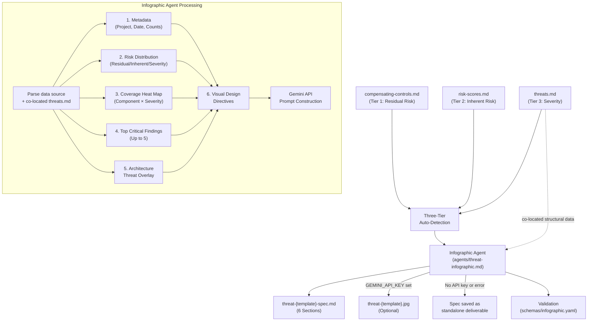
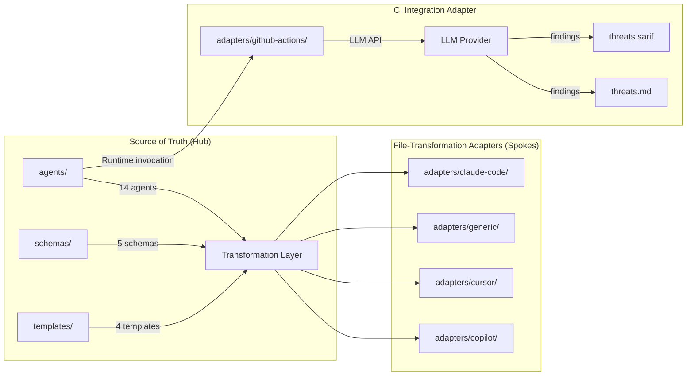
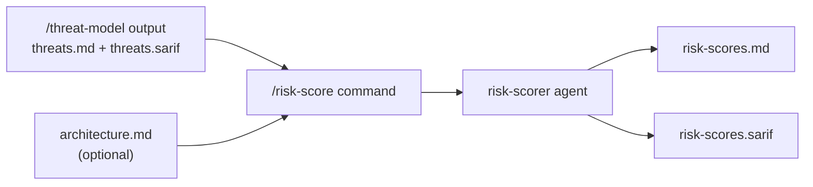

# System Design

Auto-generated from approved plan.md files. Each feature section captures component architecture and data flow at the time of planning approval.

---

### Feature 091: Delivery Document Generation

## Components

### Component 1: Delivery Document Template

**File**: `.aod/templates/delivery-template.md`
**Type**: New file
**Purpose**: Standardized template for consistent delivery document generation across all features.

The template defines the mandatory document structure:
- Header: Feature number, name, date, branch, PR
- What Was Delivered: Bullet list of accomplishments
- How to See & Test: Numbered verification steps
- Delivery Metrics: Estimated/actual/variance table
- Surprise Log: Captured during retrospective
- Lessons Learned: Category, text, KB entry reference
- Feedback Loop: New ideas or "None"
- Source Artifacts: Links to spec, plan, tasks, PRD
- Documentation Updates: Agent update summary table
- Cleanup: Checklist of closure steps

### Component 2: Skill Step 9 — Generate delivery.md

**File**: `.claude/skills/~aod-deliver/SKILL.md`
**Type**: Modify existing Step 9
**Purpose**: Replace terminal-only display with file generation + terminal display.

1. Re-read `.aod/templates/delivery-template.md` before generating
2. Resolve specs directory from branch name; create if missing
3. Populate template from retrospective data (Steps 1-8)
4. Write to `specs/{NNN}-*/delivery.md`
5. Fallback: display in terminal if write fails

### Component 3: Command Step 12 — Redirect Closure Report

**File**: `.claude/commands/aod.deliver.md`
**Type**: Modify existing Step 12
**Purpose**: Change closure report target from `.aod/closures/` to `specs/{NNN}-*/delivery.md`.

### Component 4: Command Step 10 — GitHub Closing Comment Update

**File**: `.claude/commands/aod.deliver.md`
**Type**: Modify existing Step 10
**Purpose**: Include delivery document path in GitHub Issue closing comment.

## Data Flow

```
Steps 1-8 (retrospective data collection)
         │
         ▼
   Skill Step 9: Generate delivery.md
         │
         ├── Read .aod/templates/delivery-template.md (re-ground)
         ├── Populate from collected data (accomplishments, metrics, etc.)
         ├── Write to specs/{NNN}-*/delivery.md
         │         │
         │         └── [on failure] Display in terminal as fallback
         ▼
   Command Step 10: Close GitHub Issue
         │
         └── Comment includes: "See: specs/{NNN}-*/delivery.md"
         ▼
   Command Step 12: Verify delivery.md exists (no longer generates closure file)
```

---

### Feature 001: Project Skeleton & Interface Contract

## Components

### Component 1: Agent Prompt Files (Hub)

**Location**: `agents/`
**Type**: New files (11 agent prompts + 1 placeholder)
**Purpose**: Immutable threat agent definitions — the content hub that all outputs derive from.

- `agents/stride/` — 6 STRIDE agents (spoofing, tampering, repudiation, info-disclosure, denial-of-service, privilege-escalation)
- `agents/ai/` — 5 AI agents (prompt-injection, tool-abuse, data-poisoning, model-theft, agent-autonomy)
- `agents/ai/README.md` — 5-agent-to-2-table mapping: AG (agent-autonomy, tool-abuse) and LLM (prompt-injection, data-poisoning, model-theft)
- `agents/orchestrator.md` — Placeholder for F-002

### Component 2: Machine-Readable Schemas

**Location**: `schemas/`
**Type**: New directory with 3 YAML schema files
**Purpose**: Data contracts between agents, templates, and downstream features.

- `schemas/finding.yaml` — IR schema (id, category, component, threat, likelihood, impact, risk_level, mitigation, references, dfd_element_type)
- `schemas/input.yaml` — Input validation (5 formats: ASCII, free-text, Mermaid, PlantUML, C4)
- `schemas/output.yaml` — Output structure (7 sections matching threats.md template)

### Component 3: Interface Contract

**Location**: `docs/INTERFACE-CONTRACT.md`
**Type**: New file
**Purpose**: Single document specifying input formats, STRIDE-per-Element normalization, AI dispatch rules, invocation protocol, and side-effect guarantees.

### Component 4: Output Template

**Location**: `templates/threats.md`
**Type**: New file
**Purpose**: Canonical template for threat model output with 7 sections: System Overview, Trust Boundaries, STRIDE Tables (6), AI Threat Tables (2), Coverage Matrix, Risk Summary, Recommended Actions.

## Data Flow

```
Architecture Input (5 formats)
        │
        ▼
┌─────────────────────┐
│  Input Validation    │ ◄── schemas/input.yaml
│  (format detection)  │
└────────┬────────────┘
         │
         ▼
┌─────────────────────┐
│  STRIDE-per-Element  │ ◄── INTERFACE-CONTRACT.md
│  Normalization       │     (normalization table)
│  + AI Dispatch       │
└────────┬────────────┘
         │
    ┌────┴─────────┐
    ▼              ▼
┌────────┐   ┌──────────┐
│ STRIDE  │   │ AI Threat │
│ Agents  │   │ Agents    │
│ (6)     │   │ (5)       │
└────┬───┘   └────┬─────┘
     │             │
     ▼             ▼
┌─────────────────────┐
│  Intermediate        │ ◄── schemas/finding.yaml
│  Representation (IR) │     (agent output contract)
│  [Finding objects]   │
└────────┬────────────┘
         │
         ▼
┌─────────────────────┐
│  Template Engine     │ ◄── templates/threats.md
│  (IR → Output)       │     schemas/output.yaml
└────────┬────────────┘
         │
         ▼
   Threat Model Output
   (threats.md)
```

## Tech Stack

| Technology | Purpose |
|-----------|---------|
| Markdown + YAML | Content format — platform-agnostic, no runtime dependencies |
| OWASP 3x3 Matrix | Risk rating standard — human-interpretable |
| STRIDE-per-Element | Threat methodology — DFD element mapping, O(n) scaling |

---

### Feature 003: Orchestrator Agent

## Components

### Component 1: Orchestrator Prompt File

**File**: `agents/orchestrator.md`
**Type**: Replace placeholder (Feature 001 placeholder replaced with full implementation)
**Purpose**: Central prompt implementing OWASP 4-step threat modeling workflow — parse, classify, dispatch, assemble.

**Internal Structure** (prompt sections):

| Section | OWASP Phase | Responsibility |
|---------|-------------|----------------|
| Frontmatter | — | Agent metadata (agent_name, category, status, version) with explicit references to all schemas, templates, and agent files |
| Role & Purpose | — | Establish orchestrator identity, platform-neutrality, and output constraints |
| Input Sanitization Boundary | — | Mark architecture input as data, not instructions; reject prompt injection attempts within `<architecture-input>` tags |
| Output Format Specification | — | Define 7-section structure (System Overview, Trust Boundaries, STRIDE Tables x6, AI Tables x2, Coverage Matrix, Risk Summary, Recommended Actions) with YAML frontmatter |
| Phase 1: Scope | Scope | Format detection (5 formats with heuristic priority), component extraction with format-specific parsers, DFD classification (4 element types with ambiguous-default-to-Process rule), trust boundary identification, System Overview assembly, **Component Inventory intermediate output with self-check** |
| Phase 2: Determine Threats | Determine Threats | STRIDE-per-Element normalization table (DFD type to applicable categories), AI keyword dispatch rules (LLM keywords, AG keywords, dual-dispatch), agent invocation protocol (parallel + sequential modes with full architecture context payload), **Dispatch Table intermediate output with self-check** |
| Phase 3: Determine Countermeasures | Determine Countermeasures | Agent finding collection, risk_level validation against OWASP 3x3 matrix with correction protocol, STRIDE table assembly (6 tables), AI table assembly (2 tables via 5-agent-to-2-table mapping) |
| Phase 4: Assess | Assess | Coverage matrix generation (finding counts, dash for analyzed-but-clean, empty for not-applicable), risk summary computation (percentages rounded to 1 decimal), recommended actions list (sorted by risk descending, then table order) |
| Error Handling | — | Three terminal errors: UNSUPPORTED_FORMAT (auto-detection fails), NO_COMPONENTS (parsing finds no components or data flows), INVALID_FORMAT_VALUE (format field not in allowed enum); two non-terminal handlers: ambiguous classification annotation, non-conforming finding correction |
| Output Validation | — | Structural integrity checklist: 7 sections present, frontmatter valid, finding IDs sequential, all fields populated, risk levels consistent with OWASP 3x3, cross-section counts match |

## Data Flow



## Tech Stack

| Technology | Purpose |
|-----------|---------|
| Markdown prompt file | Platform-agnostic deliverable — works with any LLM |
| OWASP 4-step process | Industry-standard threat modeling methodology |
| STRIDE-per-Element + AI keywords | Deterministic dispatch rules embedded in prompt |

---

### Feature 005: STRIDE Threat Agents

**Status**: Delivered (2026-03-22) | PR #6 | 41/41 tasks complete

## Components

### Component 1: 6 STRIDE Threat Agent Definitions

**Location**: `agents/stride/`
**Type**: Enhanced existing files (Feature 001 skeleton refined and validated)
**Purpose**: Each agent analyzes architecture input through exactly one STRIDE threat lens, producing component-specific findings conforming to `schemas/finding.yaml`.

| Agent File | Threat Class | DFD Targets | ID Prefix | Key Detection Patterns |
|-----------|-------------|-------------|-----------|----------------------|
| `spoofing.md` | Spoofing (S) | External Entity, Process | S-N | Authentication bypass, credential theft/replay, session hijacking, service impersonation, federated identity attacks |
| `tampering.md` | Tampering (T) | Process, Data Store, Data Flow | T-N | Input validation bypass, data integrity violations, message/payload manipulation, storage tampering, configuration tampering |
| `repudiation.md` | Repudiation (R) | External Entity, Process | R-N | Audit logging gaps, log integrity failures, non-repudiation mechanism absence, timestamp manipulation |
| `info-disclosure.md` | Information Disclosure (I) | Process, Data Store, Data Flow | I-N | Data leaks via error messages, excessive API responses, side-channel exposure, storage access control gaps, transit encryption gaps |
| `denial-of-service.md` | Denial of Service (D) | Process, Data Store, Data Flow | D-N | Resource exhaustion, queue/connection pool saturation, storage flooding, algorithmic complexity attacks, cascading failures |
| `privilege-escalation.md` | Elevation of Privilege (E) | Process | E-N | RBAC/ABAC bypass, horizontal/vertical escalation, default permission over-grants, parameter tampering for privilege gain |

**Agent structure** (canonical per-agent organization):
- YAML frontmatter: `agent_name`, `category`, `threat_class`, `dfd_targets`, `owasp_references`, `output_schema`
- Purpose section: Threat class definition and DFD targeting rationale
- Detection Scope: Targeted DFD element types with patterns and indicators (4-6 subcategories)
- AI-Specific Threat Patterns: Agentic application extensions per STRIDE category
- Finding Template: Concrete example demonstrating component-specific findings
- Risk Computation: OWASP 3x3 matrix application with likelihood/impact guidance
- References: OWASP Top 10 2021, OWASP API Security 2023, CWE, MITRE ATT&CK identifiers

### Component 2: AI-Specific Threat Pattern Extensions

**Location**: Within each `agents/stride/*.md` agent file
**Type**: New sections within existing agents
**Purpose**: Extend classic STRIDE patterns with threats specific to agentic AI applications.

Each STRIDE agent includes an "AI-Specific Threat Patterns" section covering:
- **Spoofing**: LLM API key theft, model identity spoofing, prompt-based identity assumption
- **Tampering**: Training data poisoning, RAG context manipulation, tool response modification
- **Repudiation**: Agentic action audit gaps, tool call logging, autonomous decision accountability
- **Info Disclosure**: Model inversion attacks, embedding leakage, context window data exposure
- **DoS**: LLM token exhaustion, recursive agent loops, unbounded tool execution chains
- **Privilege Escalation**: Agent capability boundary violations, tool permission escalation, MCP server scope creep

### Component 3: OWASP API Security 2023 Cross-References

**Location**: YAML frontmatter `owasp_references` field in each agent file
**Type**: Enhanced metadata
**Purpose**: Cross-reference STRIDE findings with OWASP API Security Top 10 2023 (API1-API10) alongside existing OWASP Top 10 2021, CWE, and MITRE ATT&CK references.

### Agent Validation Framework

The validation approach (used during Feature 005 delivery) has three layers:

**Layer 1: Structural Audit** (per agent)
- Frontmatter fields present and correct (`agent_name`, `category`, `threat_class`, `dfd_targets`, `owasp_references`, `output_schema`)
- Section structure matches canonical organization (purpose, detection scope, patterns, finding template, risk computation, references)
- `dfd_targets` matches STRIDE-per-Element matrix row for this category

**Layer 2: Content Quality** (per agent)
- Detection patterns cover all attack subcategories from PRD FR-7
- Finding template examples demonstrate component-specific threats (not generic)
- Mitigation examples are actionable with specific technology references
- Framework references include OWASP, CWE, and MITRE ATT&CK identifiers

**Layer 3: Integration Validation** (all agents together)
- Run orchestrator against `examples/mermaid-agentic-app/input.md`
- Verify all 6 STRIDE tables have findings in assembled `threats.md`
- Verify coverage matrix shows correct STRIDE-per-Element targeting
- Verify 100% component specificity (zero generic findings)

### STRIDE-per-Element Validation Matrix

| DFD Element | S | T | R | I | D | E |
|-------------|---|---|---|---|---|---|
| **Processes** | X | X | X | X | X | X |
| **Data Flows** | | X | | X | X | |
| **Data Stores** | | X | | X | X | |
| **External Entities** | X | | X | | | |

## Data Flow

```
Architecture Input (any format)
         │
         ▼
┌─────────────────────────────┐
│ Orchestrator (F-003)        │
│  Phase 1: Scope             │
│  - Format detection         │
│  - Component classification │
│  - DFD element assignment   │
└─────────┬───────────────────┘
          │ dispatch per STRIDE-per-Element
          ▼
┌─────────────────────────────┐
│ 6 STRIDE Agents (F-005)     │
│  Each agent:                │
│  1. Receives full arch      │
│  2. Filters by dfd_targets  │
│  3. Applies classic STRIDE  │
│     detection patterns      │
│  4. Applies AI-specific     │
│     threat patterns         │
│  5. Produces findings       │
│     (IR schema)             │
└─────────┬───────────────────┘
          │ findings per schemas/finding.yaml
          ▼
┌─────────────────────────────┐
│ Orchestrator (F-003)        │
│  Phase 3-4: Assemble        │
│  - Validate risk_level      │
│  - Build STRIDE tables      │
│  - Generate coverage matrix │
│  - Compute risk summary     │
└─────────┬───────────────────┘
          │
          ▼
    threats.md output
```

## Tech Stack

| Component | Technology | Justification |
|-----------|-----------|---------------|
| Agent files | Markdown with YAML frontmatter | Platform-neutral, LLM-agnostic prompt format |
| Schema | YAML | Machine-readable validation contract |
| Reference frameworks | OWASP Top 10 2021, OWASP API Security 2023, CWE, MITRE ATT&CK | Industry-standard cross-references for threat findings |
| Validation | Manual review + orchestrator integration run | No automated test framework needed for prompt files |

---

### Feature 007: AI Threat Agents

**Status**: Delivered (2026-03-22) | PR #8 | 48/48 tasks complete

## Components

### Agent Validation Framework

The validation approach follows the three-layer framework proven in F-005 (STRIDE agents):

**Layer 1: Structural Audit** (per agent)
- Frontmatter fields present and correct (`agent_name`, `category`, `threat_class`, `dfd_targets`, `owasp_references`, `output_schema`)
- Section structure matches canonical organization (purpose, detection scope, patterns, finding template, risk computation, references)
- `dfd_targets` matches interface contract AI extension dispatch rules

**Layer 2: Content Quality** (per agent)
- Detection patterns cover all attack subcategories from PRD FR-8
- Finding template examples demonstrate component-specific threats (not generic)
- Mitigation examples are actionable with specific technology references
- Framework references include OWASP AI framework IDs (LLM0x:2025, ASI-xx, MCP-xx:2025)

**Layer 3: Integration Validation** (all agents together)
- Run orchestrator against `examples/mermaid-agentic-app/input.md`
- Verify AG and LLM tables have findings in assembled `threats.md`
- Verify two-layer keyword dispatch and dual-dispatch behavior
- Verify 100% component specificity (zero generic findings)

### AI Agent DFD Targeting Matrix

| Agent | category | threat_class | dfd_targets | OWASP Framework |
|-------|----------|-------------|-------------|-----------------|
| prompt-injection.md | llm | LLM | [Process] | LLM Top 10 v2025 (LLM01) |
| data-poisoning.md | llm | LLM | [Data Store, Data Flow] | LLM Top 10 v2025 (LLM03, LLM04) |
| model-theft.md | llm | LLM | [Data Store, Process] | LLM Top 10 v2025 (LLM10) |
| agent-autonomy.md | agentic | AG | [Process] | Agentic Top 10 (ASI01, ASI06, ASI08, ASI09, ASI10) |
| tool-abuse.md | agentic | AG | [Process] | Agentic Top 10 (ASI02, ASI04), MCP Top 10 (MCP03) |

## Data Flow

```
Architecture Input (any format)
         │
         ▼
┌─────────────────────────────┐
│ Orchestrator (F-003)        │
│  Phase 1: Scope             │
│  - Format detection         │
│  - Component classification │
│  - DFD element assignment   │
└─────────┬───────────────────┘
          │ dispatch per STRIDE-per-Element
          │ + AI keyword dispatch (Layer 1)
          ▼
┌──────────────────┐    ┌──────────────────┐
│ 6 STRIDE Agents  │    │ 5 AI Agents      │
│ (F-005 validated)│    │ (F-007 — this)   │
│                  │    │                  │
│ Each agent:      │    │ Each agent:      │
│ 1. Receives arch │    │ 1. Receives arch │
│ 2. Filters by    │    │ 2. Filters by    │
│    dfd_targets   │    │    dfd_targets   │
│ 3. Applies       │    │ 3. Applies Layer │
│    patterns      │    │    2 keywords    │
│ 4. Produces      │    │ 4. Applies       │
│    findings (IR) │    │    patterns      │
│                  │    │ 5. Produces      │
│                  │    │    findings (IR) │
└────────┬─────────┘    └────────┬─────────┘
         │                       │
         └───────────┬───────────┘
                     │ all findings per schemas/finding.yaml
                     ▼
┌─────────────────────────────┐
│ Orchestrator (F-003)        │
│  Phase 3-4: Assemble        │
│  - Build 6 STRIDE tables    │
│  - Build 2 AI tables        │
│    (AG table + LLM table)   │
│  - Generate coverage matrix │
│  - Compute risk summary     │
└─────────┬───────────────────┘
          │
          ▼
    threats.md output
    (8 threat tables total)
```

## Tech Stack

| Component | Technology | Justification |
|-----------|-----------|---------------|
| Agent files | Markdown with YAML frontmatter | Platform-neutral, LLM-agnostic prompt format; matches F-005 STRIDE pattern |
| Schema | YAML (`schemas/finding.yaml` v1.0) | Machine-readable validation contract; read-only for this feature |
| OWASP references | LLM Top 10 v2025, Agentic Top 10 2026, MCP Top 10 2025 | Three complementary AI security frameworks |
| Validation | Manual review + orchestrator integration run | No automated test framework needed for prompt files |

---

### Feature 010: Deduplication & Risk Rating

**Status**: Delivered (2026-03-22) | PR #11 | 24/24 tasks complete

## Components

### Component 1: Orchestrator Prompt — Correlation Detection Phase

**File**: `agents/orchestrator.md`
**Type**: Extend existing Phase 3 (Determine Countermeasures)
**Purpose**: Add correlation detection logic after all agent findings are collected and risk-validated, before coverage matrix generation.

Five deterministic correlation rules map STRIDE-to-AI category pairs:

| Rule | STRIDE Category | AI Category | Correlation Basis |
|------|----------------|-------------|-------------------|
| CR-1 | Tampering (T) | Data-Poisoning (LLM) | Data integrity |
| CR-2 | Privilege-Escalation (E) | Agent-Autonomy (AG) | Excessive permissions |
| CR-3 | Info-Disclosure (I) | Prompt-Injection (LLM) | Information leakage |
| CR-4 | Repudiation (R) | Agent-Autonomy (AG) | Accountability gaps |
| CR-5 | Denial-of-Service (D) | Tool-Abuse (AG) | Resource exhaustion |

### Component 2: Output Template — Correlated Findings Section (4a)

**File**: `templates/threats.md`
**Type**: New Section 4a between AI Threat Tables and Coverage Matrix

### Component 3: Output Template — Enhanced Coverage Matrix

**File**: `templates/threats.md` (Section 5)
**Type**: Modify existing — deduplicated counts, "—" for gaps, "n/a" for not-applicable

### Component 4: Output Template — Risk Calibration Matrix + Deduplicated Risk Summary

**File**: `templates/threats.md` (Section 6)
**Type**: Add subsection + modify existing counts

### Component 5: Output Schema Update

**File**: `schemas/output.yaml`
**Type**: Add Correlated Findings section schema

### Component 6: Interface Contract Update

**File**: `docs/INTERFACE-CONTRACT.md`
**Type**: Formalize deduplication in Sections 3 + 4

## Data Flow

```
Architecture Input
        │
        ▼
┌─────────────────────────────┐
│ Orchestrator Phase 1-2      │
│ (unchanged)                 │
└────────┬────────────────────┘
         │
    ┌────┴────────┐
    ▼             ▼
┌─────────┐  ┌──────────┐
│ STRIDE   │  │ AI       │
│ Agents   │  │ Agents   │
│ (6)      │  │ (5)      │
└────┬────┘  └────┬─────┘
     └─────┬──────┘
           │ all findings (IR schema)
           ▼
┌─────────────────────────────┐
│ Phase 3 (extended)          │
│ 1. Collect + validate       │
│ 2. Assemble tables          │
│ 3. NEW: Correlation detect  │
│ 4. NEW: Assemble Section 4a │
└────────┬────────────────────┘
         ▼
┌─────────────────────────────┐
│ Phase 4 (modified)          │
│ 1. Coverage matrix (dedup)  │
│ 2. Risk Calibration Matrix  │
│ 3. Risk summary (dedup)     │
│ 4. Recommended actions      │
│ 5. Structural validation    │
└────────┬────────────────────┘
         ▼
   threats.md output
   (7 sections + Section 4a)
```

## Tech Stack

| Technology | Purpose |
|-----------|---------|
| Markdown prompt | Orchestrator prompt extension — platform-agnostic |
| YAML schema | Output validation contract update |
| Markdown template | Output format specification |
| OWASP 3×3 Matrix | Risk calibration documentation (already implemented) |

---

### Feature 012: SARIF Output Generation

**Status**: Delivered (2026-03-22) | PR #13 | 20/20 tasks complete

## Components

### Component 1: Orchestrator Phase 4 Extension

**File**: `agents/orchestrator.md`
**Type**: Extend existing Phase 4 (Assess)
**Purpose**: Add SARIF generation instructions after Output Structural Validation. The orchestrator produces `threats.sarif` alongside `threats.md` using the same finding data collected in Phase 3.

10 sub-sections added:
1. SARIF Generation Instructions
2. Finding IR → SARIF Result Mapping Table (FR-003)
3. Category → Rule ID Mapping Table (FR-004, resolves `info-disclosure` → `information-disclosure`)
4. Severity Mapping Table (FR-005, Note-level fix: `note`/`"0.1"`)
5. SARIF Tool Metadata Template (FR-006)
6. Rule Definition Templates (8 categories with shortDescription, fullDescription, help.text, help.markdown, tags)
7. Correlated Finding Instructions (FR-007, `relatedLocations[]`)
8. Fingerprint Computation (FR-008, SHA-256 of ruleId + component_name)
9. Dual-Location Instructions (FR-011, physicalLocation + logicalLocations)
10. JSON Structural Self-Check (FR-010)

### Component 2: Output Schema Note-Level Fix

**File**: `schemas/output.yaml`
**Type**: Modify existing SARIF Severity Mapping comment block
**Purpose**: Fix Note-level mapping from `none`/`0.0` to `note`/`0.1` per Architect review.

### Component 3: SARIF Reference Template

**File**: `templates/threats.sarif`
**Type**: New file
**Purpose**: Complete SARIF 2.1.0 reference structure with placeholder values for documentation and structural reference.

## Data Flow

```
Architecture Input (5 formats)
        ↓
Phase 1: Scope (extract components, trust boundaries)
        ↓
Phase 2: Determine Threats (dispatch to STRIDE + AI agents)
        ↓
Phase 3: Countermeasures (collect findings, validate, correlate)
        ↓
Phase 4: Assess
  ├── Coverage Matrix (Section 5)
  ├── Risk Summary (Section 6)
  ├── Recommended Actions (Section 7)
  ├── Output Structural Validation
  └── *** SARIF Generation (NEW) ***
        ├── Map findings → SARIF results
        ├── Map categories → SARIF rules
        ├── Map severity → SARIF levels
        ├── Populate tool metadata
        ├── Map correlations → relatedLocations
        ├── Compute partialFingerprints
        ├── Add dual locations
        └── Run JSON structural self-check
        ↓
Output: threats.md + threats.sarif (same directory)
```

## Tech Stack

| Technology | Purpose |
|-----------|---------|
| Markdown prompt | Orchestrator prompt extension — SARIF generation instructions |
| YAML schema | Output validation contract — Note-level severity fix |
| JSON reference | SARIF 2.1.0 template for structural documentation |
| SARIF 2.1.0 | OASIS standard for static analysis results interchange |

---

### Feature 015: Threat Report Agent & Attack Trees

**Status**: Delivered (2026-03-23) | PR #16 | 29/29 tasks complete

## Components

### Component 1: Report Agent Prompt (`agents/threat-report.md`)

**Type**: New file
**Purpose**: Markdown prompt file defining the report agent's analysis methodology, output structure, and quality requirements. Transforms `threats.md` into a narrative report with Mermaid attack trees and remediation roadmap.

**YAML Frontmatter**: `agent_name: threat-report`, `category: report`, `input_schema: schemas/output.yaml`, `output_schema: schemas/report.yaml`

**8-Section Structure**: Core Mission → Input Contract → Report Generation Methodology → Attack Tree Construction Rules → Mermaid Conventions → Executive Summary Template → Correlation Group Handling → Quality Standards / Validation Checklist

### Component 2: Report Output Schema (`schemas/report.yaml`)

**Type**: New file
**Purpose**: Structural validation contract for `threat-report.md`. Defines 7 required sections, finding reference completeness rules, and attack tree file naming conventions.

### Component 3: Report Template (`templates/threat-report.md`)

**Type**: New file
**Purpose**: Canonical template for report output with section headings, field placeholders, and structural guidance.

### Component 4: Orchestrator Phase 5 Integration

**File**: `agents/orchestrator.md`
**Type**: Extend existing — add Phase 5 (Report) dispatch
**Purpose**: After Phase 4 (Assess) completes, dispatch report agent with `threats.md` as input in fresh context. Default-on with opt-out configuration.

## Data Flow



## Tech Stack

| Component | Technology | Rationale |
|-----------|-----------|-----------|
| Report Agent | Markdown prompt file | Consistent with tachi agent architecture |
| Output Schema | YAML | Matches existing schema patterns |
| Attack Trees | Mermaid `flowchart TD` | Standard, GitHub-renderable |
| Template | Markdown | Same format as `templates/threats.md` |

---

### Feature 018: Threat Infographic Agent

**Status**: Delivered (2026-03-23) | PR #19 | 18/18 tasks complete

## Components

### Component 1: Infographic Agent Prompt (`agents/threat-infographic.md`)

**Purpose**: Markdown prompt file that defines the infographic agent's data extraction methodology, specification format, Gemini API prompt construction, and graceful fallback behavior. Invoked via the standalone `/infographic` command (Feature 039); no longer dispatched by the orchestrator pipeline. Supports three data source extraction paths (Feature 048): `compensating-controls.md` (residual risk from Coverage Matrix sub-tables + co-located `threats.md`), `risk-scores.md` (inherent risk composite scores + co-located `threats.md`), or `threats.md` standalone (qualitative severity counts). Risk labels adapt to source type: "Residual Risk", "Inherent Risk", or "Severity".

**Follows Existing Pattern**: 8-section YAML+Markdown structure matching `agents/threat-report.md` (F-015).

### Component 2: Infographic Output Schema (`schemas/infographic.yaml`)

**Purpose**: Defines the structural validation contract for `threat-infographic-spec.md`, enabling automated completeness checks. Covers 6 required sections: Metadata, Risk Distribution, Coverage Heat Map, Top Critical Findings, Architecture Threat Overlay, and Visual Design Directives.

### Component 3: Standalone `/infographic` Command (Feature 039)

**Purpose**: Infographic generation extracted from the orchestrator pipeline into a standalone `/infographic` command (Feature 039). The command auto-detects the richest available data source using a three-tier hierarchy: `compensating-controls.md` > `risk-scores.md` > `threats.md` (Feature 048). Supports explicit file override with content-based type detection and template selection. Enhancement tips guide users toward richer pipeline tiers. The orchestrator pipeline now runs 5 phases only (Phases 1-5). See Feature 039 section below for the standalone command architecture.

## Data Flow



## Tech Stack

| Component | Technology | Rationale |
|-----------|-----------|-----------|
| Infographic Agent | Markdown prompt file | Consistent with tachi agent architecture |
| Output Schema | YAML | Matches existing schema patterns |
| Image Generation | Google Gemini API (`gemini-3-pro-image-preview`) | Best-in-class text rendering for data-dense infographics |
| Specification Format | Markdown (6 sections) | Human-readable, designer-consumable, Gemini-promptable |

---

### Feature 021: Platform Adapters

**Status**: Delivered (2026-03-23) | PR #22 | 40/40 tasks complete

## Architecture Pattern: Hub-and-Spoke Distribution

Feature 021 introduces a **platform adapter layer** that extends tachi's existing hub-and-spoke content model to multi-platform distribution. The core agents (`agents/`) remain the immutable hub -- the single source of truth for all 14 threat agent prompts. Each adapter is a spoke that transforms hub content into a platform-native format without modifying source agent logic.

**Key architectural principles**:
- **Content preservation**: All file-transformation adapters preserve 100% of prompt content. Only metadata format, file extensions, and internal path references change during transformation.
- **Two adapter categories**: File-transformation adapters (Claude Code, Generic, Cursor, Copilot) produce static files for installation into target platform directories. The CI integration adapter (GitHub Actions) invokes agents at runtime via LLM API -- no file transformation occurs.
- **Metadata translation**: Platform-specific frontmatter replaces tachi YAML frontmatter. Tachi-specific metadata (category, threat_class, dfd_targets, owasp_references, output_schema) is preserved in a `## Metadata` body section for file-transformation adapters that support frontmatter (Claude Code, Cursor, Copilot). The generic adapter strips all metadata for self-contained prompts.
- **Path rewriting**: Internal references (schemas, templates, sibling agents) are rewritten based on installation depth from project root. See `specs/021-platform-adapters/conventions.md` for the complete rule set.
- **Drift detection**: Each adapter includes a `VERSION` manifest (source commit SHA, generation timestamp, per-agent SHA-256 checksums) generated by `scripts/generate-adapter-version.sh`.
- **Size-aware splitting**: Copilot enforces a ~30K character limit per agent file. Oversized agents (orchestrator at ~120K chars, threat-report at ~43K chars) are split into a compact `.agent.md` file plus a `.github/instructions/` companion file with the full context.

See [ADR-015](../02_ADRs/ADR-015-platform-adapter-hub-and-spoke-distribution.md) for the formal architectural decision record.

## Components

### Component 1: Adapter Directory Structure

**Location**: `adapters/{platform-name}/` (5 subdirectories under existing `adapters/`)
**Type**: New subdirectories
**Purpose**: Platform-specific transformations of core agents into native formats for Claude Code, Cursor, Copilot, GitHub Actions, and generic LLM usage.

Each adapter contains: platform-specific agent files, installation README, VERSION manifest.

### Component 2: Claude Code Adapter (P0)

**Location**: `adapters/claude-code/`
**Purpose**: Maps 14 agents into `.claude/agents/tachi/` format with Claude Code frontmatter (`name`, `description`). Tachi metadata relocated to `## Metadata` body section. Supports parallel dispatch via Agent tool. Single `cp -r` installation.

### Component 3: Generic Adapter (P0)

**Location**: `adapters/generic/`
**Purpose**: Self-contained numbered prompt files (`00-orchestrator.md` through `13-threat-infographic.md`). Frontmatter stripped, `{{ARCHITECTURE_INPUT}}` placeholders added. Orchestrator converted to sequential workflow guide (justified FR-002 exception). Two usage modes: chat UI copy-paste and programmatic API invocation.

### Component 4: Cursor Adapter (P1)

**Location**: `adapters/cursor/`
**Purpose**: Maps agents to `.cursor/rules/tachi/` as `.mdc` rule files. Orchestrator is `alwaysApply: true`; threat agents are Agent Requested. Behavioral difference: passive context injection, not active dispatch.

### Component 5: Copilot Adapter (P1)

**Location**: `adapters/copilot/`
**Purpose**: Maps agents to `.github/agents/tachi/` as `.agent.md` files. Size constraint handling: orchestrator (120K chars) and threat-report (43K chars) split into compact agent + `.github/instructions/` file. All other agents (5-13K) fit within 30K limit.

### Component 6: GitHub Actions Adapter (P1)

**Location**: `adapters/github-actions/`
**Purpose**: CI workflow (`tachi-threat-model.yml`) triggering on architecture file changes. Invokes orchestrator via LLM API, generates `threats.md` + `threats.sarif`, uploads SARIF to GitHub Code Scanning. Architecturally distinct from file-transformation adapters.

### Component 7: VERSION File

**Location**: `adapters/{platform}/VERSION`
**Purpose**: Drift detection manifest with source commit SHA, generation date, and per-agent SHA-256 checksums.

## Data Flow



## Tech Stack

| Technology | Purpose | Justification |
|------------|---------|---------------|
| Markdown | Agent prompt files | Native format for all target platforms |
| YAML | Frontmatter metadata, VERSION manifest | Standard for config in all target platforms |
| Bash | VERSION file generation script | Lightweight, no runtime dependencies |
| GitHub Actions YAML | CI workflow definition | Standard for GitHub CI/CD |
| `codeql/upload-sarif@v3` | SARIF upload to Code Scanning | GitHub's official SARIF upload action |

---

### Feature 035: Quantitative Risk Scoring

## Components

### Component 1: Risk Score Command

**File**: `.claude/commands/risk-score.md`
**Type**: New file
**Purpose**: `/risk-score` command definition — flag parsing, input validation, agent invocation, output summary. Follows the `/threat-model` command pattern.

### Component 2: Risk Scorer Agent

**File**: `.claude/agents/tachi/risk-scorer.md`
**Type**: New file
**Purpose**: Core scoring agent — parses threat findings, assesses 4 dimensions (CVSS 3.1, exploitability, scalability, reachability), calculates weighted composite, attaches governance fields, generates dual output.

### Component 3: Risk Scoring Schema

**File**: `schemas/risk-scoring.yaml`
**Type**: New file
**Purpose**: Scored finding schema extending `finding.yaml` with scoring dimensions, composite weights, category-level CVSS defaults, and severity band definitions aligned with `output.yaml`.

### Component 4: Output Templates

**Files**: `templates/risk-scores.md`, `templates/risk-scores.sarif`
**Type**: New files
**Purpose**: Markdown template (executive summary, scored threat table, methodology section) and SARIF template (extended property bag with per-finding composite scores and governance fields).

### Component 5: Adapter Distribution

**Files**: `adapters/claude-code/commands/risk-score.md`, `adapters/claude-code/agents/risk-scorer.md`
**Type**: New files
**Purpose**: Adapter copies for Claude Code distribution, following existing adapter pattern.

## Data Flow



Pipeline: Parse threats → Extract trust zones → Score 4 dimensions per finding → Calculate composite + governance → Generate dual output. Input precedence: `threats.md` canonical, `threats.sarif` fallback.

## Tech Stack

| Technology | Purpose | Justification |
|------------|---------|---------------|
| Markdown | Command and agent prompt files | Follows existing tachi agent pattern |
| YAML | Scoring schema, category defaults, weights | Consistent with `finding.yaml`/`output.yaml` |
| SARIF 2.1.0 JSON | Machine-readable scored output | Extends existing `threats.sarif` with scoring properties |
| CVSS 3.1 | Base scoring standard | Industry standard, NVD/GitHub Advisory Database compatible |

---

### Feature 036: Compensating Controls Analysis

**Source**: `specs/036-compensating-controls/plan.md` (approved 2026-03-27)

#### Components

| Artifact | Path | Purpose |
|----------|------|---------|
| Command | `.claude/commands/compensating-controls.md` | User-facing command orchestrator |
| Agent | `.claude/agents/tachi/control-analyzer.md` | 6-phase analysis agent |
| Schema | `schemas/compensating-controls.yaml` | Control finding IR extension |
| MD Template | `templates/compensating-controls.md` | Markdown output structure |
| SARIF Template | `templates/compensating-controls.sarif` | SARIF 2.1.0 output structure |

#### Data Flow

```
risk-scores.md/sarif → Parse → Group by Component → Detect Controls (per-component batch)
     → Map & Classify → Recommend + Residual Risk → Output (MD + SARIF)
```

#### Tech Stack

| Technology | Purpose | Justification |
|------------|---------|---------------|
| Markdown | Command and agent prompt files | Follows `/risk-score` pattern |
| YAML | Control finding schema | Extends `risk-scoring.yaml` |
| SARIF 2.1.0 JSON | Machine-readable control analysis | Supersedes `risk-scores.sarif` in alert chain |

---

### Feature 039: Standalone Infographic Command

## Components

### Component 1: `/infographic` Command (NEW)

**File**: `.claude/commands/infographic.md`
**Pattern**: Follows `/risk-score` command structure (Step 0 → Step 1 → Step 2 → Step 3)

Steps: Parse flags (`--template`, `--output-dir`) → Detect richest data source via three-tier hierarchy (`compensating-controls.md` > `risk-scores.md` > `threats.md`) → Display enhancement tip for next tier → Invoke infographic agent in fresh context → Report results.

### Component 2: Infographic Agent Enhancement (MODIFY)

**File**: `.claude/agents/tachi/threat-infographic.md`
**Change**: Three-path data extraction (Feature 048) — supports `compensating-controls.md` (residual risk from Coverage Matrix sub-tables), `risk-scores.md` (inherent risk composite scores), or `threats.md` (qualitative severity). When `compensating-controls.md` or `risk-scores.md` is primary, reads co-located `threats.md` for structural/spatial data. Risk labels adapt to source type ("Residual Risk" / "Inherent Risk" / "Severity").

### Component 3: /threat-model Pipeline Cleanup (MODIFY)

**File**: `.claude/commands/threat-model.md`
**Change**: Remove Phase 6 (infographic generation), associated flags (`--infographic-template`, `--skip-infographic`), and `TACHI_SKIP_INFOGRAPHIC` env var. Add post-pipeline hint directing users to `/infographic`.

### Component 4: Orchestrator Phase 6 Removal (MODIFY)

**File**: `.claude/agents/tachi/orchestrator.md`
**Change**: Remove Phase 6 dispatch section, update pipeline phase count from 6 to 5.

### Component 5: Platform Adapter Updates (MODIFY)

Update all adapter variants (Claude Code, Copilot, Cursor, Generic) for orchestrator, threat-model command, and infographic agent to reflect 5-phase pipeline and dual-path extraction.

## Data Flow

```
User → /infographic → Parse flags → Three-Tier Auto-Detection
         │
    ┌────┼────────────┐
    ▼    ▼            ▼
 compensating-   risk-scores.md   threats.md
 controls.md     + threats.md     (standalone)
 + threats.md        │                │
    │                │                │
    └────────┬───────┘                │
             └────────┬───────────────┘
                      ▼
  Enhancement Tip (next tier suggestion, suppressed for explicit paths)
                      ▼
  Infographic Agent (fresh context)
  → Extract data (residual/inherent/severity) → Apply template → Generate spec → Attempt Gemini image
                      ▼
  threat-{name}-spec.md (labels: Residual Risk / Inherent Risk / Severity)
  + threat-{name}.jpg (optional)
```

#### Tech Stack

| Technology | Purpose | Justification |
|------------|---------|---------------|
| Markdown | Command and agent prompt files | Follows `/risk-score` command pattern |
| YAML | Infographic schema | Existing `schemas/infographic.yaml` unchanged |
| Gemini API | Optional image generation | Existing integration preserved (ADR-014) |

---

### Feature 048: Infographic Tiered Pipeline Auto-Detection & Residual Risk

**Status**: Delivered (2026-03-28) | PR #49 | 27/27 tasks complete

## Components

### Component 1: `/infographic` Command — Three-Tier Detection (MODIFY)

**File**: `.claude/commands/infographic.md`
**Change**: Extended two-tier auto-detection to three-tier hierarchy (`compensating-controls.md` > `risk-scores.md` > `threats.md`). Added content-based type detection for explicit paths (Coverage Matrix header + Residual Score column). Added tiered enhancement tips guiding users toward richer pipeline tiers. Updated error messages to list all three expected file formats. Extended co-location check to trigger for `compensating-controls.md` (same pattern as `risk-scores.md`). Detection-level failures fall through gracefully; extraction-level failures halt with warning.

### Component 2: Infographic Agent — Compensating Controls Extraction Path (MODIFY)

**File**: `.claude/agents/tachi/threat-infographic.md`
**Change**: Added third data source extraction path for `compensating-controls.md`. Residual risk scores extracted from Coverage Matrix sub-tables (Critical, High, Medium, Low severity bands). Risk labels adapt to source type: "Residual Risk" (compensating-controls), "Inherent Risk" (risk-scores), "Severity" (threats). Baseball-card template includes risk reduction percentage in summary zone when compensating-controls is the source. Agent metadata updated with `compensating-controls` data source type declaration.

## Data Flow

```
User → /infographic [--template] [--output-dir] [explicit-path]
         │
         ▼
  Three-Tier Auto-Detection (or content-based detection for explicit paths)
  Priority: compensating-controls.md > risk-scores.md > threats.md
         │
         ├── Tier 1: compensating-controls.md → residual risk from Coverage Matrix
         ├── Tier 2: risk-scores.md → inherent risk composite scores
         └── Tier 3: threats.md → qualitative severity counts
         │
         ▼
  Enhancement Tip (auto-detect only, suppressed for explicit paths)
  - Tier 3 → "Run /risk-score for quantitative scores"
  - Tier 2 → "Run /compensating-controls for residual risk"
  - Tier 1 → "Full pipeline detected — visualizing residual risk"
         │
         ▼
  Co-location check (Tier 1 & 2: threats.md required for structural data)
         │
         ▼
  Infographic Agent (fresh context, primary + secondary files)
  → Extract data → Apply risk labels → Apply template → Generate spec → Attempt Gemini image
         │
         ▼
  threat-{template}-spec.md (labels match source tier)
  + threat-{template}.jpg (optional, Gemini API)
```

#### Tech Stack

| Technology | Purpose | Justification |
|------------|---------|---------------|
| Markdown | Command and agent prompt files | No new technologies; extends existing prompt files |
| Content-based detection | Three-tier hierarchy with header/column markers | Enables explicit path type detection without filename dependency |
