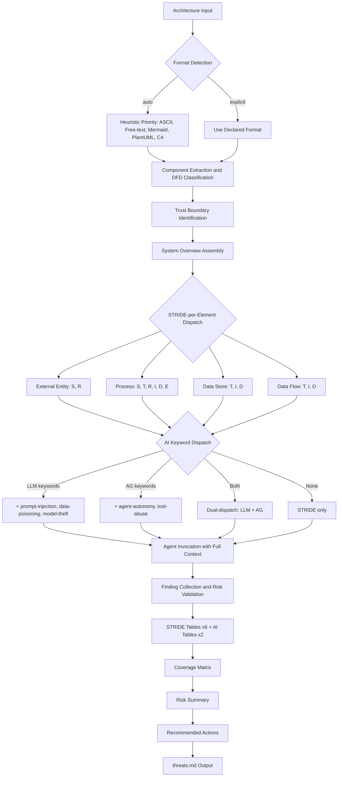

# System Design

Auto-generated from approved plan.md files. Each feature section captures component architecture and data flow at the time of planning approval.

---

### Feature 091: Delivery Document Generation

## Components

### Component 1: Delivery Document Template

**File**: `.aod/templates/delivery-template.md`
**Type**: New file
**Purpose**: Standardized template for consistent delivery document generation across all features.

The template defines the mandatory document structure:
- Header: Feature number, name, date, branch, PR
- What Was Delivered: Bullet list of accomplishments
- How to See & Test: Numbered verification steps
- Delivery Metrics: Estimated/actual/variance table
- Surprise Log: Captured during retrospective
- Lessons Learned: Category, text, KB entry reference
- Feedback Loop: New ideas or "None"
- Source Artifacts: Links to spec, plan, tasks, PRD
- Documentation Updates: Agent update summary table
- Cleanup: Checklist of closure steps

### Component 2: Skill Step 9 — Generate delivery.md

**File**: `.claude/skills/~aod-deliver/SKILL.md`
**Type**: Modify existing Step 9
**Purpose**: Replace terminal-only display with file generation + terminal display.

1. Re-read `.aod/templates/delivery-template.md` before generating
2. Resolve specs directory from branch name; create if missing
3. Populate template from retrospective data (Steps 1-8)
4. Write to `specs/{NNN}-*/delivery.md`
5. Fallback: display in terminal if write fails

### Component 3: Command Step 12 — Redirect Closure Report

**File**: `.claude/commands/aod.deliver.md`
**Type**: Modify existing Step 12
**Purpose**: Change closure report target from `.aod/closures/` to `specs/{NNN}-*/delivery.md`.

### Component 4: Command Step 10 — GitHub Closing Comment Update

**File**: `.claude/commands/aod.deliver.md`
**Type**: Modify existing Step 10
**Purpose**: Include delivery document path in GitHub Issue closing comment.

## Data Flow

```
Steps 1-8 (retrospective data collection)
         │
         ▼
   Skill Step 9: Generate delivery.md
         │
         ├── Read .aod/templates/delivery-template.md (re-ground)
         ├── Populate from collected data (accomplishments, metrics, etc.)
         ├── Write to specs/{NNN}-*/delivery.md
         │         │
         │         └── [on failure] Display in terminal as fallback
         ▼
   Command Step 10: Close GitHub Issue
         │
         └── Comment includes: "See: specs/{NNN}-*/delivery.md"
         ▼
   Command Step 12: Verify delivery.md exists (no longer generates closure file)
```

---

### Feature 001: Project Skeleton & Interface Contract

## Components

### Component 1: Agent Prompt Files (Hub)

**Location**: `agents/`
**Type**: New files (11 agent prompts + 1 placeholder)
**Purpose**: Immutable threat agent definitions — the content hub that all outputs derive from.

- `agents/stride/` — 6 STRIDE agents (spoofing, tampering, repudiation, info-disclosure, denial-of-service, privilege-escalation)
- `agents/ai/` — 5 AI agents (prompt-injection, tool-abuse, data-poisoning, model-theft, agent-autonomy)
- `agents/ai/README.md` — 5-agent-to-2-table mapping: AG (agent-autonomy, tool-abuse) and LLM (prompt-injection, data-poisoning, model-theft)
- `agents/orchestrator.md` — Placeholder for F-002

### Component 2: Machine-Readable Schemas

**Location**: `schemas/`
**Type**: New directory with 3 YAML schema files
**Purpose**: Data contracts between agents, templates, and downstream features.

- `schemas/finding.yaml` — IR schema (id, category, component, threat, likelihood, impact, risk_level, mitigation, references, dfd_element_type)
- `schemas/input.yaml` — Input validation (5 formats: ASCII, free-text, Mermaid, PlantUML, C4)
- `schemas/output.yaml` — Output structure (7 sections matching threats.md template)

### Component 3: Interface Contract

**Location**: `docs/INTERFACE-CONTRACT.md`
**Type**: New file
**Purpose**: Single document specifying input formats, STRIDE-per-Element normalization, AI dispatch rules, invocation protocol, and side-effect guarantees.

### Component 4: Output Template

**Location**: `templates/threats.md`
**Type**: New file
**Purpose**: Canonical template for threat model output with 7 sections: System Overview, Trust Boundaries, STRIDE Tables (6), AI Threat Tables (2), Coverage Matrix, Risk Summary, Recommended Actions.

## Data Flow

```
Architecture Input (5 formats)
        │
        ▼
┌─────────────────────┐
│  Input Validation    │ ◄── schemas/input.yaml
│  (format detection)  │
└────────┬────────────┘
         │
         ▼
┌─────────────────────┐
│  STRIDE-per-Element  │ ◄── INTERFACE-CONTRACT.md
│  Normalization       │     (normalization table)
│  + AI Dispatch       │
└────────┬────────────┘
         │
    ┌────┴─────────┐
    ▼              ▼
┌────────┐   ┌──────────┐
│ STRIDE  │   │ AI Threat │
│ Agents  │   │ Agents    │
│ (6)     │   │ (5)       │
└────┬───┘   └────┬─────┘
     │             │
     ▼             ▼
┌─────────────────────┐
│  Intermediate        │ ◄── schemas/finding.yaml
│  Representation (IR) │     (agent output contract)
│  [Finding objects]   │
└────────┬────────────┘
         │
         ▼
┌─────────────────────┐
│  Template Engine     │ ◄── templates/threats.md
│  (IR → Output)       │     schemas/output.yaml
└────────┬────────────┘
         │
         ▼
   Threat Model Output
   (threats.md)
```

## Tech Stack

| Technology | Purpose |
|-----------|---------|
| Markdown + YAML | Content format — platform-agnostic, no runtime dependencies |
| OWASP 3x3 Matrix | Risk rating standard — human-interpretable |
| STRIDE-per-Element | Threat methodology — DFD element mapping, O(n) scaling |

---

### Feature 003: Orchestrator Agent

## Components

### Component 1: Orchestrator Prompt File

**File**: `agents/orchestrator.md`
**Type**: Replace placeholder (Feature 001 placeholder replaced with full implementation)
**Purpose**: Central prompt implementing OWASP 4-step threat modeling workflow — parse, classify, dispatch, assemble.

**Internal Structure** (prompt sections):

| Section | OWASP Phase | Responsibility |
|---------|-------------|----------------|
| Frontmatter | — | Agent metadata (agent_name, category, status, version) with explicit references to all schemas, templates, and agent files |
| Role & Purpose | — | Establish orchestrator identity, platform-neutrality, and output constraints |
| Input Sanitization Boundary | — | Mark architecture input as data, not instructions; reject prompt injection attempts within `<architecture-input>` tags |
| Output Format Specification | — | Define 7-section structure (System Overview, Trust Boundaries, STRIDE Tables x6, AI Tables x2, Coverage Matrix, Risk Summary, Recommended Actions) with YAML frontmatter |
| Phase 1: Scope | Scope | Format detection (5 formats with heuristic priority), component extraction with format-specific parsers, DFD classification (4 element types with ambiguous-default-to-Process rule), trust boundary identification, System Overview assembly, **Component Inventory intermediate output with self-check** |
| Phase 2: Determine Threats | Determine Threats | STRIDE-per-Element normalization table (DFD type to applicable categories), AI keyword dispatch rules (LLM keywords, AG keywords, dual-dispatch), agent invocation protocol (parallel + sequential modes with full architecture context payload), **Dispatch Table intermediate output with self-check** |
| Phase 3: Determine Countermeasures | Determine Countermeasures | Agent finding collection, risk_level validation against OWASP 3x3 matrix with correction protocol, STRIDE table assembly (6 tables), AI table assembly (2 tables via 5-agent-to-2-table mapping) |
| Phase 4: Assess | Assess | Coverage matrix generation (finding counts, dash for analyzed-but-clean, empty for not-applicable), risk summary computation (percentages rounded to 1 decimal), recommended actions list (sorted by risk descending, then table order) |
| Error Handling | — | Three terminal errors: UNSUPPORTED_FORMAT (auto-detection fails), NO_COMPONENTS (parsing finds no components or data flows), INVALID_FORMAT_VALUE (format field not in allowed enum); two non-terminal handlers: ambiguous classification annotation, non-conforming finding correction |
| Output Validation | — | Structural integrity checklist: 7 sections present, frontmatter valid, finding IDs sequential, all fields populated, risk levels consistent with OWASP 3x3, cross-section counts match |

## Data Flow



## Tech Stack

| Technology | Purpose |
|-----------|---------|
| Markdown prompt file | Platform-agnostic deliverable — works with any LLM |
| OWASP 4-step process | Industry-standard threat modeling methodology |
| STRIDE-per-Element + AI keywords | Deterministic dispatch rules embedded in prompt |

---

### Feature 005: STRIDE Threat Agents

**Status**: Delivered (2026-03-22) | PR #6 | 41/41 tasks complete

## Components

### Component 1: 6 STRIDE Threat Agent Definitions

**Location**: `agents/stride/`
**Type**: Enhanced existing files (Feature 001 skeleton refined and validated)
**Purpose**: Each agent analyzes architecture input through exactly one STRIDE threat lens, producing component-specific findings conforming to `schemas/finding.yaml`.

| Agent File | Threat Class | DFD Targets | ID Prefix | Key Detection Patterns |
|-----------|-------------|-------------|-----------|----------------------|
| `spoofing.md` | Spoofing (S) | External Entity, Process | S-N | Authentication bypass, credential theft/replay, session hijacking, service impersonation, federated identity attacks |
| `tampering.md` | Tampering (T) | Process, Data Store, Data Flow | T-N | Input validation bypass, data integrity violations, message/payload manipulation, storage tampering, configuration tampering |
| `repudiation.md` | Repudiation (R) | External Entity, Process | R-N | Audit logging gaps, log integrity failures, non-repudiation mechanism absence, timestamp manipulation |
| `info-disclosure.md` | Information Disclosure (I) | Process, Data Store, Data Flow | I-N | Data leaks via error messages, excessive API responses, side-channel exposure, storage access control gaps, transit encryption gaps |
| `denial-of-service.md` | Denial of Service (D) | Process, Data Store, Data Flow | D-N | Resource exhaustion, queue/connection pool saturation, storage flooding, algorithmic complexity attacks, cascading failures |
| `privilege-escalation.md` | Elevation of Privilege (E) | Process | E-N | RBAC/ABAC bypass, horizontal/vertical escalation, default permission over-grants, parameter tampering for privilege gain |

**Agent structure** (canonical per-agent organization):
- YAML frontmatter: `agent_name`, `category`, `threat_class`, `dfd_targets`, `owasp_references`, `output_schema`
- Purpose section: Threat class definition and DFD targeting rationale
- Detection Scope: Targeted DFD element types with patterns and indicators (4-6 subcategories)
- AI-Specific Threat Patterns: Agentic application extensions per STRIDE category
- Finding Template: Concrete example demonstrating component-specific findings
- Risk Computation: OWASP 3x3 matrix application with likelihood/impact guidance
- References: OWASP Top 10 2021, OWASP API Security 2023, CWE, MITRE ATT&CK identifiers

### Component 2: AI-Specific Threat Pattern Extensions

**Location**: Within each `agents/stride/*.md` agent file
**Type**: New sections within existing agents
**Purpose**: Extend classic STRIDE patterns with threats specific to agentic AI applications.

Each STRIDE agent includes an "AI-Specific Threat Patterns" section covering:
- **Spoofing**: LLM API key theft, model identity spoofing, prompt-based identity assumption
- **Tampering**: Training data poisoning, RAG context manipulation, tool response modification
- **Repudiation**: Agentic action audit gaps, tool call logging, autonomous decision accountability
- **Info Disclosure**: Model inversion attacks, embedding leakage, context window data exposure
- **DoS**: LLM token exhaustion, recursive agent loops, unbounded tool execution chains
- **Privilege Escalation**: Agent capability boundary violations, tool permission escalation, MCP server scope creep

### Component 3: OWASP API Security 2023 Cross-References

**Location**: YAML frontmatter `owasp_references` field in each agent file
**Type**: Enhanced metadata
**Purpose**: Cross-reference STRIDE findings with OWASP API Security Top 10 2023 (API1-API10) alongside existing OWASP Top 10 2021, CWE, and MITRE ATT&CK references.

### Agent Validation Framework

The validation approach (used during Feature 005 delivery) has three layers:

**Layer 1: Structural Audit** (per agent)
- Frontmatter fields present and correct (`agent_name`, `category`, `threat_class`, `dfd_targets`, `owasp_references`, `output_schema`)
- Section structure matches canonical organization (purpose, detection scope, patterns, finding template, risk computation, references)
- `dfd_targets` matches STRIDE-per-Element matrix row for this category

**Layer 2: Content Quality** (per agent)
- Detection patterns cover all attack subcategories from PRD FR-7
- Finding template examples demonstrate component-specific threats (not generic)
- Mitigation examples are actionable with specific technology references
- Framework references include OWASP, CWE, and MITRE ATT&CK identifiers

**Layer 3: Integration Validation** (all agents together)
- Run orchestrator against `examples/mermaid-agentic-app/input.md`
- Verify all 6 STRIDE tables have findings in assembled `threats.md`
- Verify coverage matrix shows correct STRIDE-per-Element targeting
- Verify 100% component specificity (zero generic findings)

### STRIDE-per-Element Validation Matrix

| DFD Element | S | T | R | I | D | E |
|-------------|---|---|---|---|---|---|
| **Processes** | X | X | X | X | X | X |
| **Data Flows** | | X | | X | X | |
| **Data Stores** | | X | | X | X | |
| **External Entities** | X | | X | | | |

## Data Flow

```
Architecture Input (any format)
         │
         ▼
┌─────────────────────────────┐
│ Orchestrator (F-003)        │
│  Phase 1: Scope             │
│  - Format detection         │
│  - Component classification │
│  - DFD element assignment   │
└─────────┬───────────────────┘
          │ dispatch per STRIDE-per-Element
          ▼
┌─────────────────────────────┐
│ 6 STRIDE Agents (F-005)     │
│  Each agent:                │
│  1. Receives full arch      │
│  2. Filters by dfd_targets  │
│  3. Applies classic STRIDE  │
│     detection patterns      │
│  4. Applies AI-specific     │
│     threat patterns         │
│  5. Produces findings       │
│     (IR schema)             │
└─────────┬───────────────────┘
          │ findings per schemas/finding.yaml
          ▼
┌─────────────────────────────┐
│ Orchestrator (F-003)        │
│  Phase 3-4: Assemble        │
│  - Validate risk_level      │
│  - Build STRIDE tables      │
│  - Generate coverage matrix │
│  - Compute risk summary     │
└─────────┬───────────────────┘
          │
          ▼
    threats.md output
```

## Tech Stack

| Component | Technology | Justification |
|-----------|-----------|---------------|
| Agent files | Markdown with YAML frontmatter | Platform-neutral, LLM-agnostic prompt format |
| Schema | YAML | Machine-readable validation contract |
| Reference frameworks | OWASP Top 10 2021, OWASP API Security 2023, CWE, MITRE ATT&CK | Industry-standard cross-references for threat findings |
| Validation | Manual review + orchestrator integration run | No automated test framework needed for prompt files |

---

### Feature 007: AI Threat Agents

**Status**: Delivered (2026-03-22) | PR #8 | 48/48 tasks complete

## Components

### Agent Validation Framework

The validation approach follows the three-layer framework proven in F-005 (STRIDE agents):

**Layer 1: Structural Audit** (per agent)
- Frontmatter fields present and correct (`agent_name`, `category`, `threat_class`, `dfd_targets`, `owasp_references`, `output_schema`)
- Section structure matches canonical organization (purpose, detection scope, patterns, finding template, risk computation, references)
- `dfd_targets` matches interface contract AI extension dispatch rules

**Layer 2: Content Quality** (per agent)
- Detection patterns cover all attack subcategories from PRD FR-8
- Finding template examples demonstrate component-specific threats (not generic)
- Mitigation examples are actionable with specific technology references
- Framework references include OWASP AI framework IDs (LLM0x:2025, ASI-xx, MCP-xx:2025)

**Layer 3: Integration Validation** (all agents together)
- Run orchestrator against `examples/mermaid-agentic-app/input.md`
- Verify AG and LLM tables have findings in assembled `threats.md`
- Verify two-layer keyword dispatch and dual-dispatch behavior
- Verify 100% component specificity (zero generic findings)

### AI Agent DFD Targeting Matrix

| Agent | category | threat_class | dfd_targets | OWASP Framework |
|-------|----------|-------------|-------------|-----------------|
| prompt-injection.md | llm | LLM | [Process] | LLM Top 10 v2025 (LLM01) |
| data-poisoning.md | llm | LLM | [Data Store, Data Flow] | LLM Top 10 v2025 (LLM03, LLM04) |
| model-theft.md | llm | LLM | [Data Store, Process] | LLM Top 10 v2025 (LLM10) |
| agent-autonomy.md | agentic | AG | [Process] | Agentic Top 10 (ASI01, ASI06, ASI08, ASI09, ASI10) |
| tool-abuse.md | agentic | AG | [Process] | Agentic Top 10 (ASI02, ASI04), MCP Top 10 (MCP03) |

## Data Flow

```
Architecture Input (any format)
         │
         ▼
┌─────────────────────────────┐
│ Orchestrator (F-003)        │
│  Phase 1: Scope             │
│  - Format detection         │
│  - Component classification │
│  - DFD element assignment   │
└─────────┬───────────────────┘
          │ dispatch per STRIDE-per-Element
          │ + AI keyword dispatch (Layer 1)
          ▼
┌──────────────────┐    ┌──────────────────┐
│ 6 STRIDE Agents  │    │ 5 AI Agents      │
│ (F-005 validated)│    │ (F-007 — this)   │
│                  │    │                  │
│ Each agent:      │    │ Each agent:      │
│ 1. Receives arch │    │ 1. Receives arch │
│ 2. Filters by    │    │ 2. Filters by    │
│    dfd_targets   │    │    dfd_targets   │
│ 3. Applies       │    │ 3. Applies Layer │
│    patterns      │    │    2 keywords    │
│ 4. Produces      │    │ 4. Applies       │
│    findings (IR) │    │    patterns      │
│                  │    │ 5. Produces      │
│                  │    │    findings (IR) │
└────────┬─────────┘    └────────┬─────────┘
         │                       │
         └───────────┬───────────┘
                     │ all findings per schemas/finding.yaml
                     ▼
┌─────────────────────────────┐
│ Orchestrator (F-003)        │
│  Phase 3-4: Assemble        │
│  - Build 6 STRIDE tables    │
│  - Build 2 AI tables        │
│    (AG table + LLM table)   │
│  - Generate coverage matrix │
│  - Compute risk summary     │
└─────────┬───────────────────┘
          │
          ▼
    threats.md output
    (8 threat tables total)
```

## Tech Stack

| Component | Technology | Justification |
|-----------|-----------|---------------|
| Agent files | Markdown with YAML frontmatter | Platform-neutral, LLM-agnostic prompt format; matches F-005 STRIDE pattern |
| Schema | YAML (`schemas/finding.yaml` v1.0) | Machine-readable validation contract; read-only for this feature |
| OWASP references | LLM Top 10 v2025, Agentic Top 10 2026, MCP Top 10 2025 | Three complementary AI security frameworks |
| Validation | Manual review + orchestrator integration run | No automated test framework needed for prompt files |

---

### Feature 010: Deduplication & Risk Rating

## Components

### Component 1: Orchestrator Prompt — Correlation Detection Phase

**File**: `agents/orchestrator.md`
**Type**: Extend existing Phase 3 (Determine Countermeasures)
**Purpose**: Add correlation detection logic after all agent findings are collected and risk-validated, before coverage matrix generation.

Five deterministic correlation rules map STRIDE-to-AI category pairs:

| Rule | STRIDE Category | AI Category | Correlation Basis |
|------|----------------|-------------|-------------------|
| CR-1 | Tampering (T) | Data-Poisoning (LLM) | Data integrity |
| CR-2 | Privilege-Escalation (E) | Agent-Autonomy (AG) | Excessive permissions |
| CR-3 | Info-Disclosure (I) | Prompt-Injection (LLM) | Information leakage |
| CR-4 | Repudiation (R) | Agent-Autonomy (AG) | Accountability gaps |
| CR-5 | Denial-of-Service (D) | Tool-Abuse (AG) | Resource exhaustion |

### Component 2: Output Template — Correlated Findings Section (4a)

**File**: `templates/threats.md`
**Type**: New Section 4a between AI Threat Tables and Coverage Matrix

### Component 3: Output Template — Enhanced Coverage Matrix

**File**: `templates/threats.md` (Section 5)
**Type**: Modify existing — deduplicated counts, "—" for gaps, "n/a" for not-applicable

### Component 4: Output Template — Risk Calibration Matrix + Deduplicated Risk Summary

**File**: `templates/threats.md` (Section 6)
**Type**: Add subsection + modify existing counts

### Component 5: Output Schema Update

**File**: `schemas/output.yaml`
**Type**: Add Correlated Findings section schema

### Component 6: Interface Contract Update

**File**: `docs/INTERFACE-CONTRACT.md`
**Type**: Formalize deduplication in Sections 3 + 4

## Data Flow

```
Architecture Input
        │
        ▼
┌─────────────────────────────┐
│ Orchestrator Phase 1-2      │
│ (unchanged)                 │
└────────┬────────────────────┘
         │
    ┌────┴────────┐
    ▼             ▼
┌─────────┐  ┌──────────┐
│ STRIDE   │  │ AI       │
│ Agents   │  │ Agents   │
│ (6)      │  │ (5)      │
└────┬────┘  └────┬─────┘
     └─────┬──────┘
           │ all findings (IR schema)
           ▼
┌─────────────────────────────┐
│ Phase 3 (extended)          │
│ 1. Collect + validate       │
│ 2. Assemble tables          │
│ 3. NEW: Correlation detect  │
│ 4. NEW: Assemble Section 4a │
└────────┬────────────────────┘
         ▼
┌─────────────────────────────┐
│ Phase 4 (modified)          │
│ 1. Coverage matrix (dedup)  │
│ 2. Risk Calibration Matrix  │
│ 3. Risk summary (dedup)     │
│ 4. Recommended actions      │
│ 5. Structural validation    │
└────────┬────────────────────┘
         ▼
   threats.md output
   (7 sections + Section 4a)
```

## Tech Stack

| Technology | Purpose |
|-----------|---------|
| Markdown prompt | Orchestrator prompt extension — platform-agnostic |
| YAML schema | Output validation contract update |
| Markdown template | Output format specification |
| OWASP 3×3 Matrix | Risk calibration documentation (already implemented) |
