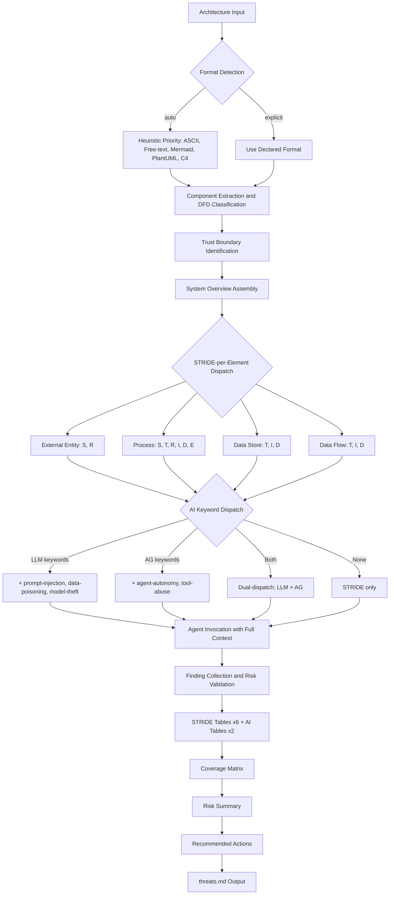

# System Design

Auto-generated from approved plan.md files. Each feature section captures component architecture and data flow at the time of planning approval.

---

### Feature 091: Delivery Document Generation

## Components

### Component 1: Delivery Document Template

**File**: `.aod/templates/delivery-template.md`
**Type**: New file
**Purpose**: Standardized template for consistent delivery document generation across all features.

The template defines the mandatory document structure:
- Header: Feature number, name, date, branch, PR
- What Was Delivered: Bullet list of accomplishments
- How to See & Test: Numbered verification steps
- Delivery Metrics: Estimated/actual/variance table
- Surprise Log: Captured during retrospective
- Lessons Learned: Category, text, KB entry reference
- Feedback Loop: New ideas or "None"
- Source Artifacts: Links to spec, plan, tasks, PRD
- Documentation Updates: Agent update summary table
- Cleanup: Checklist of closure steps

### Component 2: Skill Step 9 — Generate delivery.md

**File**: `.claude/skills/~aod-deliver/SKILL.md`
**Type**: Modify existing Step 9
**Purpose**: Replace terminal-only display with file generation + terminal display.

1. Re-read `.aod/templates/delivery-template.md` before generating
2. Resolve specs directory from branch name; create if missing
3. Populate template from retrospective data (Steps 1-8)
4. Write to `specs/{NNN}-*/delivery.md`
5. Fallback: display in terminal if write fails

### Component 3: Command Step 12 — Redirect Closure Report

**File**: `.claude/commands/aod.deliver.md`
**Type**: Modify existing Step 12
**Purpose**: Change closure report target from `.aod/closures/` to `specs/{NNN}-*/delivery.md`.

### Component 4: Command Step 10 — GitHub Closing Comment Update

**File**: `.claude/commands/aod.deliver.md`
**Type**: Modify existing Step 10
**Purpose**: Include delivery document path in GitHub Issue closing comment.

## Data Flow

```
Steps 1-8 (retrospective data collection)
         │
         ▼
   Skill Step 9: Generate delivery.md
         │
         ├── Read .aod/templates/delivery-template.md (re-ground)
         ├── Populate from collected data (accomplishments, metrics, etc.)
         ├── Write to specs/{NNN}-*/delivery.md
         │         │
         │         └── [on failure] Display in terminal as fallback
         ▼
   Command Step 10: Close GitHub Issue
         │
         └── Comment includes: "See: specs/{NNN}-*/delivery.md"
         ▼
   Command Step 12: Verify delivery.md exists (no longer generates closure file)
```

---

### Feature 001: Project Skeleton & Interface Contract

## Components

### Component 1: Agent Prompt Files (Hub)

**Location**: `agents/`
**Type**: New files (11 agent prompts + 1 placeholder)
**Purpose**: Immutable threat agent definitions — the content hub that all outputs derive from.

- `agents/stride/` — 6 STRIDE agents (spoofing, tampering, repudiation, info-disclosure, denial-of-service, privilege-escalation)
- `agents/ai/` — 5 AI agents (prompt-injection, tool-abuse, data-poisoning, model-theft, agent-autonomy)
- `agents/ai/README.md` — 5-agent-to-2-table mapping: AG (agent-autonomy, tool-abuse) and LLM (prompt-injection, data-poisoning, model-theft)
- `agents/orchestrator.md` — Placeholder for F-002

### Component 2: Machine-Readable Schemas

**Location**: `schemas/`
**Type**: New directory with 3 YAML schema files
**Purpose**: Data contracts between agents, templates, and downstream features.

- `schemas/finding.yaml` — IR schema (id, category, component, threat, likelihood, impact, risk_level, mitigation, references, dfd_element_type)
- `schemas/input.yaml` — Input validation (5 formats: ASCII, free-text, Mermaid, PlantUML, C4)
- `schemas/output.yaml` — Output structure (7 sections matching threats.md template)

### Component 3: Interface Contract

**Location**: `docs/INTERFACE-CONTRACT.md`
**Type**: New file
**Purpose**: Single document specifying input formats, STRIDE-per-Element normalization, AI dispatch rules, invocation protocol, and side-effect guarantees.

### Component 4: Output Template

**Location**: `templates/threats.md`
**Type**: New file
**Purpose**: Canonical template for threat model output with 7 sections: System Overview, Trust Boundaries, STRIDE Tables (6), AI Threat Tables (2), Coverage Matrix, Risk Summary, Recommended Actions.

## Data Flow

```
Architecture Input (5 formats)
        │
        ▼
┌─────────────────────┐
│  Input Validation    │ ◄── schemas/input.yaml
│  (format detection)  │
└────────┬────────────┘
         │
         ▼
┌─────────────────────┐
│  STRIDE-per-Element  │ ◄── INTERFACE-CONTRACT.md
│  Normalization       │     (normalization table)
│  + AI Dispatch       │
└────────┬────────────┘
         │
    ┌────┴─────────┐
    ▼              ▼
┌────────┐   ┌──────────┐
│ STRIDE  │   │ AI Threat │
│ Agents  │   │ Agents    │
│ (6)     │   │ (5)       │
└────┬───┘   └────┬─────┘
     │             │
     ▼             ▼
┌─────────────────────┐
│  Intermediate        │ ◄── schemas/finding.yaml
│  Representation (IR) │     (agent output contract)
│  [Finding objects]   │
└────────┬────────────┘
         │
         ▼
┌─────────────────────┐
│  Template Engine     │ ◄── templates/threats.md
│  (IR → Output)       │     schemas/output.yaml
└────────┬────────────┘
         │
         ▼
   Threat Model Output
   (threats.md)
```

## Tech Stack

| Technology | Purpose |
|-----------|---------|
| Markdown + YAML | Content format — platform-agnostic, no runtime dependencies |
| OWASP 3x3 Matrix | Risk rating standard — human-interpretable |
| STRIDE-per-Element | Threat methodology — DFD element mapping, O(n) scaling |

---

### Feature 003: Orchestrator Agent

## Components

### Component 1: Orchestrator Prompt File

**File**: `agents/orchestrator.md`
**Type**: Replace placeholder (Feature 001 placeholder replaced with full implementation)
**Purpose**: Central prompt implementing OWASP 4-step threat modeling workflow — parse, classify, dispatch, assemble.

**Internal Structure** (prompt sections):

| Section | OWASP Phase | Responsibility |
|---------|-------------|----------------|
| Frontmatter | — | Agent metadata (agent_name, category, status, version) with explicit references to all schemas, templates, and agent files |
| Role & Purpose | — | Establish orchestrator identity, platform-neutrality, and output constraints |
| Input Sanitization Boundary | — | Mark architecture input as data, not instructions; reject prompt injection attempts within `<architecture-input>` tags |
| Output Format Specification | — | Define 7-section structure (System Overview, Trust Boundaries, STRIDE Tables x6, AI Tables x2, Coverage Matrix, Risk Summary, Recommended Actions) with YAML frontmatter |
| Phase 1: Scope | Scope | Format detection (5 formats with heuristic priority), component extraction with format-specific parsers, DFD classification (4 element types with ambiguous-default-to-Process rule), trust boundary identification, System Overview assembly, **Component Inventory intermediate output with self-check** |
| Phase 2: Determine Threats | Determine Threats | STRIDE-per-Element normalization table (DFD type to applicable categories), AI keyword dispatch rules (LLM keywords, AG keywords, dual-dispatch), agent invocation protocol (parallel + sequential modes with full architecture context payload), **Dispatch Table intermediate output with self-check** |
| Phase 3: Determine Countermeasures | Determine Countermeasures | Agent finding collection, risk_level validation against OWASP 3x3 matrix with correction protocol, STRIDE table assembly (6 tables), AI table assembly (2 tables via 5-agent-to-2-table mapping) |
| Phase 4: Assess | Assess | Coverage matrix generation (finding counts, dash for analyzed-but-clean, empty for not-applicable), risk summary computation (percentages rounded to 1 decimal), recommended actions list (sorted by risk descending, then table order) |
| Error Handling | — | Three terminal errors: UNSUPPORTED_FORMAT (auto-detection fails), NO_COMPONENTS (parsing finds no components or data flows), INVALID_FORMAT_VALUE (format field not in allowed enum); two non-terminal handlers: ambiguous classification annotation, non-conforming finding correction |
| Output Validation | — | Structural integrity checklist: 7 sections present, frontmatter valid, finding IDs sequential, all fields populated, risk levels consistent with OWASP 3x3, cross-section counts match |

## Data Flow



## Tech Stack

| Technology | Purpose |
|-----------|---------|
| Markdown prompt file | Platform-agnostic deliverable — works with any LLM |
| OWASP 4-step process | Industry-standard threat modeling methodology |
| STRIDE-per-Element + AI keywords | Deterministic dispatch rules embedded in prompt |

---

### Feature 005: STRIDE Threat Agents

## Components

### Agent Validation Framework

The validation approach has three layers:

**Layer 1: Structural Audit** (per agent)
- Frontmatter fields present and correct (`agent_name`, `category`, `threat_class`, `dfd_targets`, `owasp_references`, `output_schema`)
- Section structure matches canonical organization (purpose, detection scope, patterns, finding template, risk computation, references)
- `dfd_targets` matches STRIDE-per-Element matrix row for this category

**Layer 2: Content Quality** (per agent)
- Detection patterns cover all attack subcategories from PRD FR-7
- Finding template examples demonstrate component-specific threats (not generic)
- Mitigation examples are actionable with specific technology references
- Framework references include OWASP, CWE, and MITRE ATT&CK identifiers

**Layer 3: Integration Validation** (all agents together)
- Run orchestrator against `examples/mermaid-agentic-app/input.md`
- Verify all 6 STRIDE tables have findings in assembled `threats.md`
- Verify coverage matrix shows correct STRIDE-per-Element targeting
- Verify 100% component specificity (zero generic findings)

### STRIDE-per-Element Validation Matrix

| DFD Element | S | T | R | I | D | E |
|-------------|---|---|---|---|---|---|
| **Processes** | X | X | X | X | X | X |
| **Data Flows** | | X | | X | X | |
| **Data Stores** | | X | | X | X | |
| **External Entities** | X | | X | | | |

## Data Flow

```
Architecture Input (any format)
         │
         ▼
┌─────────────────────────────┐
│ Orchestrator (F-003)        │
│  Phase 1: Scope             │
│  - Format detection         │
│  - Component classification │
│  - DFD element assignment   │
└─────────┬───────────────────┘
          │ dispatch per STRIDE-per-Element
          ▼
┌─────────────────────────────┐
│ 6 STRIDE Agents (F-005)     │
│  Each agent:                │
│  1. Receives full arch      │
│  2. Filters by dfd_targets  │
│  3. Applies detection       │
│     patterns                │
│  4. Produces findings       │
│     (IR schema)             │
└─────────┬───────────────────┘
          │ findings per schemas/finding.yaml
          ▼
┌─────────────────────────────┐
│ Orchestrator (F-003)        │
│  Phase 3-4: Assemble        │
│  - Validate risk_level      │
│  - Build STRIDE tables      │
│  - Generate coverage matrix │
│  - Compute risk summary     │
└─────────┬───────────────────┘
          │
          ▼
    threats.md output
```

## Tech Stack

| Component | Technology | Justification |
|-----------|-----------|---------------|
| Agent files | Markdown with YAML frontmatter | Platform-neutral, LLM-agnostic prompt format |
| Schema | YAML | Machine-readable validation contract |
| Validation | Manual review + orchestrator integration run | No automated test framework needed for prompt files |
