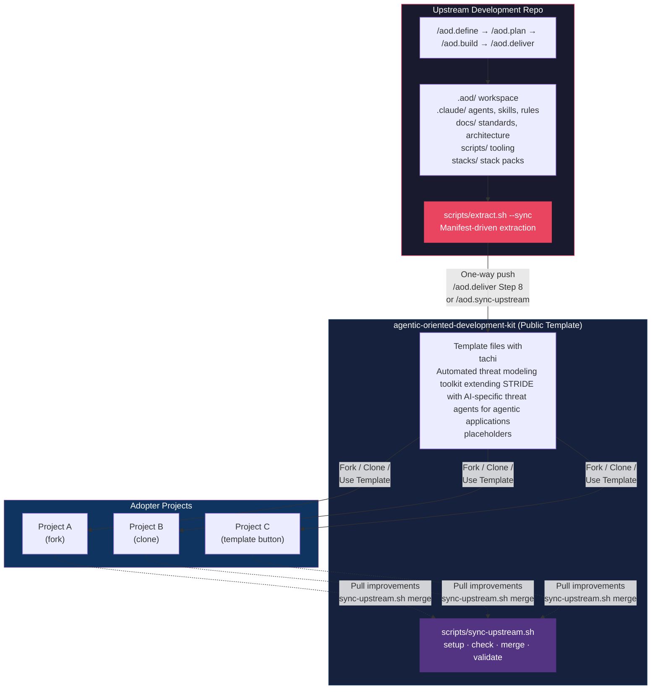
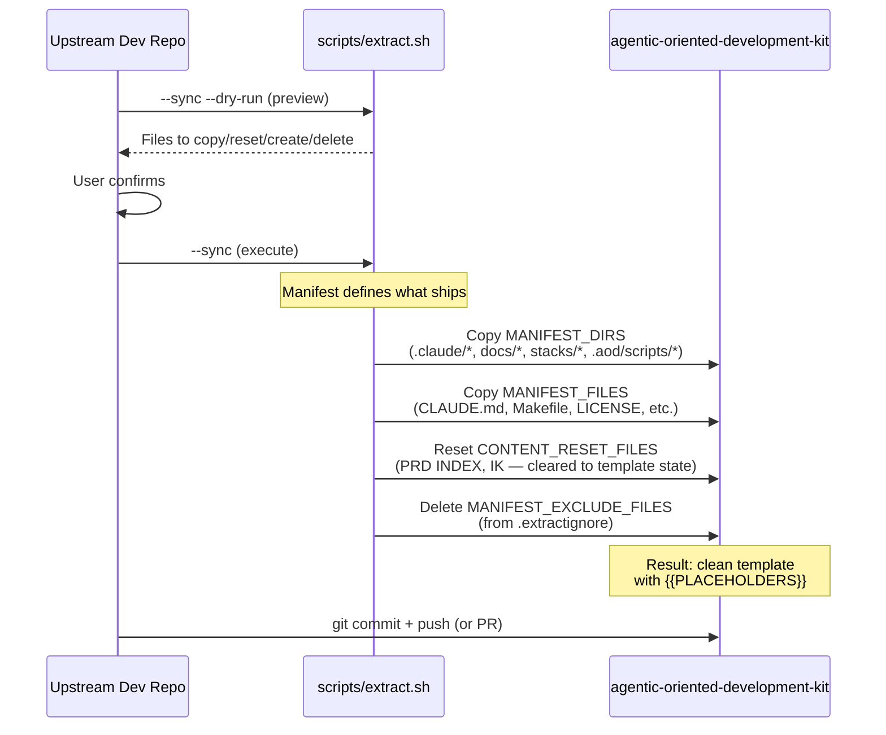
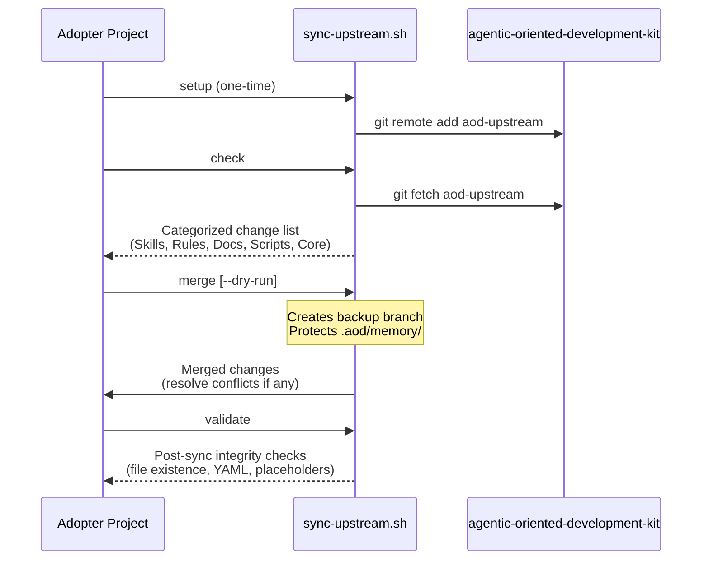

# Upstream Sync Architecture

**Owner**: Architect
**Last Updated**: 2026-03-19

---

## Overview

The AOD methodology is developed in an upstream development repo and published to a public template repo (`agentic-oriented-development-kit`) via a manifest-driven extraction pipeline. Adopters fork/clone the public template and pull improvements back using a safe merge workflow.

---

## System Diagram

---

## Push Flow: Private → Public Template

Triggered by `/aod.deliver` (Step 8) or standalone `/aod.sync-upstream`.

### What Gets Synced (Extract Manifest)

| Category | Content | Action |
|----------|---------|--------|
| **Agent Infrastructure** | `.claude/agents/`, `skills/`, `commands/`, `rules/`, `hooks/`, `lib/`, `config/` | Copy |
| **Docs & Standards** | `docs/core_principles/`, `standards/`, `architecture/`, `guides/`, `testing/` | Copy |
| **DevOps** | `docs/devops/01_Local/`, `02_Staging/`, `03_Production/` | Copy |
| **Product Templates** | `docs/product/03_Product_Roadmap/`, `04_Journey_Maps/`, `05_User_Stories/`, `06_OKRs/` | Copy |
| **AOD Runtime** | `.aod/scripts/bash/`, `.aod/templates/` | Copy |
| **Stack Packs** | `stacks/` | Copy |
| **Root Files** | `CLAUDE.md`, `Makefile`, `.gitignore`, `LICENSE`, `.env.example`, `MIGRATION.md` | Copy |
| **Seeded Content** | `.aod/memory/constitution.md`, `scripts/init.sh`, `check.sh`, `sync-upstream.sh` | Copy |
| **Content Reset** | `docs/product/02_PRD/INDEX.md`, `docs/INSTITUTIONAL_KNOWLEDGE.md` | Copy then reset to template state |
| **Private Content** | Files in `.extractignore` | Deleted from destination |

### What Never Ships

- `specs/` (feature-specific artifacts)
- `docs/product/02_PRD/*.md` (actual PRDs, except INDEX template)
- `.aod/spec.md`, `plan.md`, `tasks.md` (active workspace)
- `.aod/memory/` (except `constitution.md` seed)
- `archive/`, `node_modules/`, `.git/`
- Any path listed in `.extractignore`

---

## Pull Flow: Public Template → Adopter

Adopters use `scripts/sync-upstream.sh` to pull improvements from the public template.

### Protected During Merge

| Path | Why Protected |
|------|---------------|
| `.aod/memory/` | Adopter's governance memory, constitution customizations |
| Project-specific PRDs | Adopter's product decisions |
| Custom rules in `.claude/rules/` | Conflict resolution preserves local changes |

---

## Trigger Points

| Trigger | Command | What Happens |
|---------|---------|--------------|
| Feature delivery | `/aod.deliver` Step 8 | Asks user whether to sync upstream |
| Ad-hoc sync | `/aod.sync-upstream` | Standalone extract + push/PR |
| Adopter update | `sync-upstream.sh merge` | Pulls latest template into adopter repo |

---

## Key Design Decisions

- **One-way push**: Private repo is always the source of truth; public template never feeds back
- **Manifest-driven**: `scripts/extract.sh` is the single source of truth for what constitutes template content
- **Content resets**: Some files are copied then overwritten to remove project-specific data (e.g., PRD index, institutional knowledge)
- **`.extractignore`**: Works like `.gitignore` — adopters of the private repo can exclude paths from extraction
- **Bash 3.2 compatible**: All scripts use `case` statements and `while read` loops (no associative arrays) for macOS compatibility
