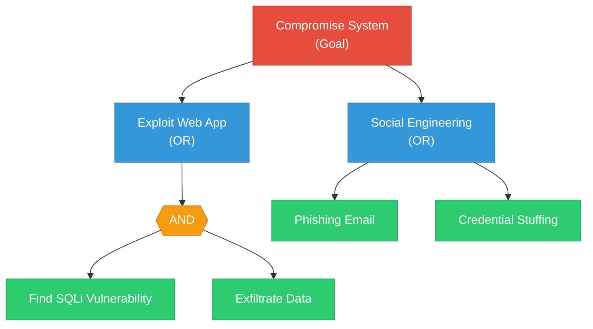

# Tachi Research Document — Authoritative Framework References

**Purpose**: Ground the Tachi threat modeling toolkit in industry-approved, correctly-sourced security frameworks.
**Created**: 2026-03-20
**Status**: Reference material for PRD 095 and Consumer Guide

**Related documents**:
- [CONSUMER_GUIDE_TACHI.md](CONSUMER_GUIDE_TACHI.md) — Main consumer guide with 10 seed features
- [CONSUMER_GUIDE_TACHI_AOD_INTEGRATION.md](CONSUMER_GUIDE_TACHI_AOD_INTEGRATION.md) — Auxiliary guide for AOD Kit integration

---

## Table of Contents

1. [Microsoft STRIDE](#1-microsoft-stride)
2. [OWASP Top 10 for LLM Applications (v2025)](#2-owasp-top-10-for-llm-applications-v2025)
3. [OWASP Top 10 for Agentic Applications (2026)](#3-owasp-top-10-for-agentic-applications-2026)
4. [OWASP MCP Top 10 (2025)](#4-owasp-mcp-top-10-2025)
5. [OWASP API Security Top 10 (2023)](#5-owasp-api-security-top-10-2023)
6. [SARIF 2.1.0](#6-sarif-210)
7. [Attack Tree Methodology](#7-attack-tree-methodology)
8. [Risk Rating Matrices](#8-risk-rating-matrices)
9. [OWASP Top 10 Web Applications (2025)](#9-owasp-top-10-web-applications-2025)
10. [CVSS (Common Vulnerability Scoring System)](#10-cvss-common-vulnerability-scoring-system)
11. [Input Format Specifications](#11-input-format-specifications)
12. [Input-to-STRIDE Crosswalk](#12-input-to-stride-crosswalk)
13. [Consumer Guide Corrections](#13-consumer-guide-corrections)

---

## 1. Microsoft STRIDE

### Origin

- **Creators**: Loren Kohnfelder and Praerit Garg (Microsoft)
- **First published**: April 1, 1999, in Microsoft's internal "Interface" journal — "The Threats to Our Products"
- **Adopted by Microsoft SDL**: 2002
- **Status**: Actively maintained. Microsoft Threat Modeling Tool v7.3.51110.1 (November 2025) uses STRIDE-per-Element as its guided methodology.

### The Six Categories

**Original definitions** from Kohnfelder & Garg, "The Threats to Our Products" (April 1, 1999):

| Category | Original Paper Name | Original Definition |
|----------|--------------------|--------------------|
| **Spoofing** | Spoofing of user identity | Breaching the user's authentication information — the hacker has obtained the user's personal information or something that enables him to replay the authentication procedure |
| **Tampering** | Tampering with data | Modifying system or user data with or without detection — unauthorized change to stored or in-transit information |
| **Repudiation** | Repudiability | An untrusted user performing an illegal operation without the ability to be traced — users who can deny a wrongdoing without any way to prove otherwise |
| **Information Disclosure** | Information disclosure (privacy breach) | Compromising the user's private or business-critical information — information exposed to individuals who are not supposed to see it |
| **Denial of Service** | Denial of Service (D.o.S.) | Making the system temporarily unavailable or unusable — when an attacker can temporarily make system resources unavailable or unusable |
| **Elevation of Privilege** | Elevation of privilege | An unprivileged user gains privileged access and thereby has sufficient access to completely compromise or destroy the entire system |

**Additional threats from the original paper** (beyond the six STRIDE categories):
- Privilege misuse — administrators browsing untrusted sites or documents with elevated privileges
- Rogue administrator — administrator with "godlike powers" turns rogue
- Trust abuse — trusted software violating user's privacy requirements
- Physical security — increasingly important in connected environments

These "beyond STRIDE" threats from the original paper are relevant to Tachi's agentic context — privilege misuse and rogue administrator directly parallel ASI03 (Identity & Privilege Abuse) and ASI10 (Rogue Agents).

**Current Microsoft definitions** (simplified, from [Microsoft Learn](https://learn.microsoft.com/en-us/azure/security/develop/threat-modeling-tool-threats)):

| Category | Definition |
|----------|-----------|
| **Spoofing** | Illegally accessing and then using another user's authentication information, such as username and password |
| **Tampering** | Malicious modification of data — unauthorized changes to persistent data or alteration of data in transit between two computers |
| **Repudiation** | Users deny performing an action without other parties having any way to prove otherwise. Non-repudiation is the ability of a system to counter repudiation threats |
| **Information Disclosure** | Exposure of information to individuals who are not supposed to have access — reading a file without authorization or reading data in transit |
| **Denial of Service** | Attacks that deny service to valid users by making a server temporarily unavailable or unusable |
| **Elevation of Privilege** | An unprivileged user gains privileged access sufficient to compromise or destroy the entire system |

### STRIDE-to-Security-Property Mapping

Source: [MSDN Magazine, November 2006 — "Uncover Security Design Flaws Using The STRIDE Approach"](https://learn.microsoft.com/en-us/archive/msdn-magazine/2006/november/uncover-security-design-flaws-using-the-stride-approach)

| STRIDE Threat | Violates Security Property |
|---------------|---------------------------|
| **S**poofing | Authentication |
| **T**ampering | Integrity |
| **R**epudiation | Non-repudiation |
| **I**nformation Disclosure | Confidentiality |
| **D**enial of Service | Availability |
| **E**levation of Privilege | Authorization |

### STRIDE-per-Element Matrix

Which STRIDE threats apply to which Data Flow Diagram (DFD) elements:

| DFD Element | S | T | R | I | D | E |
|-------------|---|---|---|---|---|---|
| **Processes** | X | X | X | X | X | X |
| **Data Flows** | | X | | X | X | |
| **Data Stores** | | X | | X | X | |
| **External Entities** | X | | X | | | |

Key insight: Processes are susceptible to all six threat types. External entities are only susceptible to Spoofing and Repudiation. This matrix should be used by Tachi agents to scope threat generation.

### OWASP Threat Modeling Process

Source: [OWASP Threat Modeling Process](https://owasp.org/www-community/Threat_Modeling_Process)

OWASP defines a four-step threat modeling process that wraps STRIDE:

1. **Scope your work** — Understand the application through diagrams, entry/exit points, assets, and trust levels
2. **Determine Threats** — Identify potential threats using STRIDE categories
3. **Determine Countermeasures and Mitigation** — Map protective measures to identified threats
4. **Assess your work** — Verify documentation exists (diagrams, threats list, control list)

**Mitigation strategy options** (from OWASP):
- **Accept** — Document business-acceptable risk
- **Eliminate** — Remove vulnerable components
- **Mitigate** — Add controls reducing likelihood/impact
- **Transfer** — Shift risk via insurance or contracts

This four-step process should inform Tachi's orchestrator workflow.

### References

| Source | URL |
|--------|-----|
| **Original paper** (Kohnfelder & Garg, 1999) | Local copy: `The-Threats-To-Our-Products.docx` — verified against text |
| Original paper archive (Shostack) | https://shostack.org/resources/early-threat-modeling |
| OWASP Threat Modeling Process | https://owasp.org/www-community/Threat_Modeling_Process |
| OWASP Threat Model Project | https://owasp.org/www-project-threat-modeling/ |
| STRIDE Threat Definitions (Microsoft Learn) | https://learn.microsoft.com/en-us/azure/security/develop/threat-modeling-tool-threats |
| MSDN Magazine: STRIDE Approach (Nov 2006) | https://learn.microsoft.com/en-us/archive/msdn-magazine/2006/november/uncover-security-design-flaws-using-the-stride-approach |
| Microsoft SDL Threat Modeling | https://www.microsoft.com/en-us/securityengineering/sdl/threatmodeling |
| Threat Modeling Tool Overview | https://learn.microsoft.com/en-us/azure/security/develop/threat-modeling-tool |
| Threat Modeling Tool Release Notes | https://learn.microsoft.com/en-us/azure/security/develop/threat-modeling-tool-releases |
| STRIDE Chart (Microsoft Security Blog, 2007) | https://www.microsoft.com/en-us/security/blog/2007/09/11/stride-chart/ |

**Books:**
- Kohnfelder & Garg, "The Threats to Our Products" (1999) — origin paper, verified from original .docx
- Howard & Lipner, "The Security Development Lifecycle" (2006, Microsoft Press) — Chapter 22: STRIDE threat trees for DFD elements
- Shostack, "Threat Modeling: Designing for Security" (2014, Wiley) — definitive STRIDE methodology treatment

---

## 2. OWASP Top 10 for LLM Applications (v2025)

### Project Details

- **Official name**: OWASP Top 10 for Large Language Model Applications
- **Parent project**: OWASP Gen AI Security Project
- **Current version**: v2025 (published November 18, 2024)
- **Contributors**: 500+, 1,100+ commits
- **Official ID format**: `LLM01:2025` through `LLM10:2025`

### Version History

| Version | Date | Notes |
|---------|------|-------|
| v1.0 | August 2023 | First release — focused on model-building risks |
| v1.1 | October 2023 | Refined examples, streamlined definitions |
| **v2025** | November 2024 | Major overhaul — shifted focus to organizations deploying/using LLMs |

### All 10 Categories (v2025)

| ID | Name | Description |
|----|------|-------------|
| **LLM01:2025** | Prompt Injection | Crafted inputs manipulate LLM behavior, bypassing instructions for unauthorized access or data exfiltration |
| **LLM02:2025** | Sensitive Information Disclosure | LLM reveals PII, credentials, or confidential data through training data memorization, RAG retrieval, or cross-session leakage |
| **LLM03:2025** | Supply Chain | Compromised third-party components — datasets, adapters, pre-trained models, plugins — undermine system integrity |
| **LLM04:2025** | Data and Model Poisoning | Attackers manipulate data during pre-training, fine-tuning, or embedding to introduce biases or backdoors |
| **LLM05:2025** | Improper Output Handling | LLM outputs passed to downstream systems without validation enable XSS, code execution, or privilege escalation |
| **LLM06:2025** | Excessive Agency | LLMs granted excessive functionality, permissions, or autonomy take unintended actions with real-world consequences |
| **LLM07:2025** | System Prompt Leakage | Internal system prompts containing sensitive instructions or credentials exposed through adversarial queries |
| **LLM08:2025** | Vector and Embedding Weaknesses | Vulnerabilities in RAG pipelines and vector databases allow unauthorized access or poisoned retrieval results |
| **LLM09:2025** | Misinformation | LLMs generate false but credible-sounding content (hallucinations) leading to misinformed decisions |
| **LLM10:2025** | Unbounded Consumption | Uncontrolled resource usage causes performance degradation, downtime, or unexpected costs |

### Key Changes from v1.x to v2025

| v1.x Name | v2025 Name | Change |
|-----------|-----------|--------|
| Insecure Output Handling | Improper Output Handling (LLM05) | Renamed, repositioned |
| Training Data Poisoning | Data and Model Poisoning (LLM04) | Expanded scope |
| Model Denial of Service | Unbounded Consumption (LLM10) | Renamed, repositioned |
| Insecure Plugin Design | *Removed* | Absorbed into Excessive Agency + Supply Chain |
| Overreliance | Misinformation (LLM09) | Renamed |
| Model Theft | *Removed* | Less relevant to deployers |
| — | System Prompt Leakage (LLM07) | **New** |
| — | Vector and Embedding Weaknesses (LLM08) | **New** (reflects RAG adoption) |

### References

| Source | URL |
|--------|-----|
| OWASP Project Page | https://owasp.org/www-project-top-10-for-large-language-model-applications/ |
| Gen AI Security Hub | https://genai.owasp.org/llm-top-10/ |
| v2025 Resource Page | https://genai.owasp.org/resource/owasp-top-10-for-llm-applications-2025/ |
| v2025 PDF | https://owasp.org/www-project-top-10-for-large-language-model-applications/assets/PDF/OWASP-Top-10-for-LLMs-v2025.pdf |
| GitHub Repository | https://github.com/OWASP/www-project-top-10-for-large-language-model-applications |

**GitHub-verified file naming pattern** (from `2_0_vulns/` directory):
```
LLM01_PromptInjection.md
LLM02_SensitiveInformationDisclosure.md
LLM03_SupplyChain.md
LLM04_DataModelPoisoning.md
LLM05_ImproperOutputHandling.md
LLM06_ExcessiveAgency.md
LLM07_SystemPromptLeakage.md
LLM08_VectorAndEmbeddingWeaknesses.md
LLM09_Misinformation.md
LLM10_UnboundedConsumption.md
```

---

## 3. OWASP Top 10 for Agentic Applications (2026)

### Project Details

- **Official name**: OWASP Top 10 for Agentic Applications for 2026
- **Published**: December 10, 2025
- **Status**: Officially published (not draft)
- **Parent project**: OWASP GenAI Security Project
- **Contributors**: 100+ security researchers
- **Review board includes**: NIST, Cisco, Alan Turing Institute, Oracle Cloud, Microsoft AI Red Team, AWS, European Commission
- **Official ID format**: `ASI01` through `ASI10` (Agentic Security Issue)

### All 10 Categories

Source: [GitHub — OWASP ASI agentic-top-10](https://github.com/owasp/www-project-top-10-for-large-language-model-applications/tree/main/initiatives/agent_security_initiative/agentic-top-10)

| ID | Name (from GitHub source) | Description |
|----|--------------------------|-------------|
| **ASI01** | Agent Behaviour Hijack | Manipulating an agent's goals/plans to pursue attacker-aligned objectives via injected text (poisoned emails, PDFs, RAG documents, web content) |
| **ASI02** | Tool Misuse and Exploitation | Tricking agents into using their tools in harmful or unintended ways — destructive parameters or unexpected tool chaining |
| **ASI03** | Identity & Privilege Abuse | Impersonating agents or escalating access through identity/auth weaknesses — compromised agents silently escalate privileges and move laterally |
| **ASI04** | Agentic Supply Chain Vulnerabilities | Introducing insecure models, agents, tools or artefacts compromising integrity — malicious MCP servers, poisoned prompt templates, tampered models |
| **ASI05** | Unexpected Code Execution (RCE) | Triggering unauthorized or unsafe code execution through agent behaviors — shell commands, scripts, migrations, template evaluation, deserialization |
| **ASI06** | Memory & Context Poisoning | Corrupting agent memory or context to distort reasoning and decision-making — RAG stores, scratchpads, long-term memory, cross-tenant leakage |
| **ASI07** | Insecure Inter-Agent Communication | Poisoning messages or abusing protocols between agents to alter behavior — spoofed identities, replayed delegation, message tampering |
| **ASI08** | Cascading Failures | Faults or hallucinations propagate through agents, causing compounded failures — hallucinating planners issuing destructive tasks to multiple agents |
| **ASI09** | Human-Agent Trust Exploitation | Exploiting over-trust or fatigue in human oversight to enable misuse, including deceptive behaviours — authority bias manipulation |
| **ASI10** | Rogue Agents | Malicious or compromised agents acting autonomously to deceive, disrupt, or exfiltrate — self-repeat, persist across sessions, impersonate other agents |

### How Agentic Top 10 Differs from LLM Top 10

The LLM Top 10 addresses risks from **content generation** (incorrect or misleading outputs). The Agentic Top 10 addresses risks from **autonomous action** — agents that access APIs, modify databases, send emails, and execute code.

**Agentic-only threats (no LLM Top 10 equivalent):**

| Agentic Threat | Why LLM Top 10 Cannot Cover It |
|----------------|-------------------------------|
| ASI01 Goal Hijack | Targets agent planning/objective layer, not text generation |
| ASI02 Tool Misuse | Agents execute tools; LLMs generate text |
| ASI03 Identity & Privilege Abuse | Agents hold persistent identity and system privileges |
| ASI07 Insecure Inter-Agent Comms | Multi-agent systems have no single-LLM analogue |
| ASI08 Cascading Failures | Autonomy + fan-out creates failure propagation |
| ASI09 Human-Agent Trust Exploitation | Agents actively request authorization for actions |
| ASI10 Rogue Agents | Persistent session-spanning misalignment is agent-specific |

**Overlapping themes (agentic variations):**

| Agentic | LLM | Relationship |
|---------|-----|-------------|
| ASI04 Supply Chain | LLM03 Supply Chain | Agentic version adds MCP servers, dynamic tool registries |
| ASI06 Memory Poisoning | LLM04 Data Poisoning | Agentic targets RAG stores/scratchpads, not training data |
| ASI05 Code Execution | LLM05 Improper Output | Agentic focuses on code generation and execution specifically |

### References

| Source | URL |
|--------|-----|
| Agentic Top 10 Resource Page | https://genai.owasp.org/resource/owasp-top-10-for-agentic-applications-for-2026/ |
| Announcement Blog | https://genai.owasp.org/2025/12/09/owasp-top-10-for-agentic-applications-the-benchmark-for-agentic-security-in-the-age-of-autonomous-ai/ |
| Press Release | https://genai.owasp.org/2025/12/09/owasp-genai-security-project-releases-top-10-risks-and-mitigations-for-agentic-ai-security/ |
| Agentic Security Initiative | https://genai.owasp.org/initiatives/agentic-security-initiative/ |
| GitHub (parent repo) | https://github.com/OWASP/www-project-top-10-for-large-language-model-applications |
| GitHub (OWASP-ASI org) | https://github.com/OWASP-ASI |

---

## 4. OWASP MCP Top 10 (2025)

### Project Details

- **Official name**: OWASP MCP Top 10
- **Status**: Incubator Project (officially recognized OWASP project, v0.1 Beta)
- **Repository created**: June 18, 2025
- **License**: CC BY-NC-SA 4.0
- **Project lead**: Vandana Verma Sehgal
- **Co-leader**: Liran Tal
- **Official ID format**: `MCP01:2025` through `MCP10:2025`

### All 10 Categories

| ID | Name | Description |
|----|------|-------------|
| **MCP01:2025** | Token Mismanagement & Secret Exposure | Hard-coded credentials, long-lived tokens, and secrets in model memory or protocol logs expose environments to unauthorized access |
| **MCP02:2025** | Privilege Escalation via Scope Creep | Loosely defined permissions expand over time, granting agents excessive capabilities — 78.3% attack success rate with 5 compromised servers |
| **MCP03:2025** | Tool Poisoning | Adversaries compromise tools/plugins via three sub-techniques: **direct poisoning**, **tool shadowing**, **rug pulls** — 84.2% success rate with auto-approval |
| **MCP04:2025** | Software Supply Chain Attacks & Dependency Tampering | Compromised open-source packages, connectors, or plugins introduce backdoors — includes typosquatting and dependency confusion |
| **MCP05:2025** | Command Injection & Execution | AI agent constructs and executes system commands using untrusted input without validation — parallels SQL injection |
| **MCP06:2025** | Prompt Injection via Contextual Payloads | Malicious payloads exploit the model's design to follow natural-language instructions embedded in tool-returned context |
| **MCP07:2025** | Insufficient Authentication & Authorization | MCP servers, tools, or agents fail to verify identities or enforce access controls — 38% of surveyed MCP servers lack any authentication |
| **MCP08:2025** | Lack of Audit & Telemetry | Limited telemetry impedes investigation and incident response — unauthorized actions remain undetected |
| **MCP09:2025** | Shadow MCP Servers | Unapproved MCP instances operating outside security governance with default credentials and permissive configurations |
| **MCP10:2025** | Context Injection & Over-Sharing | Shared or insufficiently scoped context windows expose sensitive information — includes memory poisoning across sessions |

### MCP03: Tool Poisoning Sub-Techniques (Critical for Tachi)

| Variant | Description |
|---------|-------------|
| **Direct Poisoning** | Hidden instructions in tool descriptions cause data theft without requiring invocation — e.g., `<IMPORTANT>` tags in tool metadata exfiltrate SSH keys |
| **Tool Shadowing** | Malicious servers inject tool descriptions mimicking legitimate tools — 100% success rate in first-match resolution mode |
| **Rug Pulls** | Servers pass initial security review with clean definitions, then silently modify tool descriptions on reconnection — exploits lack of re-verification |

### Real-World CVEs (January-February 2026)

| CVE | CVSS | Description |
|-----|------|-------------|
| CVE-2026-27896 | 9.6 | RCE in MCP Go SDK (~500K downloads) |
| CVE-2026-26118 | 8.8 | SSRF in Azure MCP Server |

30+ CVEs filed targeting MCP servers/clients in a 2-month period. 43% were exec/shell injection, 20% tooling infrastructure flaws.

### How MCP Works (Architecture Overview)

**Three-tier architecture:**
- **MCP Hosts**: User-facing applications (Claude Desktop, Cursor, IDEs)
- **MCP Clients**: Run inside Hosts; manage 1:1 connection to one MCP Server
- **MCP Servers**: External programs exposing capabilities via standardized API

**Three core primitives:**
- **Tools**: Functions the LLM can invoke (side effects possible)
- **Resources**: Read-only data sources (no side effects)
- **Prompts**: Pre-defined templates for tool/resource usage

**Protocol**: JSON-RPC 2.0 over stdio (local) or HTTP+SSE (remote)

### References

| Source | URL |
|--------|-----|
| OWASP MCP Top 10 Project Page | https://owasp.org/www-project-mcp-top-10/ |
| GitHub Repository | https://github.com/OWASP/www-project-mcp-top-10 |
| OWASP Nest Listing | https://nest.owasp.org/projects/mcp-top-10 |
| MCP Security Best Practices (Anthropic) | https://modelcontextprotocol.io/docs/tutorials/security/security_best_practices |
| MCP Specification (2025-11-25) | https://modelcontextprotocol.io/specification/2025-11-25 |
| Introducing MCP (Anthropic) | https://www.anthropic.com/news/model-context-protocol |
| OWASP MCP Security Cheat Sheet | https://cheatsheetseries.owasp.org/cheatsheets/MCP_Security_Cheat_Sheet.html |
| Microsoft MCP Azure Security Guide | https://microsoft.github.io/mcp-azure-security-guide/ |
| OWASP GenAI: Securing Third-Party MCP Servers | https://genai.owasp.org/resource/cheatsheet-a-practical-guide-for-securely-using-third-party-mcp-servers-1-0/ |

---

## 5. OWASP API Security Top 10 (2023)

### Project Details

- **Official name**: OWASP API Security Top 10
- **Current version**: 2023 edition
- **Previous version**: 2019 edition
- **License**: CC BY-SA 4.0
- **Official ID format**: `API1:2023` through `API10:2023`
- **GitHub**: https://github.com/OWASP/API-Security

### Why This Matters for Tachi

Every Tachi example architecture (web app, microservices, agentic app) exposes APIs. STRIDE covers system-level threats, but **API-specific authorization, authentication, and resource consumption patterns** are covered more precisely by this framework. Tachi's STRIDE agents (especially Spoofing, Elevation of Privilege, and DoS) should cross-reference these API-specific patterns when the architecture contains REST/GraphQL endpoints.

### All 10 Categories

Source: [OWASP API Security Top 10 (2023)](https://owasp.org/API-Security/editions/2023/en/0x11-t10/)

| ID | Name | Description |
|----|------|-------------|
| **API1:2023** | Broken Object Level Authorization | APIs expose endpoints handling object IDs, creating wide attack surface for object-level access control issues |
| **API2:2023** | Broken Authentication | Authentication mechanisms implemented incorrectly, allowing compromise of authentication tokens or exploitation of implementation flaws |
| **API3:2023** | Broken Object Property Level Authorization | Lack of or improper authorization validation at the object property level, leading to information exposure or manipulation |
| **API4:2023** | Unrestricted Resource Consumption | API requests require network bandwidth, CPU, memory, storage — successful attacks lead to DoS or increased operational costs |
| **API5:2023** | Broken Function Level Authorization | Complex access control policies with hierarchies, groups, and roles lead to authorization flaws — access to other users' resources and admin functions |
| **API6:2023** | Unrestricted Access to Sensitive Business Flows | Business flow exposed without compensating for how functionality could harm the business if used excessively in automated manner |
| **API7:2023** | Server Side Request Forgery | API fetches remote resource without validating user-supplied URI — attacker coerces application to send crafted request to unexpected destination |
| **API8:2023** | Security Misconfiguration | APIs contain complex configurations that engineers miss or don't follow security best practices for |
| **API9:2023** | Improper Inventory Management | APIs expose more endpoints than traditional web apps — proper documentation of hosts and deployed API versions essential |
| **API10:2023** | Unsafe Consumption of APIs | Developers trust third-party API data more than user input, adopting weaker security standards — attackers target integrated services |

### Cross-Reference to STRIDE

| API Security Risk | Most Relevant STRIDE Category | Notes |
|-------------------|------------------------------|-------|
| API1, API3, API5 (Authorization) | Elevation of Privilege (E) | Broken authorization = privilege escalation via API |
| API2 (Authentication) | Spoofing (S) | Broken auth enables identity spoofing |
| API4 (Resource Consumption) | Denial of Service (D) | API-specific DoS patterns |
| API6 (Business Flow Abuse) | Tampering (T) + Denial of Service (D) | Automated abuse of legitimate flows |
| API7 (SSRF) | Information Disclosure (I) + Tampering (T) | Server-side request forgery |
| API8 (Misconfiguration) | Information Disclosure (I) | Exposed debug endpoints, verbose errors |
| API9 (Inventory) | Information Disclosure (I) | Undocumented/deprecated endpoints |
| API10 (Unsafe Consumption) | Tampering (T) | Trusting unvalidated third-party data |

### Relevance Decision for Consumer Guide

**Recommendation**: Do not add a dedicated API Security agent to Tachi's initial scope — this would expand from 8 to 9+ agents. Instead, embed API-specific threat patterns into the existing STRIDE agents' prompt definitions. The Spoofing agent should know API2 patterns, the EoP agent should know API1/API3/API5 patterns, etc. This keeps the agent count manageable while improving STRIDE coverage for API-heavy architectures.

### References

| Source | URL |
|--------|-----|
| OWASP API Security Project | https://owasp.org/www-project-api-security/ |
| API Security Top 10 (2023) | https://owasp.org/API-Security/editions/2023/en/0x11-t10/ |
| GitHub Repository | https://github.com/OWASP/API-Security |

---

## 6. SARIF 2.1.0

### Standard Details

- **Full name**: Static Analysis Results Interchange Format
- **Standards body**: OASIS Open
- **Current version**: 2.1.0 (approved March 27, 2020; Errata 01 approved August 28, 2023)
- **Editors**: Michael C. Fanning and Laurence J. Golding (Microsoft)
- **Status**: Current and active — no 3.0 published

### Key JSON Structure

```
sarifLog
  ├── $schema          → URI to JSON schema
  ├── version          → "2.1.0"
  └── runs[]           → Array of run objects
       ├── tool.driver
       │    ├── name                          → Tool identifier
       │    ├── semanticVersion               → Tool version
       │    └── rules[]                       → Array of reportingDescriptor
       │         ├── id                       → Unique rule ID
       │         ├── shortDescription.text    → Brief description
       │         ├── fullDescription.text     → Detailed description
       │         ├── help.text / help.markdown → Remediation guidance
       │         ├── defaultConfiguration.level → note | warning | error
       │         └── properties
       │              ├── security-severity   → Float 0.0-10.0
       │              ├── precision           → very-high | high | medium | low
       │              └── tags[]              → Categorization tags
       └── results[]   → Array of findings
            ├── ruleId             → Matches rules[].id
            ├── message.text       → Human-readable description
            ├── level              → Overrides rule default
            ├── locations[]
            │    └── physicalLocation
            │         ├── artifactLocation.uri → File path
            │         └── region
            │              ├── startLine / endLine
            │              └── startColumn / endColumn
            └── partialFingerprints → Stable deduplication keys
```

### Severity Mapping

**SARIF result levels:**

| Level | Meaning |
|-------|---------|
| `error` | Serious problem |
| `warning` | Potential problem |
| `note` | Informational finding |

**GitHub Code Scanning severity mapping** (via `properties.security-severity`):

| Score Range | GitHub Severity |
|-------------|----------------|
| 9.0 – 10.0 | Critical |
| 7.0 – 8.9 | High |
| 4.0 – 6.9 | Medium |
| 0.1 – 3.9 | Low |

Note: GitHub requires `security-severity` as a **numeric string** (e.g., `"7.5"`), not text labels.

### GitHub Code Scanning Constraints

| Constraint | Limit |
|------------|-------|
| Max file size (gzip-compressed) | 10 MB |
| Runs per file | 20 |
| Results per run | 25,000 (top 5,000 displayed) |
| Rules per run | 25,000 |

Upload via `codeql/upload-sarif@v3` GitHub Action.

### References

| Source | URL |
|--------|-----|
| SARIF 2.1.0 Specification | https://docs.oasis-open.org/sarif/sarif/v2.1.0/sarif-v2.1.0.html |
| SARIF 2.1.0 + Errata 01 | https://docs.oasis-open.org/sarif/sarif/v2.1.0/errata01/os/sarif-v2.1.0-errata01-os.html |
| SARIF JSON Schema (GitHub) | https://github.com/oasis-tcs/sarif-spec/blob/main/sarif-2.1/schema/sarif-schema-2.1.0.json |
| SARIF JSON Schema (SchemaStore) | https://json.schemastore.org/sarif-2.1.0.json |
| OASIS SARIF TC Home | https://www.oasis-open.org/committees/tc_home.php?wg_abbrev=sarif |
| GitHub SARIF Support Docs | https://docs.github.com/en/code-security/code-scanning/integrating-with-code-scanning/sarif-support-for-code-scanning |
| SARIF Home (Microsoft) | https://sarifweb.azurewebsites.net/ |

---

## 7. Attack Tree Methodology

### Origin

- **Formalized by**: Bruce Schneier
- **Published**: "Attack Trees" — Dr. Dobb's Journal, Volume 24, Issue 12, December 1999
- **Derived from**: Fault tree analysis (FTA), a reliability engineering technique from the 1960s (Bell Labs)

### Key Concepts

| Concept | Definition |
|---------|-----------|
| **Root node (Goal)** | Attacker's ultimate objective |
| **Intermediate nodes** | Decomposed sub-goals required to reach the goal |
| **Leaf nodes** | Concrete, atomic attack actions that cannot be further decomposed |
| **OR node** | Attacker needs any one child — cost = min child cost |
| **AND node** | Attacker must achieve all children — cost = sum of child costs |

**Node annotations** (assigned to leaves, propagated upward):
- Boolean: Possible/Impossible, Legal/Illegal, Requires special equipment
- Continuous: Cost ($), probability of success, time required, difficulty

### Mermaid Rendering

Mermaid has no native "attack tree" type. Use `flowchart TD` (top-down) with styling conventions:



**Conventions**: Red = goals, Orange = AND gates, Blue = OR branches, Green = leaf nodes.

### References

| Source | URL |
|--------|-----|
| Schneier, "Attack Trees" (1999) | https://www.schneier.com/academic/archives/1999/12/attack_trees.html |
| Wikipedia: Attack Tree | https://en.wikipedia.org/wiki/Attack_tree |
| UK NCSC: Using Attack Trees | https://www.ncsc.gov.uk/collection/risk-management/using-attack-trees-to-understand-cyber-security-risk |
| SEI: Threat Modeling Methods | https://www.sei.cmu.edu/blog/threat-modeling-12-available-methods/ |
| Mermaid Flowchart Syntax | https://mermaid.ai/open-source/syntax/flowchart.html |

---

## 8. Risk Rating Matrices

### Core Approach

All major frameworks use **Risk = Likelihood x Impact**, with qualitative or semi-quantitative scales.

### OWASP Risk Rating Methodology (Recommended for Tachi)

Source: [OWASP Risk Rating Methodology](https://owasp.org/www-community/OWASP_Risk_Rating_Methodology)

**Scale classification:**

| Level | Score Range (0–9 average) |
|-------|--------------------------|
| LOW | 0 to < 3 |
| MEDIUM | 3 to < 6 |
| HIGH | 6 to 9 |

**3x3 Risk Matrix:**

| | Likelihood: LOW | Likelihood: MEDIUM | Likelihood: HIGH |
|---|---|---|---|
| **Impact: HIGH** | Medium | High | Critical |
| **Impact: MEDIUM** | Low | Medium | High |
| **Impact: LOW** | Note | Low | Medium |

**OWASP Likelihood Factors** (8 factors, scored 1–9, averaged):

*Threat Agent Factors:* Skill Level, Motive, Opportunity, Size
*Vulnerability Factors:* Ease of Discovery, Ease of Exploit, Awareness, Intrusion Detection

**OWASP Impact Factors** (8 factors, scored 1–9, averaged):

*Technical Impact:* Loss of Confidentiality, Integrity, Availability, Accountability
*Business Impact:* Financial Damage, Reputation Damage, Non-Compliance, Privacy Violation

### NIST SP 800-30 Rev. 1 (5-Level Alternative)

| | Impact: VL | Impact: L | Impact: M | Impact: H | Impact: VH |
|---|---|---|---|---|---|
| **Likelihood: VH** | Low | Moderate | High | Very High | Very High |
| **Likelihood: H** | Low | Moderate | High | Very High | Very High |
| **Likelihood: M** | Low | Low | Moderate | High | High |
| **Likelihood: L** | Low | Low | Low | Moderate | Moderate |
| **Likelihood: VL** | Low | Low | Low | Low | Low |

### Mapping to SARIF Severity Scores

For Tachi's SARIF output, map the risk matrix to `security-severity` scores:

| Risk Level | SARIF security-severity | GitHub Display |
|------------|------------------------|----------------|
| Critical | 9.0 – 10.0 | Critical |
| High | 7.0 – 8.9 | High |
| Medium | 4.0 – 6.9 | Medium |
| Low | 0.1 – 3.9 | Low |
| Note | 0.0 | No severity |

### References

| Source | URL |
|--------|-----|
| OWASP Risk Rating Methodology | https://owasp.org/www-community/OWASP_Risk_Rating_Methodology |
| OWASP Risk Calculator | https://javierolmedo.github.io/OWASP-Calculator/ |
| NIST SP 800-30 Rev. 1 | https://csrc.nist.gov/pubs/sp/800/30/r1/final |
| NIST SP 800-30 PDF | https://nvlpubs.nist.gov/nistpubs/legacy/sp/nistspecialpublication800-30r1.pdf |

---

## 9. OWASP Top 10 Web Applications (2025)

### Project Details

- **Official name**: OWASP Top 10:2025
- **Published**: 2025 (supersedes 2021 edition)
- **Official ID format**: `A01:2025` through `A10:2025`
- **GitHub**: https://github.com/OWASP/Top10 (3,022 commits, 5.4k stars)

### All 10 Categories

Source: [GitHub — OWASP/Top10/2025/docs/en/](https://github.com/OWASP/Top10/tree/master/2025/docs/en)

| ID | Name |
|----|------|
| **A01:2025** | Broken Access Control |
| **A02:2025** | Security Misconfiguration |
| **A03:2025** | Software Supply Chain Failures |
| **A04:2025** | Cryptographic Failures |
| **A05:2025** | Injection |
| **A06:2025** | Insecure Design |
| **A07:2025** | Authentication Failures |
| **A08:2025** | Software or Data Integrity Failures |
| **A09:2025** | Security Logging and Alerting Failures |
| **A10:2025** | Mishandling of Exceptional Conditions |

### Changes from 2021 to 2025

| 2021 | 2025 | Change |
|------|------|--------|
| A03:2021 Injection | A05:2025 Injection | Repositioned |
| A04:2021 Insecure Design | A06:2025 Insecure Design | Repositioned |
| A07:2021 Identification and Authentication Failures | A07:2025 Authentication Failures | Renamed |
| A09:2021 Security Logging and Monitoring Failures | A09:2025 Security Logging and Alerting Failures | Renamed |
| A10:2021 Server-Side Request Forgery | *Removed from Top 10* | Dropped |
| — | A03:2025 Software Supply Chain Failures | **New** |
| — | A10:2025 Mishandling of Exceptional Conditions | **New** |

### Relevance for Tachi

The Web Top 10 is the **baseline** that all architectures should be evaluated against. Tachi's F-010 web application example should cross-reference these categories. The STRIDE agents already cover most of these implicitly (Injection = Tampering, Broken Access Control = Elevation of Privilege), but explicit cross-references improve credibility.

### References

| Source | URL |
|--------|-----|
| OWASP Top 10:2025 | https://owasp.org/Top10/2025/ |
| GitHub Repository | https://github.com/OWASP/Top10 |

---

## 10. CVSS (Common Vulnerability Scoring System)

### Version Status

| Version | Status | Score Range |
|---------|--------|-------------|
| **v2.0** | Retired (July 2022) — NVD no longer generates v2.0 scores | 0.0–10.0 |
| **v3.1** | Active — still used alongside v4.0 | 0.0–10.0 |
| **v4.0** | Current — latest version | 0.0–10.0 |

Source: [NVD CVSS](https://nvd.nist.gov/vuln-metrics/cvss), [FIRST CVSS v4.0 User Guide](https://www.first.org/cvss/user-guide)

### Severity Scales

**CVSS v3.1:**

| Rating | Score Range |
|--------|------------|
| None | 0.0 |
| Low | 0.1 – 3.9 |
| Medium | 4.0 – 6.9 |
| High | 7.0 – 8.9 |
| Critical | 9.0 – 10.0 |

**CVSS v4.0** (same ranges, different metric groups):

| Rating | Score Range |
|--------|------------|
| None | 0.0 |
| Low | 0.1 – 3.9 |
| Medium | 4.0 – 6.9 |
| High | 7.0 – 8.9 |
| Critical | 9.0 – 10.0 |

### CVSS v4.0 Metric Groups

| Group | Purpose | Affects Score? |
|-------|---------|---------------|
| **Base** | Intrinsic vulnerability qualities, constant across environments | Yes |
| **Threat** (formerly Temporal) | Characteristics that change over time (exploit maturity) | Yes |
| **Environmental** | User-environment-specific factors | Yes |
| **Supplemental** | Optional contextual information | No |

**CVSS v4.0 nomenclature**: Scores use designators indicating which metric groups were applied:
- `CVSS-B` — Base only
- `CVSS-BT` — Base + Threat
- `CVSS-BE` — Base + Environmental
- `CVSS-BTE` — Base + Threat + Environmental

### CVSS is Severity, Not Risk

The FIRST user guide emphasizes: "CVSS Base scores are designed to measure the **severity** of a vulnerability" — not risk. Risk assessment requires combining CVSS with threat intelligence and environmental context.

This aligns with Tachi's approach: STRIDE agents identify threats (qualitative), the risk matrix calibrates severity (likelihood x impact), and the SARIF output maps to CVSS-aligned `security-severity` scores for machine-readable output.

### Alignment: Tachi Risk Matrix → SARIF → CVSS → GitHub

| Tachi Risk Level | OWASP Matrix Cell | SARIF security-severity | CVSS Rating | GitHub Display |
|-----------------|-------------------|------------------------|-------------|----------------|
| Critical | HIGH likelihood × HIGH impact | 9.0 – 10.0 | Critical | Critical |
| High | MEDIUM × HIGH or HIGH × MEDIUM | 7.0 – 8.9 | High | High |
| Medium | MEDIUM × MEDIUM | 4.0 – 6.9 | Medium | Medium |
| Low | LOW × MEDIUM or MEDIUM × LOW | 0.1 – 3.9 | Low | Low |
| Note | LOW × LOW | 0.0 | None | No severity |

This end-to-end alignment means Tachi findings appear alongside CVE-scored vulnerabilities in GitHub Code Scanning with consistent severity semantics.

### References

| Source | URL |
|--------|-----|
| NVD CVSS Overview | https://nvd.nist.gov/vuln-metrics/cvss |
| NVD CVSS v4.0 Calculator | https://nvd.nist.gov/vuln-metrics/cvss/v4-calculator |
| FIRST CVSS v4.0 User Guide | https://www.first.org/cvss/user-guide |
| FIRST CVSS v4.0 Specification | https://www.first.org/cvss/v4.0/specification-document |

---

## 11. Input Format Specifications

### Supported Architecture Input Formats (F-002)

Tachi's orchestrator parses architecture descriptions in multiple formats. Since the parser is an LLM (not a traditional grammar-based parser), all formats are interpreted through natural language understanding. This makes ASCII diagrams the most accessible input — no special syntax required.

**Format priority** (by real-world adoption likelihood):

| Priority | Format | Why |
|----------|--------|-----|
| 1 | **ASCII diagrams** | Already everywhere — READMEs, RFCs, Slack, design docs. Zero learning curve. |
| 2 | **Free-text** | Natural language architecture descriptions. Common in early-stage design. |
| 3 | **Mermaid** | Widely used in GitHub Markdown, renders natively. Structured but human-readable. |
| 4 | **PlantUML** | Popular in enterprise, strong C4 extension. Requires tooling. |
| 5 | **C4 (native)** | Most precise, but smallest existing user base for hand-authored diagrams. |

### ASCII Architecture Diagrams

ASCII diagrams use Unicode box-drawing characters (`┌─┐└─┘│`), plain ASCII (`+--+|`), or mixed notation to visually represent system architectures. They are the most common architecture diagram format in practice because they require no tooling — any text editor works.

**Element recognition patterns:**

| Visual Pattern | Interpretation |
|---------------|----------------|
| `┌──────────┐` / `+----------+` | Box — classify by label content |
| `│  Label   │` | Box label — determines DFD type (see crosswalk) |
| `──▶` / `-->` / `->` / `=>` | Directional data flow |
| `<──▶` / `<-->` | Bidirectional data flow |
| Arrow labels: `HTTPS`, `gRPC`, `SQL` | Protocol context for data flow |
| `- - - -` / `═══════` dashed/double lines | Trust boundary |
| `│ Zone Name │` enclosures | Named trust boundary region |
| Indentation grouping | Implied trust boundary |
| Cylinder shapes or `[DB]` | Data store (explicit shape) |

**Example — a complete ASCII architecture input:**

```
                        ┌─ Trust Boundary: DMZ ──────────────────────┐
                        │                                            │
  ┌──────────┐   HTTPS  │  ┌────────────┐         ┌──────────────┐  │
  │  Mobile  │─────────▶│  │   API      │  gRPC   │  Auth        │  │
  │  App     │          │  │   Gateway  │────────▶│  Service     │  │
  └──────────┘          │  └─────┬──────┘         └──────────────┘  │
                        │        │                                   │
  ┌──────────┐   HTTPS  │        │ REST                              │
  │  Browser │─────────▶│        │                                   │
  └──────────┘          │        ▼                                   │
                        │  ┌────────────┐                            │
                        │  │  AI Agent  │──── MCP ───▶ ┌───────────┐│
                        │  │  (Claude)  │             ││MCP Server ││
                        │  └─────┬──────┘             └───────────┘│
                        │        │                                   │
                        └────────┼───────────────────────────────────┘
                                 │ SQL
                                 ▼
                        ┌────────────────┐
                        │   PostgreSQL   │
                        │   [Users DB]   │
                        └────────────────┘
```

**What the orchestrator extracts from this:**

| Extracted Element | DFD Type | STRIDE | AI Agents? |
|------------------|----------|--------|------------|
| Mobile App | External Entity | S, R | No |
| Browser | External Entity | S, R | No |
| API Gateway | Process | S, T, R, I, D, E | No |
| Auth Service | Process | S, T, R, I, D, E | No |
| AI Agent (Claude) | Process | S, T, R, I, D, E | Yes — LLM + Agentic |
| MCP Server | Process | S, T, R, I, D, E | Yes — MCP + Agentic |
| PostgreSQL [Users DB] | Data Store | T, I, D | No |
| HTTPS flows | Data Flow | T, I, D | No |
| gRPC flow | Data Flow | T, I, D | No |
| MCP flow | Data Flow | T, I, D | Yes — MCP |
| SQL flow | Data Flow | T, I, D | No |
| DMZ trust boundary | Trust Boundary | (prioritize crossings) | — |

### Mermaid Diagram Types

Source: [Mermaid Syntax Reference](https://mermaid.js.org/intro/syntax-reference.html)

| Diagram Type | Keyword | Relevance for Tachi |
|-------------|---------|---------------------|
| **Flowchart** | `flowchart` | **Primary** — most common for system architecture, attack trees |
| **C4 Diagram** | `C4Context`, `C4Container`, `C4Component` | **Primary** — native C4 support (experimental) |
| **Architecture** | `architecture` | **Primary** — system component layouts |
| **Sequence Diagram** | `sequenceDiagram` | **Secondary** — interaction/attack sequences |
| **Class Diagram** | `classDiagram` | Secondary — component relationships |
| **State Diagram** | `stateDiagram` | Secondary — security state transitions |
| **ER Diagram** | `erDiagram` | Secondary — database schema |
| **Block Diagram** | `block` | Secondary — component layouts |

**Note**: Mermaid's C4 support is **experimental** — "The syntax and properties can change in future releases." The orchestrator parser should handle both `flowchart` and `C4Container` syntax.

### C4 Model (Simon Brown)

- **Created by**: Simon Brown (~2006-2011)
- **Official site**: https://c4model.com/
- **Four levels**: Context → Container → Component → Code
- **Level 2 (Container)** is the optimal level for threat modeling — sufficient detail without excessive granularity

**C4 element types:**

| Element | Definition | Appears At |
|---------|-----------|------------|
| **Person** | Human user (actor, role, persona) | Levels 1-3 |
| **Software System** | Highest abstraction — delivers value to users | Levels 1-3 |
| **Container** | Runtime boundary — app or data store (NOT Docker) | Level 2+ |
| **Component** | Grouping of related functionality behind an interface | Level 3 |
| **Relationship** | Connection between elements (labeled with protocol/tech) | All levels |

**Container subtypes** (critical distinction):
- **Application containers** (execute code): web apps, APIs, microservices, mobile apps, serverless functions
- **Data store containers** (store data): databases, file systems, blob stores, message queues

### PlantUML C4 Extension

- **GitHub**: https://github.com/plantuml-stdlib/C4-PlantUML
- Included as standard library in PlantUML
- Elements: `Person`, `System`, `Container`, `ContainerDb`, `ContainerQueue`, `Component` (plus `_Ext` variants)
- Boundary support: `System_Boundary`, `Enterprise_Boundary`, `Boundary`

### References

| Source | URL |
|--------|-----|
| Mermaid Syntax Reference | https://mermaid.js.org/intro/syntax-reference.html |
| Mermaid C4 Diagrams | https://mermaid.js.org/syntax/c4.html |
| C4 Model Official | https://c4model.com/ |
| C4 Model FAQ (history) | https://c4model.com/faq |
| C4-PlantUML | https://github.com/plantuml-stdlib/C4-PlantUML |
| Structurizr DSL | https://structurizr.com/dsl |

---

## 12. Input-to-STRIDE Crosswalk

### The Problem

STRIDE-per-Element was designed for Data Flow Diagrams (DFDs). Tachi accepts multiple input formats (ASCII diagrams, Mermaid, C4, PlantUML, free-text). Each format has its own element vocabulary. Tachi needs a **crosswalk** — a normalization layer that maps any input element to a DFD element type, which then determines which STRIDE threats apply.

Since Tachi's parser is an LLM, all formats are ultimately parsed through natural language understanding. The crosswalk defines the **semantic rules** the LLM applies, not a traditional grammar-based parser.

### DFD Element Types (the canonical target)

| DFD Element | What It Represents | STRIDE Threats |
|------------|-------------------|----------------|
| **External Entity** | Actor or system outside the trust boundary | S, R |
| **Process** | Computation that transforms data | S, T, R, I, D, E |
| **Data Store** | Persistent storage of data | T, I, D |
| **Data Flow** | Movement of data between elements | T, I, D |

### The Crosswalk Table

This is the core lookup that Tachi's orchestrator uses. For any parsed element from any input format, determine its DFD type, then apply the corresponding STRIDE threats.

| Input Format | Input Element | → DFD Type | STRIDE Threats |
|-------------|--------------|-----------|----------------|
| **ASCII diagram** | Box (`┌──┐` or `+--+`) labeled "User", "Client", "Admin", "Browser" | External Entity | S, R |
| **ASCII diagram** | Box labeled "Service", "API", "Gateway", "Server", "App", "Worker" | Process | S, T, R, I, D, E |
| **ASCII diagram** | Box labeled "DB", "Database", "Cache", "Queue", "Storage", "S3" | Data Store | T, I, D |
| **ASCII diagram** | Cylinder shape or `[DB]` / `((DB))` notation | Data Store | T, I, D |
| **ASCII diagram** | Arrows: `──▶`, `-->`, `───▶`, `->`, `<-->` | Data Flow | T, I, D |
| **ASCII diagram** | Arrow labels: "HTTPS", "gRPC", "SQL", "MCP", "REST" | Data Flow (with protocol context) | T, I, D |
| **ASCII diagram** | Dashed lines `- - -`, `═══`, `│ DMZ │` enclosures | Trust Boundary | (prioritize threats at crossings) |
| **ASCII diagram** | Box labeled "LLM", "Agent", "Model", "AI", "MCP Server" | Process + AI element (dispatch AI agents) | S, T, R, I, D, E + AI |
| **C4** | Person | External Entity | S, R |
| **C4** | Software System (external) | External Entity | S, R |
| **C4** | Software System (in scope) | Process | S, T, R, I, D, E |
| **C4** | Container (application) | Process | S, T, R, I, D, E |
| **C4** | Container (database/queue) | Data Store | T, I, D |
| **C4** | Component | Process | S, T, R, I, D, E |
| **C4** | Relationship | Data Flow | T, I, D |
| **Mermaid flowchart** | Node (rectangle/rounded) | Process | S, T, R, I, D, E |
| **Mermaid flowchart** | Node (cylinder `[()]`) | Data Store | T, I, D |
| **Mermaid flowchart** | Node (stadium `([])`) | External Entity | S, R |
| **Mermaid flowchart** | Edge (arrow `-->`) | Data Flow | T, I, D |
| **PlantUML** | actor | External Entity | S, R |
| **PlantUML** | rectangle/component | Process | S, T, R, I, D, E |
| **PlantUML** | database | Data Store | T, I, D |
| **PlantUML** | arrow (`-->`) | Data Flow | T, I, D |
| **Free-text** | "user", "customer", "admin" | External Entity | S, R |
| **Free-text** | "service", "API", "server", "app" | Process | S, T, R, I, D, E |
| **Free-text** | "database", "cache", "queue", "storage" | Data Store | T, I, D |
| **Free-text** | "sends to", "calls", "reads from" | Data Flow | T, I, D |

### Trust Boundary Handling

C4 and DFDs handle trust boundaries differently:

| Format | Trust Boundary Support |
|--------|----------------------|
| **DFD** | First-class element (dashed line enclosing elements) |
| **ASCII diagram** | Visual enclosures: dashed lines `- - -`, double lines `═══`, labeled regions `│ DMZ │`, indentation grouping |
| **C4** | Not native — use `Boundary` syntax as annotation |
| **Mermaid** | `subgraph` can represent boundaries |
| **PlantUML** | `rectangle` or `package` as boundary container |
| **Free-text** | Keywords: "DMZ", "internal", "external", "trusted", "untrusted" |

**Tachi should prioritize threat analysis at trust boundary crossings** — this is where STRIDE threats most commonly materialize (per the original MSDN article).

### AI-Specific Extension

The crosswalk extends beyond STRIDE for AI/agentic elements:

| Input Element Pattern | Additional Frameworks | Agent to Dispatch |
|----------------------|----------------------|-------------------|
| "LLM", "model", "GPT", "Claude" | OWASP LLM Top 10 | LLM Threat Agent |
| "agent", "autonomous", "orchestrator" | OWASP Agentic Top 10 | Agentic Threat Agent |
| "MCP server", "tool server", "plugin" | OWASP MCP Top 10 | Agentic Threat Agent |
| "API", "REST", "GraphQL", "endpoint" | OWASP API Security Top 10 | STRIDE agents (enhanced) |
| "RAG", "vector store", "embeddings" | LLM Top 10 (LLM08) | LLM Threat Agent |

This means the orchestrator's parsing step has two jobs:
1. **Classify each element** → DFD type → determines STRIDE agent dispatch
2. **Detect AI/agentic patterns** → determines whether to also dispatch LLM and Agentic agents

### References

| Source | URL |
|--------|-----|
| STRIDE-per-Element (MSDN 2006) | https://learn.microsoft.com/en-us/archive/msdn-magazine/2006/november/uncover-security-design-flaws-using-the-stride-approach |
| C4 Model | https://c4model.com/ |
| OWASP Threat Modeling Process | https://owasp.org/www-community/Threat_Modeling_Process |

---

## 13. Consumer Guide Corrections

The following issues were identified during this research. These should be addressed before the TACHI consumer guide is used for feature implementation.

### 13.1 OWASP ID Format Mismatches

The consumer guide uses invented reference formats that don't match official OWASP IDs:

| TACHI Format | Official Format | Notes |
|--------------|----------------|-------|
| `OWASP-LLM-xx` | `LLM0x:2025` | e.g., `LLM01:2025` for Prompt Injection |
| `OWASP-AG-xx` | `ASI0x` | e.g., `ASI01` for Agent Behaviour Hijack |
| `OWASP-MCP-xx` | `MCP0x:2025` | e.g., `MCP03:2025` for Tool Poisoning |

**Recommendation**: Either adopt official IDs directly in the threat agent output format, or document the mapping explicitly in the interface contract (F-001).

### 13.2 Outdated LLM Top 10 Category Names

The consumer guide (lines 182–183) uses v1.x terminology that changed in v2025:

| Consumer Guide Text | v2025 Correct Name |
|--------------------|--------------------|
| "model denial of service" | Unbounded Consumption (LLM10:2025) |
| "excessive reliance on LLM output without validation" | Misinformation (LLM09:2025) |
| "insecure output handling" | Improper Output Handling (LLM05:2025) |
| "supply chain vulnerabilities (model provenance, plugin trust)" | Supply Chain (LLM03:2025) — "Insecure Plugin Design" was removed as a separate category |

### 13.3 Agentic Top 10 Title Year

The consumer guide references "OWASP Agentic Top 10" without a year. The official title is **"OWASP Top 10 for Agentic Applications for 2026"** (not 2025). Published December 10, 2025.

### 13.4 MCP Top 10 Maturity Caveat

The OWASP MCP Top 10 is an **Incubator Project at v0.1 (Beta)**. IDs and descriptions may evolve before reaching 1.0. The consumer guide should note this caveat for F-004 implementation.

### 13.5 TACHI Threat Coverage vs OWASP Categories

Mapping TACHI's stated threat examination areas to official OWASP categories:

**F-004 Story 1 (Agentic Agent) — stated coverage:**

| TACHI Stated Coverage | Maps to Official Category |
|----------------------|--------------------------|
| "excessive agency" | ASI01 (Goal Hijack) + ASI02 (Tool Misuse) |
| "tool/function abuse" | ASI02 (Tool Misuse & Exploitation) |
| "insecure plugin execution" | ASI04 (Supply Chain) + ASI05 (Code Execution) |
| "agent-to-agent trust boundaries" | ASI07 (Insecure Inter-Agent Communication) |
| "MCP server poisoning, tool poisoning, rug pulls" | MCP03:2025 (Tool Poisoning) — all three are sub-techniques |
| "orchestration attacks" | ASI08 (Cascading Failures) |
| "uncontrolled autonomous actions" | ASI01 (Goal Hijack) + ASI09 (Trust Exploitation) |
| "insufficient human oversight" | ASI09 (Human-Agent Trust Exploitation) |

**Missing from TACHI's stated coverage:**
- ASI03 (Identity & Privilege Abuse) — credential escalation and lateral movement
- ASI06 (Memory & Context Poisoning) — RAG store and scratchpad poisoning
- ASI10 (Rogue Agents) — persistent misalignment, session-spanning compromise
- MCP01 (Token Mismanagement) — secrets in model memory
- MCP02 (Privilege Escalation via Scope Creep) — permission expansion over time
- MCP07 (Insufficient Auth) — 38% of MCP servers lack auth
- MCP08 (Audit Gaps) — missing telemetry
- MCP09 (Shadow MCP Servers) — unapproved instances
- MCP10 (Context Over-Sharing) — cross-tenant leakage

### 13.6 Framework Relationship Hierarchy

For the Tachi methodology docs, the three OWASP frameworks form a layered defense model:

```
┌─────────────────────────────────────┐
│  OWASP MCP Top 10 (2025)           │ ← Protocol & tool security
│  MCP01–MCP10                        │   (Incubator, v0.1 Beta)
├─────────────────────────────────────┤
│  OWASP Agentic Top 10 (2026)       │ ← Agent behavior & orchestration
│  ASI01–ASI10                        │   (Published Dec 2025)
├─────────────────────────────────────┤
│  OWASP LLM Top 10 (2025)          │ ← Model-level risks
│  LLM01–LLM10                       │   (Published Nov 2024)
├─────────────────────────────────────┤
│  OWASP API Security Top 10 (2023)  │ ← API-specific patterns
│  API1–API10                         │   (Published, stable)
├─────────────────────────────────────┤
│  OWASP Top 10 Web (2025)           │ ← Web application risks
│  A01–A10                            │   (Published 2025)
├─────────────────────────────────────┤
│  Microsoft STRIDE                   │ ← Traditional system security
│  S-T-R-I-D-E                        │   (1999, actively maintained)
└─────────────────────────────────────┘
```

Each layer addresses different security boundaries. Tachi's unique value is combining all six in a single analysis pipeline.

### 13.7 GitHub Source Repositories

All OWASP frameworks referenced by Tachi are maintained on GitHub:

| Framework | GitHub Repository | Status |
|-----------|------------------|--------|
| Web Top 10 | https://github.com/OWASP/Top10 | Stable, 3,022 commits, 5.4k stars |
| LLM Top 10 | https://github.com/OWASP/www-project-top-10-for-large-language-model-applications | Active, 500+ contributors |
| Agentic Top 10 | Same repo, `initiatives/agent_security_initiative/agentic-top-10/` | Published, under GenAI umbrella |
| MCP Top 10 | https://github.com/OWASP/www-project-mcp-top-10 | Incubator, 111 commits |
| API Security | https://github.com/OWASP/API-Security | Stable, 925 commits |
