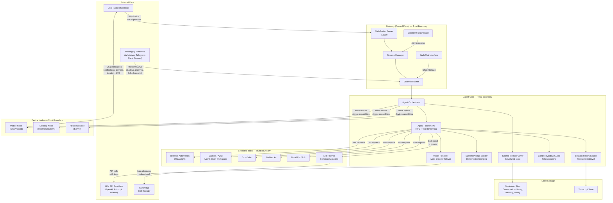

# Prompt: Generate Tachi Developer Guide

> **Usage**: Paste this entire document into a fresh Claude conversation. Provide no other instructions. Claude will produce the complete guide as output.

---

## Your Role

You are a technical writer creating a developer guide for **Tachi** — an open-source automated threat modeling toolkit. Your audience is **general developers who have never done threat modeling before**. They build software, they understand architecture, but they don't know STRIDE, OWASP, or how to assess security threats systematically.

Write in a practical, hands-on tone. Explain security concepts as you introduce them — don't assume prior knowledge. Use concrete examples, not abstract descriptions. Every section should answer "what do I do?" before "why does this matter?"

---

## What Tachi Is

Tachi is an automated threat modeling toolkit that extends the Microsoft STRIDE methodology with AI-specific threat agents. It analyzes architecture descriptions and produces structured security threat assessments.

**Key facts:**
- All components are markdown prompt files and YAML schemas — no runtime code, no dependencies
- Works with any LLM that accepts text prompts; this guide focuses on Claude Code integration
- Accepts 5 architecture input formats: ASCII diagrams, free-text prose, Mermaid, PlantUML, C4
- Produces a full threat modeling output suite: findings tables, SARIF for CI/CD, narrative reports, attack trees, and visual infographic specs
- Maps findings to OWASP frameworks: Top 10 Web 2025, LLM Top 10 v2025, Agentic Top 10, MCP Top 10
- Open source, Apache 2.0 licensed

**Repository**: https://github.com/davidmatousek/tachi

---

## Threat Modeling Methodology

### STRIDE (Traditional — 6 Categories)

STRIDE is Microsoft's threat classification framework. Each letter represents a category of security threat:

| Category | What It Means | Example |
|----------|--------------|---------|
| **S**poofing | Pretending to be someone/something else | Stolen API keys used to impersonate a service |
| **T**ampering | Unauthorized modification of data or code | SQL injection modifying database records |
| **R**epudiation | Denying an action occurred (no audit trail) | User performs destructive action with no logs |
| **I**nformation Disclosure | Exposing data to unauthorized parties | Error messages leaking stack traces |
| **D**enial of Service | Making a system unavailable | Flooding an API with requests |
| **E**levation of Privilege | Gaining unauthorized access levels | Regular user accessing admin endpoints |

Tachi uses **STRIDE-per-Element** dispatch — which STRIDE categories apply depends on what type of component is being analyzed:

| DFD Element Type | Applicable STRIDE Categories |
|------------------|------------------------------|
| External Entity | S, R |
| Process | S, T, R, I, D, E (all six) |
| Data Store | T, I, D |
| Data Flow | T, I, D |

### AI Extension (5 Additional Agents)

Tachi extends STRIDE with 5 AI-specific threat agents, organized into 2 output tables:

**Agentic (AG) — 2 agents:**
- **Agent Autonomy**: Risks from excessive autonomy, missing constraints, unintended actions. References OWASP ASI-01.
- **Tool Abuse**: Misuse of tool access, privilege escalation through tools. References OWASP MCP-03.

**LLM — 3 agents:**
- **Prompt Injection**: Direct/indirect injection, jailbreaking, system prompt extraction. References OWASP LLM01:2025.
- **Data Poisoning**: Training data manipulation, RAG tampering. References OWASP LLM03:2025.
- **Model Theft**: Model extraction, architecture inference. References OWASP LLM10:2025.

**AI agents activate based on keywords** in the architecture description:
- LLM keywords: "LLM", "model", "GPT", "Claude", "language model", "completion", "chat", "inference", "prompt", "generative AI"
- Agentic keywords: "agent", "autonomous", "orchestrator", "MCP server", "tool server", "plugin"
- A component matching both sets triggers both AG and LLM agents (dual-dispatch)

### Cross-Agent Correlation

Tachi detects overlapping threats from different agents on the same component using 5 deterministic correlation rules:

| Rule | Agents Correlated | Overlap Theme |
|------|-------------------|---------------|
| CR-1 | Tampering + Data-Poisoning | Data integrity |
| CR-2 | Privilege-Escalation + Agent-Autonomy | Excessive permissions |
| CR-3 | Info-Disclosure + Prompt-Injection | Information leakage |
| CR-4 | Repudiation + Agent-Autonomy | Accountability gaps |
| CR-5 | Denial-of-Service + Tool-Abuse | Resource exhaustion |

### Risk Rating

Findings are rated using the OWASP 3x3 Risk Matrix (Likelihood x Impact):

```
                LOW Likelihood   MEDIUM Likelihood   HIGH Likelihood
HIGH Impact          Medium            High              Critical
MEDIUM Impact        Low               Medium            High
LOW Impact           Note              Low               Medium
```

Risk levels: Critical > High > Medium > Low > Note (informational).

---

## The 14 Agents

Tachi uses 14 markdown-based agents, coordinated by a central orchestrator:

| # | File | Agent | Role |
|---|------|-------|------|
| 0 | `orchestrator.md` | Orchestrator | Central coordinator — parses input, dispatches agents, assembles output |
| 1 | `spoofing.md` | STRIDE: Spoofing | Identity impersonation, auth bypass, session hijacking |
| 2 | `tampering.md` | STRIDE: Tampering | Data modification, input injection, supply chain attacks |
| 3 | `repudiation.md` | STRIDE: Repudiation | Missing audit trails, log tampering, timestamp manipulation |
| 4 | `info-disclosure.md` | STRIDE: Info Disclosure | Error message exposure, data leakage at rest/in transit |
| 5 | `denial-of-service.md` | STRIDE: Denial of Service | Resource exhaustion, algorithmic complexity, cascading failures |
| 6 | `privilege-escalation.md` | STRIDE: Elevation of Privilege | Broken access control, role escalation, multi-tenancy violations |
| 7 | `prompt-injection.md` | AI: Prompt Injection | Direct/indirect injection, jailbreaking, system prompt extraction |
| 8 | `data-poisoning.md` | AI: Data Poisoning | Training data manipulation, RAG index corruption |
| 9 | `model-theft.md` | AI: Model Theft | Model weight exfiltration, API-based extraction |
| 10 | `agent-autonomy.md` | AI: Agent Autonomy | Excessive autonomy, goal misalignment, cascading agent failures |
| 11 | `tool-abuse.md` | AI: Tool Abuse | Unauthorized tool invocation, capability escalation, parameter injection |
| 12 | `threat-report.md` | Report | Narrative report with executive summary, attack trees, remediation roadmap |
| 13 | `threat-infographic.md` | Infographic | Visual risk specification with 6-section structured data |

---

## Orchestrator Flow (6 Phases)

The orchestrator implements the OWASP four-step threat modeling methodology, extended with two reporting phases:

1. **Phase 1 — Scope**: Parse architecture input, auto-detect format, extract components, classify each as a DFD element type (External Entity, Process, Data Store, Data Flow), identify trust boundaries and boundary crossings.

2. **Phase 2 — Determine Threats**: Apply STRIDE-per-Element dispatch rules to determine which STRIDE agents analyze which components. Apply AI keyword dispatch rules to determine if AI agents should activate. Plan the dispatch sequence.

3. **Phase 3 — Determine Countermeasures**: Dispatch each component to its applicable agents. Collect structured findings (using the Finding IR schema: ID, component, threat, likelihood, impact, risk_level, mitigation, references). Validate all risk levels against the OWASP 3x3 matrix. Detect cross-agent correlations using the 5 deterministic rules.

4. **Phase 4 — Assess**: Generate the coverage matrix (components x threat categories), compute deduplicated risk summary counts, and produce the prioritized recommended actions list.

5. **Phase 5 — Report** (default-on): Generate a narrative threat report with executive summary, per-agent analysis, Mermaid attack trees for Critical/High findings, and a prioritized remediation roadmap.

**Post-pipeline commands**: After the 5-phase pipeline completes, run `/risk-score` for quantitative scoring, `/compensating-controls` for control analysis, and `/infographic` for visual risk diagrams (auto-detects richest data source).

---

## Output Artifacts (Full Suite)

Tachi produces the following files in a single analysis run:

### 1. `threats.md` — Primary Threat Model

A structured markdown document with YAML frontmatter and 7 required sections (plus Section 4a):

- **Frontmatter**: schema_version, date, input_format, classification
- **Section 1 — System Overview**: Components table, data flows table, technologies table
- **Section 2 — Trust Boundaries**: Trust zones table, boundary crossings table
- **Section 3 — STRIDE Findings**: 6 tables (one per STRIDE category), each row: ID, Component, Threat, Likelihood, Impact, Risk Level, Mitigation
- **Section 4 — AI Threat Findings**: 2 tables (AG and LLM), each row includes OWASP reference
- **Section 4a — Correlated Findings**: Cross-agent correlation groups with audit trail
- **Section 5 — Coverage Matrix**: Components (rows) x Threat Categories (columns), cells show finding counts
- **Section 6 — Risk Summary**: Aggregate severity counts using OWASP 3x3 matrix
- **Section 7 — Recommended Actions**: All findings sorted by risk level descending

Finding ID format: `S-1`, `T-2`, `R-1`, `I-3`, `D-1`, `E-2` (STRIDE); `AG-1`, `AG-2` (Agentic); `LLM-1`, `LLM-2` (LLM)

### 2. `threats.sarif` — Machine-Readable Findings

SARIF 2.1.0 JSON file containing the same findings, formatted for integration with:
- GitHub Code Scanning
- Azure DevOps
- VS Code SARIF Viewer
- Any SARIF-compatible CI/CD tool

Risk levels are mapped to CVSS scores for tool compatibility.

### 3. `threat-report.md` — Narrative Report

Executive-friendly narrative covering:
- Executive summary (for CISOs/boards)
- Per-agent threat analysis with cross-cutting themes
- Remediation roadmap with effort estimates

### 4. `attack-trees/` — Mermaid Attack Trees

One `.md` file per Critical/High finding, containing a Mermaid `flowchart TD` diagram showing:
- Attacker goal (root node)
- Sub-goals (intermediate nodes)
- Atomic attack steps (leaf nodes)

These are standalone files suitable for presentations and security reviews.

### 5. `threat-infographic-spec.md` — Visual Risk Specification

Structured data for infographic rendering with 6 sections:
- Executive summary, risk gauge, control effectiveness, attack surface map, remediation priority, compliance alignment

### 6. `threat-infographic.jpg` — Presentation Image

Generated via Google Gemini API. Presentation-ready infographic image.

**Gemini API key requirement**: The developer must have a Gemini API key. The guide must cover:
- Store the key in a `.env` file in the project root, add `.env` to `.gitignore`
- Restart VS Code after adding or changing the key (VS Code loads `.env` on startup)
- Never hardcode keys in source files, never commit keys to version control
- For CI/CD, use the platform's secrets management (GitHub Actions secrets, etc.)

---

## Input Formats (5 Supported)

Tachi auto-detects the input format. All formats require at least 1 identifiable component and 1 data flow/relationship.

**Priority 1 — ASCII**: Box-drawing characters (`+--+`, `|`), arrow indicators (`-->`)
**Priority 2 — Free-text**: Natural language prose describing components and relationships
**Priority 3 — Mermaid**: `flowchart`, `graph`, `sequenceDiagram` with `subgraph` trust boundaries
**Priority 4 — PlantUML**: `@startuml`/`@enduml` blocks
**Priority 5 — C4**: C4 model syntax with `Person`, `System`, `Container`, `Component`

Trust boundaries can be expressed as subgraphs (Mermaid), dashed lines (ASCII), section headers (free-text), or boundary declarations (PlantUML/C4).

---

## Claude Code Installation

From the user's project root:

```bash
# Clone tachi as a sibling project (one-time, reuse across projects)
git clone https://github.com/davidmatousek/tachi.git ~/Projects/tachi

# Copy agents + templates into your project's Claude Code agents directory
cp -r ~/Projects/tachi/adapters/claude-code/agents/ .claude/agents/tachi/

# Copy the /threat-model command for single-command invocation
mkdir -p .claude/commands
cp ~/Projects/tachi/adapters/claude-code/commands/threat-model.md .claude/commands/

# Verify installation
ls .claude/agents/tachi/              # Should show 14 .md files + templates/ directory
ls .claude/agents/tachi/templates/    # Should show infographic-corporate-white.md
ls .claude/commands/                   # Should show threat-model.md
```

This installs three things:
1. **14 agent files** in `.claude/agents/tachi/` — Claude Code auto-discovers these as dispatchable agents
2. **Infographic templates** in `.claude/agents/tachi/templates/` — design templates for Gemini image generation (default: `corporate-white`)
3. **`/threat-model` command** in `.claude/commands/` — single slash command to run analysis

**Additional setup for infographic image generation:**

You need a Google Gemini API key. There are two ways to configure it:

```bash
# Option 1 (recommended): Add to your shell profile
# This makes the key available to all tools, all sessions, permanently.
echo 'export GEMINI_API_KEY="your-key-here"' >> ~/.zshrc
source ~/.zshrc
```

```bash
# Option 2: Add to a project .env file
# Keeps the key scoped to this project. Requires the /threat-model command.
echo "GEMINI_API_KEY=your-key-here" >> .env
echo ".env" >> .gitignore
```

**After adding to `.env`**: Restart VS Code for it to pick up the new environment variable. VS Code loads `.env` into its integrated terminal on startup, so a restart is required after adding or changing keys.

No npm install or other dependencies required beyond Claude Code and the Gemini API key.

**Updating tachi** — when tachi releases new agent versions, re-run the `cp` commands from your local tachi clone after pulling updates:
```bash
cd ~/Projects/tachi && git pull
cp -r adapters/claude-code/agents/ ~/Projects/my-app/.claude/agents/tachi/
cp adapters/claude-code/commands/threat-model.md ~/Projects/my-app/.claude/commands/
```

**Custom infographic templates are preserved** — the `cp -r` overwrites the default template but won't delete custom templates you've added to `.claude/agents/tachi/templates/`.

Tachi serves multiple projects — clone once, copy adapters into each project that needs threat modeling.

---

## Two Integration Paths

### Path A: Standalone (Any Project)

For developers using any orchestration tool, framework, or development process. You install Tachi's Claude Code adapter into your existing project and run threat analysis on demand.

**The workflow:**
1. Install the adapter (copy 14 agent files + command into your project)
2. Have an architecture description (existing doc, diagram, or write one)
3. Run `/threat-model` in Claude Code
4. Review the output artifacts

**Invocation — the `/threat-model` command:**

The adapter includes a `/threat-model` command that wraps the entire analysis workflow:

```bash
# Minimal — uses defaults (docs/security/architecture.md → docs/security/)
/threat-model

# Specify architecture file
/threat-model path/to/my-architecture.md

# Version-tagged output for a release
/threat-model docs/security/architecture.md --version v1.0.0

# Custom output directory
/threat-model docs/security/architecture.md --output-dir reports/security/

# Both version and custom base directory
/threat-model docs/security/architecture.md --output-dir reports/security/ --version v2.0.0
```

The command validates prerequisites (agents installed, architecture file exists, Gemini key status), invokes the `tachi-orchestrator` agent, and reports a summary with risk counts and next steps.

**Invocation — natural language (alternative):**

You can also invoke the orchestrator directly without the command:
```
Analyze the architecture in docs/architecture.md for security threats using the tachi orchestrator agent. Write all outputs to docs/security/
```

**Per-release versioning:**

For projects that ship releases, use the `--version` flag to maintain a threat model per version:

```
docs/security/
├── architecture.md        ← You maintain this (update when architecture changes)
├── v0.9.0/                ← /threat-model --version v0.9.0
│   ├── threats.md
│   ├── threats.sarif
│   ├── threat-report.md
│   ├── attack-trees/
│   ├── threat-infographic-spec.md
│   └── threat-infographic.jpg
├── v1.0.0/                ← /threat-model --version v1.0.0
│   └── ...
└── v1.1.0/
    └── ...
```

Compare `threats.md` across versions to track which threats are new, resolved, or still open. Diff coverage matrices and risk summaries to measure security posture over time.

### Path B: AOD Lifecycle Integration

For teams using Tachi's Agentic-Oriented Development (AOD) governance framework. Threat modeling is integrated into the governed development lifecycle.

**The workflow:**
1. `/aod.define` — Create PRD with Triad governance (PM + Architect + Team-Lead sign-offs)
2. `/aod.plan` — Create spec, architecture plan, and tasks (architecture is defined in `plan.md`)
3. After `plan.md` is approved, run threat analysis on the architecture defined in the plan
4. `/aod.build` — Execute implementation (includes `/security` scan step)
5. `/aod.deliver` — Close feature with documentation updates

**Where threat modeling fits:**
- After `/aod.plan` produces an approved `plan.md` with architecture documentation
- The architecture section of `plan.md` becomes the input for Tachi's threat analysis
- Run analysis before `/aod.build` to identify security requirements before implementation begins
- Findings feed into task planning — security mitigations become implementation tasks

**Invocation in AOD context:**
```bash
# Using the /threat-model command
/threat-model .aod/plan.md --output-dir .aod/security/

# Or with natural language
Run tachi threat analysis on the architecture defined in .aod/plan.md. Write outputs to .aod/security/
```

When `/aod.deliver` archives the feature to `specs/NNN-feature/`, the `security/` folder is preserved alongside `spec.md`, `plan.md`, and `tasks.md` — giving each feature a permanent threat model record.

---

## Worked Example: OpenClaw

The guide must include a complete worked example using **OpenClaw** — a real, public, open-source AI agent platform (https://github.com/openclaw/openclaw, MIT license, 200K+ GitHub stars).

### Why OpenClaw Is a Perfect Example

OpenClaw is an autonomous AI agent that runs locally and connects through messaging platforms (WhatsApp, Telegram, Slack, Discord, etc.). Its architecture triggers **both STRIDE and AI threat agents**, demonstrating Tachi's full capability:

- **Traditional infrastructure** (Gateway, WebSocket transport, messaging integrations) → triggers all 6 STRIDE agents
- **LLM integration** (multi-provider model resolution, system prompt building, context window management) → triggers all 3 LLM agents
- **Agentic system** (orchestrator, specialized agents, tool dispatch, skill registry) → triggers both AG agents
- **Known security issues** (~10.8% of community Skills were found to be malicious) → real-world validation of findings

### OpenClaw Architecture Description (Use as Input)

Include this architecture description in the guide as the example input. It should be presented in **Mermaid format** for clarity:



### What the Guide Should Show for OpenClaw

Walk through the analysis step by step:

1. **Show the input** — the Mermaid architecture above
2. **Explain what Tachi sees** — components classified as DFD elements, trust boundaries identified, AI keywords detected
3. **Show which agents activate** — all 6 STRIDE agents (traditional infrastructure) + all 5 AI agents (LLM providers, agent orchestrator, tool dispatch, skill runner)
4. **Highlight key expected findings** (these are illustrative — show the kind of findings, not exact wording):
   - **S-1 (Spoofing)**: Device identity challenge-response could be bypassed if signing keys are compromised
   - **T-1 (Tampering)**: Markdown files storing conversation history and config could be modified by malicious skills
   - **I-1 (Info Disclosure)**: API keys for LLM providers stored in config could be exposed to community skills
   - **E-1 (Privilege Escalation)**: Skill Runner executes community plugins with same permissions as core agent
   - **LLM-1 (Prompt Injection)**: System Prompt Builder dynamically merges tool descriptions — malicious tool descriptions could inject prompts
   - **AG-1 (Agent Autonomy)**: Agent Orchestrator dispatches to Device Nodes with TCC permissions (camera, location, SMS) — insufficient constraints on autonomous actions
   - **AG-2 (Tool Abuse)**: ClawhHub auto-discovery downloads and installs community skills without verification — known 10.8% malicious rate
   - **CR-2 (Correlation)**: Privilege-Escalation (E-1 on SkillRunner) + Agent-Autonomy (AG-1 on Orchestrator) → combined excessive permissions risk
5. **Show the output files** — snippets from threats.md (coverage matrix, risk summary), the SARIF structure, an attack tree for a Critical finding, and the report executive summary
6. **Show the "so what"** — how a developer reads the output and decides what to fix first

---

## Guide Structure Specification

Produce a single markdown document with two major parts:

### Part 1: Quick Start (target: 2 pages / ~800 words)

Get a developer from zero to their first threat model in 5 steps. No theory — just do it.

**Structure:**
1. **Prerequisites**: Claude Code installed, a Gemini API key stored as `GEMINI_API_KEY` environment variable (for infographic generation), a project with architecture docs (or create a simple one)
2. **Install Tachi**: Clone tachi, copy agents + command (`cp` commands from installation section)
3. **Verify**: `ls .claude/agents/tachi/` shows 14 files, `ls .claude/commands/` shows `threat-model.md`
4. **Create Your Architecture File**: Create `docs/security/architecture.md` with a simple 3-component architecture as the minimal example (e.g., a React frontend, a Node.js API, and a PostgreSQL database — show the Mermaid diagram)
5. **Run Your First Analysis**: `/threat-model` — that's it, one command
6. **Read Your Results**: Where to find `threats.md`, what the key sections mean, what to do first (look at Critical/High findings in Section 7)

End the Quick Start with: "For the full worked example using OpenClaw, understanding all threat categories, and integrating Tachi into your development lifecycle, continue to the Comprehensive Guide below."

### Part 2: Comprehensive Guide (target: 12-15 pages)

**Section 1 — What Is Threat Modeling? (And Why Should You Care?)**
- Explain threat modeling for beginners: "systematically finding security weaknesses before attackers do"
- Why developers (not just security teams) should do it
- The cost of finding issues early vs. in production
- What STRIDE is and why it's the industry standard
- What AI-specific threats are and why traditional STRIDE isn't enough for modern AI applications

**Section 2 — Understanding Tachi's Threat Categories**
- Walk through all 11 threat categories (6 STRIDE + 5 AI) with beginner-friendly explanations
- For each category: what it means, a real-world example, what a finding looks like
- Explain the AI dispatch rules: how Tachi decides whether to run AI agents based on architecture keywords
- Explain cross-agent correlation: how Tachi detects overlapping threats

**Section 3 — Describing Your Architecture**
- How to write an architecture description Tachi can analyze
- Walk through each of the 5 input formats with examples
- Best practices: what makes a good architecture description (include components, data flows, trust boundaries, technologies)
- Common mistakes: too vague ("we have a web app"), missing data flows, forgetting trust boundaries
- Recommend Mermaid as the default format for most teams

**Section 4 — Worked Example: OpenClaw**
- Full end-to-end walkthrough using the OpenClaw architecture
- Step 1: The architecture input (Mermaid diagram)
- Step 2: What Tachi identifies (components, DFD types, trust zones, AI keywords)
- Step 3: Which agents activate and why
- Step 4: Key findings walkthrough (show representative findings from each category that fires)
- Step 5: Reading the coverage matrix
- Step 6: Understanding the risk summary
- Step 7: The recommended actions list — how to prioritize
- Step 8: The SARIF output — how to plug into CI/CD
- Step 9: The narrative report — how to share with stakeholders
- Step 10: Attack trees — how to use them in security reviews
- Include actual output snippets (threats.md excerpts, a sample attack tree, coverage matrix)

**Section 5 — Integration Path A: Standalone (Any Project)**
- Detailed installation walkthrough (agents + `/threat-model` command)
- Using `/threat-model` — all flag combinations with examples
- Per-release versioning workflow (`--version v1.0.0`)
- Maintaining `architecture.md` — when and how to update it
- Comparing threat models across versions (delta tracking)
- How to integrate SARIF output into GitHub Code Scanning
- How to use the narrative report for stakeholder communication
- How to use attack trees in security review meetings
- Tips for teams: who reviews the threat model, how often to re-run

**Section 6 — Integration Path B: AOD Lifecycle**
- What AOD is (brief — this isn't an AOD tutorial)
- Where threat modeling fits in the AOD lifecycle (after `plan.md` approval, before `build`)
- Using `/threat-model .aod/plan.md --output-dir .aod/security/`
- How findings become implementation tasks
- How the `/security` build step complements threat modeling (SAST/SCA vs threat modeling)
- The governance connection: threat model review as part of Architect sign-off
- How `/aod.deliver` archives threat models alongside feature specs

**Section 7 — Reading and Acting on Your Threat Model**
- How to read `threats.md` section by section
- How to prioritize: Critical first, then High, then Medium
- How to turn findings into action items (each finding has a mitigation — implement it)
- How to track remediation progress
- How to decide what's acceptable risk vs. must-fix
- Common patterns: what most projects get wrong

**Section 8 — Advanced Topics**
- Customizing input: adding detail to get better findings
- Re-running analysis as your architecture evolves
- Comparing threat models across versions
- Using SARIF in CI/CD pipelines (GitHub Actions example)
- Generating infographics with Gemini API (secure key storage, environment variables, CI/CD secrets management)
- Running analysis on different architecture types (traditional web, microservices, agentic AI)

**Section 9 — Troubleshooting & FAQ**
- "I got no AI findings" → Your architecture description doesn't contain AI keywords. Add component descriptions that mention LLM, agent, model, etc.
- "The threat model is too generic" → Add more detail to your architecture: specific technologies, data flows, trust boundaries
- "How often should I re-run?" → When architecture changes. At minimum, before major releases.
- "Can I use this with Cursor/Copilot instead of Claude Code?" → Yes, Tachi has adapters for Cursor, Copilot, GitHub Actions, and a generic adapter for any LLM. See the adapters/ directory.
- "Is this a replacement for penetration testing?" → No. Threat modeling finds design-level issues; pentesting finds implementation-level issues. Do both.

**Appendix A — OWASP Framework Reference**
- Brief descriptions of the 4 OWASP frameworks Tachi maps to:
  - OWASP Top 10 Web Application Security Risks 2025
  - OWASP Top 10 for LLM Applications v2025
  - OWASP Agentic AI Security Initiative Top 10 2026
  - OWASP MCP Top 10 2025
- How finding IDs map to OWASP references (e.g., LLM-1 → OWASP LLM01:2025)

**Appendix B — Output File Reference**
- Complete specification of each output file (threats.md structure, SARIF schema, report sections, attack tree format, infographic sections)
- Finding IR schema (11 fields with types and allowed values)

**Appendix C — Glossary**
- DFD (Data Flow Diagram), STRIDE, OWASP, SARIF, CVE, CWE, CVSS, Trust Boundary, Finding IR, Risk Matrix, Attack Tree — one-line definitions

---

## Writing Guidelines

1. **Beginner-friendly**: Define every acronym on first use. Explain security concepts as you introduce them. Never assume the reader knows STRIDE, OWASP, DFD, SARIF, or any security terminology.

2. **Practical over theoretical**: Lead with "here's how to do it" — then explain why. Include copy-pasteable commands and prompts.

3. **Accurate to Tachi**: Use the exact agent names, file names, output section numbers, and finding ID formats specified in this prompt. Don't invent features that don't exist.

4. **Real examples**: The OpenClaw walkthrough should feel like a real analysis, not a hypothetical exercise. Show realistic findings, realistic risk levels, realistic mitigations.

5. **Show, don't tell**: Include output snippets — excerpts from `threats.md`, a sample attack tree in Mermaid, a snippet of the coverage matrix, a few lines of the SARIF output. Don't just describe what the output looks like — show it.

6. **Two-track awareness**: Throughout the guide, acknowledge both standalone and AOD integration paths. A developer using OpenClaw (standalone) and a developer using AOD should both feel the guide speaks to them.

7. **No emojis**. Use standard markdown formatting. Professional tone, but not dry — conversational where it helps comprehension.

8. **Length discipline**: Quick Start must stay under 2 pages. Comprehensive Guide sections should be thorough but not padded. If a section doesn't add actionable value, cut it.

---

## Deliverable

Produce the complete guide as a single markdown document. Title it:

**"Tachi Developer Guide: Automated Threat Modeling for Your Architecture"**

Start with the Quick Start. Follow with the Comprehensive Guide. Include all appendices.
