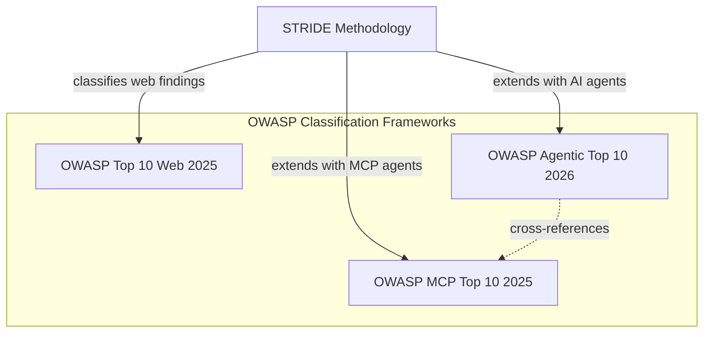

# Examples

Example architecture inputs and their corresponding threat model outputs. These serve as reference implementations for users evaluating tachi and as test fixtures for validating agent behavior.

## Standardized Examples

Three polished examples demonstrate tachi's threat modeling capabilities across different architecture types. Each example pairs a Mermaid architecture diagram (`architecture.md`) with a complete schema v1.1 threat model output (`threats.md`).

| Example | Architecture | Components | Key Demonstration |
|---------|-------------|------------|-------------------|
| [`web-app/`](web-app/) | Traditional multi-tier web application | 6 (CDN, API Gateway, Auth Service, Session Store, User Database) | Baseline STRIDE output with correctly empty AI sections |
| [`agentic-app/`](agentic-app/) | Agentic AI application with LLM and MCP | 7 (Guardrails, LLM Orchestrator, MCP Tool Server, Knowledge Base, Audit Logger) | STRIDE + AI findings, correlated findings, dual-dispatch |
| [`microservices/`](microservices/) | E-commerce microservices platform | 10 (API Gateway, Order/Payment/Notification Services, Message Queue, Databases) | Cross-service threat analysis at scale |

## Framework Relationship Hierarchy

STRIDE is the base threat modeling methodology. OWASP frameworks provide classification overlays that map findings to industry-recognized vulnerability categories.



**How they relate:**
- **STRIDE** (Spoofing, Tampering, Repudiation, Information Disclosure, Denial of Service, Elevation of Privilege) is applied to every component via STRIDE-per-Element dispatch rules
- **OWASP Top 10 Web 2025** (A01–A10) classifies STRIDE findings against web vulnerability categories
- **OWASP Agentic Top 10 2026** (ASI01–ASI10) classifies AI agent-specific findings (agent autonomy, tool abuse)
- **OWASP MCP Top 10 2025** (MCP01–MCP10) classifies MCP/LLM-specific findings (prompt injection, data poisoning)

## Example-to-Framework Mapping

| Example | STRIDE | OWASP Web 2025 | OWASP Agentic 2026 | OWASP MCP 2025 | AI Sections |
|---------|--------|----------------|---------------------|----------------|-------------|
| `web-app` | All 6 categories | A01–A10 (8 mapped) | n/a | n/a | Empty (no AI components) |
| `agentic-app` | All 6 categories | A01–A10 (8 mapped) | ASI01–ASI10 (3 mapped) | MCP01–MCP10 (3 mapped) | Populated (AG + LLM + correlations) |
| `microservices` | All 6 categories | A01–A10 (8 mapped) | n/a | n/a | Empty (no AI components) |

## Usage Instructions

### Browse Examples

Open any example's `architecture.md` to see the input diagram and `threats.md` to see the complete threat model output. GitHub renders Mermaid diagrams automatically.

### Sample Report

The [`agentic-app/sample-report/`](agentic-app/sample-report/) directory contains the complete output from running tachi against the agentic-app architecture. This shows every artifact the pipeline produces:

| File | Description |
|------|-------------|
| `threats.md` | Structured threat model with findings, coverage matrix, and risk summary |
| `threats.sarif` | SARIF 2.1.0 for GitHub Code Scanning integration |
| `threat-report.md` | Narrative report with executive summary and remediation roadmap |
| `attack-trees/` | 27 Mermaid attack trees for Critical and High findings |
| `threat-baseball-card.jpg` | Risk summary dashboard infographic |
| `threat-system-architecture.jpg` | Annotated architecture diagram with attack surface badges |

**Risk Summary Dashboard:**


**Annotated Architecture:**


### Compare with Your Own Results

Run tachi against an example's `architecture.md` and compare the output with the reference `threats.md`:

```bash
# Analyze the web-app example
tachi analyze examples/web-app/architecture.md

# Compare your output with the reference
diff examples/web-app/threats.md output/threats.md
```

### Use as Templates

Copy an example directory and replace the architecture diagram with your own system:

```bash
cp -r examples/web-app my-project
# Edit my-project/architecture.md with your architecture
tachi analyze my-project/architecture.md
```

## Format-Specific Test Fixtures

Three additional examples validate tachi's input format handling. These are retained as test fixtures and use the older schema v1.0 format:

| Example | Input Format | Purpose |
|---------|-------------|---------|
| [`ascii-web-api/`](ascii-web-api/) | ASCII box-drawing | Validates ASCII diagram parsing |
| [`free-text-microservice/`](free-text-microservice/) | Free-text prose | Validates natural language input |
| [`mermaid-agentic-app/`](mermaid-agentic-app/) | Mermaid flowchart | Validates Mermaid parsing with AI dispatch |
