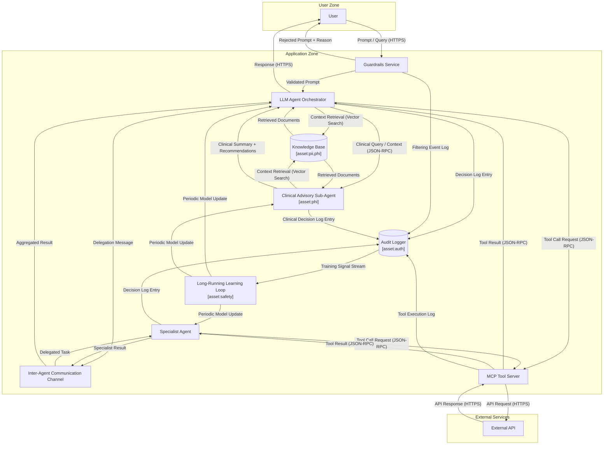

# Agentic AI Application — Architecture with Asset-Sensitivity Tags

Worked example for [Issue #260](https://github.com/davidmatousek/tachi/issues/260) — the asset-sensitivity tag prototype. This file is a copy of `architecture.md` with `[asset:tag1,tag2]` annotations added to the components that store or process high-value data. The risk-scorer's Section 3.5 modifier pass (see `.claude/skills/tachi-risk-scoring/references/asset-modifiers.md`) consumes these annotations to elevate CVSS impact bits on findings whose target component carries asset tags.

> **Status**: prototype demonstration. The canonical `architecture.md` is unchanged so existing byte-identical baselines under `SOURCE_DATE_EPOCH=1700000000` continue to pass. To exercise the modifier pipeline against this variant, run `/tachi.threat-model examples/agentic-app/architecture-with-asset-tags.md` followed by `/tachi.risk-score`.

format: mermaid



## Asset Annotations

| Component | Tags | Rationale |
|-----------|------|-----------|
| Knowledge Base | `pii, phi` | Stores user prompts, conversation history, and retrieved clinical documents — both PII and PHI. |
| Audit Logger | `auth` | Holds authentication artifacts and decision logs that double as session-replay material. |
| Long-Running Learning Loop | `safety` | Periodic-update path into the production model; corruption here propagates to every downstream agent decision. |
| Clinical Advisory Sub-Agent | `phi` | Generates clinical summaries grounded in PHI retrieved from the knowledge base. |

The remaining components (Guardrails Service, Orchestrator, Specialist Agent, Channel, MCP Tool Server, External API) carry no tags — they preserve the existing scoring behavior exactly.

## Expected Modifier Effect

Findings whose target component carries asset tags receive CVSS impact-bit elevation per `.claude/skills/tachi-risk-scoring/references/asset-modifiers.md`. CVSS values below are computed from the category-default vectors in `schemas/risk-scoring.yaml` using the standard CVSS 3.1 base-score formula.

| Finding shape | Component | Tags | cvss_base before | cvss_base after | Composite delta (x0.35) |
|---------------|-----------|------|------------------|-----------------|-------------------------|
| Tampering on Knowledge Base | KB | `pii, phi` | `C:N/I:H/A:L` -> 7.1 | `C:H/I:H/A:L` -> 8.3 | +0.42 |
| Repudiation on Audit Logger | AuditLog | `auth` | `C:N/I:L/A:N` -> 4.3 | `C:H/I:H/A:N` -> 8.1 | +1.33 |
| Tampering on Long-Running Learning Loop | LearningLoop | `safety` | `C:N/I:H/A:L` -> 7.1 | `C:N/I:H/A:H` -> 8.1 | +0.35 |
| Info-disclosure on Knowledge Base | KB | `pii, phi` | `C:H/I:N/A:N` -> 6.5 | `C:H/I:N/A:N` -> 6.5 | 0 (no-op) |

Severity bands are computed from the four-dimensional composite (`0.35*CVSS + 0.30*Exploitability + 0.15*Scalability + 0.20*Reachability`), not from `cvss_base` alone, so a CVSS bump translates to a smaller composite delta. The most dramatic case is the repudiation row: `auth` forces both `C:H` and `I:H`, lifting `cvss_base` by 3.8 points and the composite by ~1.3 — enough to cross the Medium -> High band threshold on borderline findings.

The "no-op" row is the key correctness check — modifiers are floor-only and never lower a category default. Info-disclosure already treats confidentiality as the dominant axis, so the `pii`/`phi` tags add nothing on that finding shape; they only matter when the dominant axis differs (e.g., tampering's `I:H` baseline gains `C:H` from PII).

## How to Reproduce

```bash
# Generate threats + risk scores against the asset-tagged variant
/tachi.threat-model examples/agentic-app/architecture-with-asset-tags.md
/tachi.risk-score docs/security/<run-timestamp>/

# Compare against the canonical baseline
diff examples/agentic-app/sample-report/risk-scores.md docs/security/<run-timestamp>/risk-scores.md
```

Findings on tagged components should show elevated `cvss_base` values and (for borderline cases) crossed severity-band thresholds. The dimensional breakdown narrative (`risk-scores.md` Section 9d) records the original (pre-modifier) score so the elevation is auditable.
