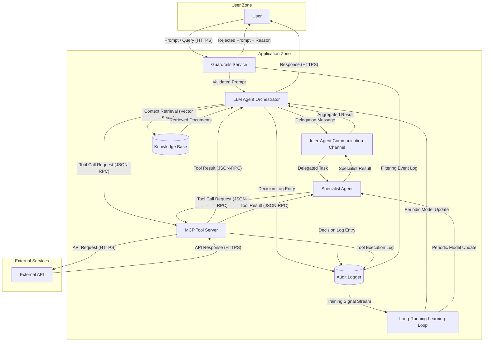

# Agentic AI Application — Architecture

Example architecture input for a multi-agent AI application with trust boundaries, guardrails, audit logging, and a long-running learning loop. This diagram demonstrates both LLM and Agentic (AG) dispatch triggers for AI-specific threat analysis and exercises the Feature 142 Phase 3.6 pattern synthesis engine by providing a supervisor-plus-specialist delegation topology over an inter-agent communication channel. The LLM Agent Orchestrator triggers dual-dispatch (LLM + AG keywords), the Specialist Agent triggers dual-dispatch (LLM + AG keywords), and the MCP Tool Server triggers AG dispatch independently. Additional components (Guardrails Service, Audit Logger, Inter-Agent Communication Channel, Long-Running Learning Loop) enrich the threat surface for STRIDE analysis and the six CSA MAESTRO cross-cutting agentic patterns (Agent Collusion, Emergent Behavior, Temporal Attacks, Trust Exploitation, Communication Vulnerabilities, Resource Competition).

format: mermaid

## Component Summary

| Component | DFD Element Type | AI Dispatch Trigger |
|---|---|---|
| User | External Entity | None |
| Guardrails Service | Process | None |
| LLM Agent Orchestrator | Process | LLM ("LLM") + AG ("Agent", "Orchestrator") |
| Specialist Agent | Process | LLM ("LLM" inherited from delegation context) + AG ("Agent", "Specialist") |
| Inter-Agent Communication Channel | Process | AG ("Agent", "Inter-Agent") |
| MCP Tool Server | Process | AG ("MCP", "Tool Server") |
| Knowledge Base | Data Store | None |
| Audit Logger | Data Store | None |
| Long-Running Learning Loop | Process | LLM ("learning loop" training context) + AG ("Agent" model update recipients) |
| External API | External Entity | None |

## Expected Dispatch Behavior

- **LLM Agent Orchestrator**: Dual-dispatch. Matches LLM keyword "LLM" and AG keywords "Agent", "Orchestrator". Receives STRIDE (S,T,R,I,D,E) plus LLM agents (prompt-injection, data-poisoning, model-theft) plus AG agents (agent-autonomy, tool-abuse). Acts as the supervisor in the multi-agent delegation topology.
- **Specialist Agent**: Dual-dispatch. Matches AG keywords "Agent", "Specialist". Receives STRIDE (S,T,R,I,D,E) plus LLM agents (prompt-injection, data-poisoning, model-theft) plus AG agents (agent-autonomy, tool-abuse). Acts as the delegated worker in the supervisor-plus-specialist topology.
- **Inter-Agent Communication Channel**: AG dispatch. Matches AG keywords "Agent", "Inter-Agent". Receives STRIDE (S,T,R,I,D,E) plus AG agents (tool-abuse for messaging-substrate attacks). Exercises the CSA Communication Vulnerabilities pattern surface.
- **MCP Tool Server**: AG dispatch. Matches AG keywords "MCP" (from "MCP Tool Server") and "Tool Server". Receives STRIDE (S,T,R,I,D,E) plus AG agents (agent-autonomy, tool-abuse).
- **Long-Running Learning Loop**: Dual-dispatch. Matches LLM keyword "learning loop" and AG keywords "Agent" (recipients). Receives STRIDE (T,D,E) plus LLM agents (data-poisoning, model-theft) plus AG agents (agent-autonomy). Exercises the CSA Temporal Attacks pattern surface via delayed activation through the training cycle.
- **User**: Standard STRIDE only (S, R). External entity — no AI keywords.
- **Guardrails Service**: Standard STRIDE only (S, T, R, I, D, E). No AI keywords. Analyzes input filtering bypass, tampering with validation rules, and denial of service through resource exhaustion.
- **Knowledge Base**: Standard STRIDE only (T, I, D). Data store — no AI keywords.
- **Audit Logger**: Standard STRIDE only (T, I, D). Data store — no AI keywords. Analyzes log tampering, information disclosure through log exposure, and denial of service through log flooding.
- **External API**: Standard STRIDE only (S, R). External entity — no AI keywords.
