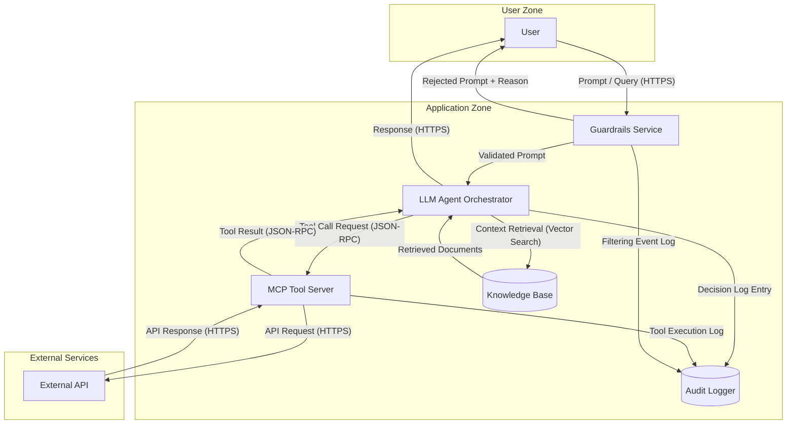

# Agentic AI Application — Architecture

Example architecture input for an agentic AI application with trust boundaries, guardrails, and audit logging. This diagram demonstrates both LLM and Agentic (AG) dispatch triggers for AI-specific threat analysis. The LLM Agent Orchestrator triggers dual-dispatch (LLM + AG keywords), while the MCP Tool Server triggers AG dispatch independently. Additional components (Guardrails Service, Audit Logger) enrich the threat surface for STRIDE analysis.

format: mermaid

## Component Summary

| Component | DFD Element Type | AI Dispatch Trigger |
|---|---|---|
| User | External Entity | None |
| Guardrails Service | Process | None |
| LLM Agent Orchestrator | Process | LLM ("LLM") + AG ("Agent", "Orchestrator") |
| MCP Tool Server | Process | AG ("MCP", "Tool Server") |
| Knowledge Base | Data Store | None |
| Audit Logger | Data Store | None |
| External API | External Entity | None |

## Expected Dispatch Behavior

- **LLM Agent Orchestrator**: Dual-dispatch. Matches LLM keyword "LLM" and AG keywords "Agent", "Orchestrator". Receives STRIDE (S,T,R,I,D,E) plus LLM agents (prompt-injection, data-poisoning, model-theft) plus AG agents (agent-autonomy, tool-abuse).
- **MCP Tool Server**: AG dispatch. Matches AG keywords "MCP" (from "MCP Tool Server") and "Tool Server". Receives STRIDE (S,T,R,I,D,E) plus AG agents (agent-autonomy, tool-abuse).
- **User**: Standard STRIDE only (S, R). External entity — no AI keywords.
- **Guardrails Service**: Standard STRIDE only (S, T, R, I, D, E). No AI keywords. Analyzes input filtering bypass, tampering with validation rules, and denial of service through resource exhaustion.
- **Knowledge Base**: Standard STRIDE only (T, I, D). Data store — no AI keywords.
- **Audit Logger**: Standard STRIDE only (T, I, D). Data store — no AI keywords. Analyzes log tampering, information disclosure through log exposure, and denial of service through log flooding.
- **External API**: Standard STRIDE only (S, R). External entity — no AI keywords.
