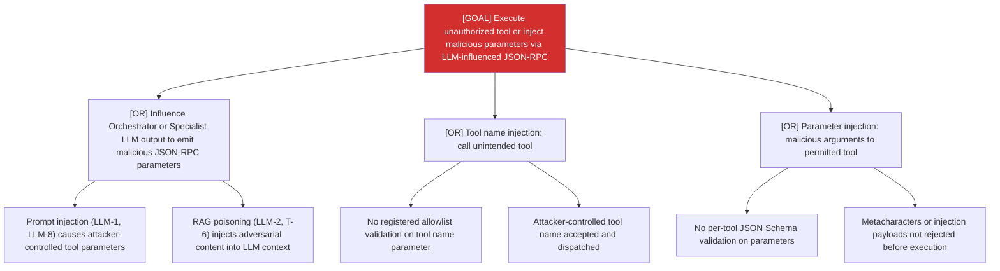

# Attack Tree: AG-5 — MCP Tool Server

**Risk Level**: Critical
**Component**: MCP Tool Server
**Threat**: Tool call injection via LLM-influenced JSON-RPC parameters

```mermaid
graph TD
    Goal["[GOAL] Execute unauthorized tool or inject malicious parameters via LLM-influenced JSON-RPC"]
    Goal --> A["[OR] Influence Orchestrator or Specialist LLM output to emit malicious JSON-RPC parameters"]
    A --> A1["Prompt injection (LLM-1, LLM-8) causes attacker-controlled tool parameters"]
    A --> A2["RAG poisoning (LLM-2, T-6) injects adversarial content into LLM context"]
    Goal --> B["[OR] Tool name injection: call unintended tool"]
    B --> B1["No registered allowlist validation on tool name parameter"]
    B --> B2["Attacker-controlled tool name accepted and dispatched"]
    Goal --> C["[OR] Parameter injection: malicious arguments to permitted tool"]
    C --> C1["No per-tool JSON Schema validation on parameters"]
    C --> C2["Metacharacters or injection payloads not rejected before execution"]
    classDef critical fill:#d32f2f,color:#fff
    class Goal critical
```
