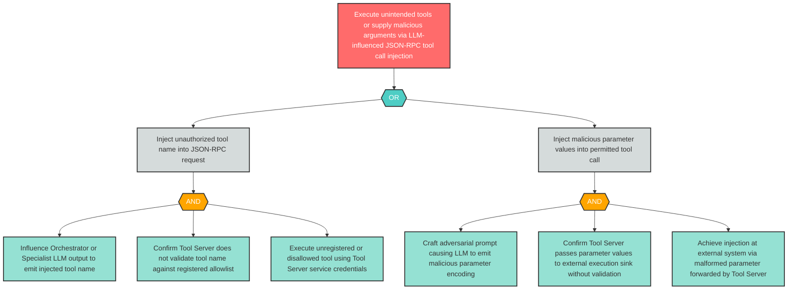

# Attack Tree: AG-5 — Tool Call Injection via LLM-Influenced JSON-RPC Parameters

**Finding ID**: AG-5
**Risk Level**: Critical
**Component**: MCP Tool Server
**Delta Status**: UNCHANGED

```mermaid
flowchart TD
    AG5_root["Execute unintended tools or supply malicious arguments via LLM-influenced JSON-RPC tool call injection"]
    AG5_or1{{"OR"}}
    AG5_sub1["Inject unauthorized tool name into JSON-RPC request"]
    AG5_sub2["Inject malicious parameter values into permitted tool call"]
    AG5_and1{{"AND"}}
    AG5_leaf1["Influence Orchestrator or Specialist LLM output to emit injected tool name"]
    AG5_leaf2["Confirm Tool Server does not validate tool name against registered allowlist"]
    AG5_leaf3["Execute unregistered or disallowed tool using Tool Server service credentials"]
    AG5_and2{{"AND"}}
    AG5_leaf4["Craft adversarial prompt causing LLM to emit malicious parameter encoding"]
    AG5_leaf5["Confirm Tool Server passes parameter values to external execution sink without validation"]
    AG5_leaf6["Achieve injection at external system via malformed parameter forwarded by Tool Server"]

    AG5_root --> AG5_or1
    AG5_or1 --> AG5_sub1
    AG5_or1 --> AG5_sub2
    AG5_sub1 --> AG5_and1
    AG5_and1 --> AG5_leaf1
    AG5_and1 --> AG5_leaf2
    AG5_and1 --> AG5_leaf3
    AG5_sub2 --> AG5_and2
    AG5_and2 --> AG5_leaf4
    AG5_and2 --> AG5_leaf5
    AG5_and2 --> AG5_leaf6

    classDef goal fill:#ff6b6b,stroke:#333,stroke-width:2px,color:#fff
    classDef andGate fill:#ffa500,stroke:#333,stroke-width:2px,color:#fff
    classDef orGate fill:#4ecdc4,stroke:#333,stroke-width:2px,color:#fff
    classDef subGoal fill:#d5dbdb,stroke:#333,stroke-width:2px,color:#333
    classDef leaf fill:#95e1d3,stroke:#333,stroke-width:2px,color:#333

    class AG5_root goal
    class AG5_or1 orGate
    class AG5_and1,AG5_and2 andGate
    class AG5_sub1,AG5_sub2 subGoal
    class AG5_leaf1,AG5_leaf2,AG5_leaf3,AG5_leaf4,AG5_leaf5,AG5_leaf6 leaf
```
