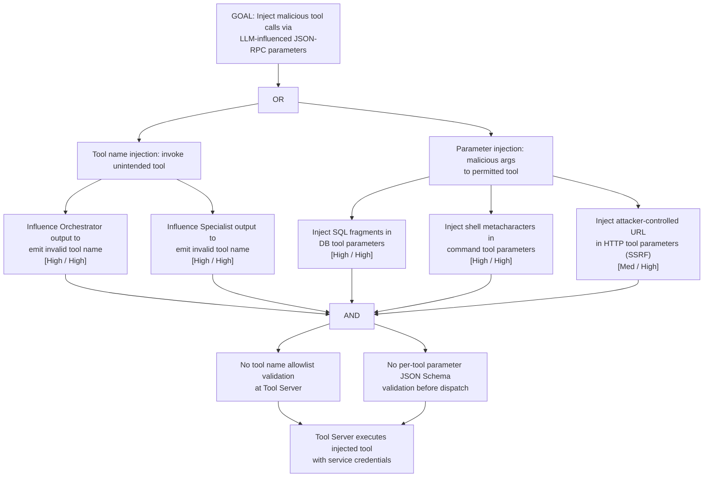

# Attack Tree: AG-5 — MCP Tool Server Tool Call Injection

**Chain-breaking control**: Implement strict tool call validation: (a) validate the tool name against a registered allowlist, (b) validate each parameter against a per-tool JSON Schema, (c) reject any request that fails validation before execution. Apply parameter encoding for values forwarded to external systems.
