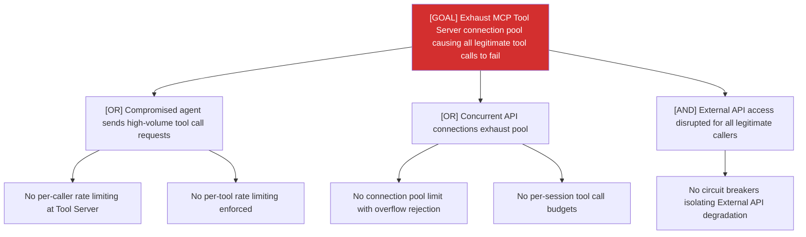

# Attack Tree: D-5 — MCP Tool Server

**Risk Level**: Critical
**Component**: MCP Tool Server
**Threat**: Connection pool exhaustion via high-volume tool call requests

```mermaid
graph TD
    Goal["[GOAL] Exhaust MCP Tool Server connection pool causing all legitimate tool calls to fail"]
    Goal --> A["[OR] Compromised agent sends high-volume tool call requests"]
    A --> A1["No per-caller rate limiting at Tool Server"]
    A --> A2["No per-tool rate limiting enforced"]
    Goal --> B["[OR] Concurrent API connections exhaust pool"]
    B --> B1["No connection pool limit with overflow rejection"]
    B --> B2["No per-session tool call budgets"]
    Goal --> C["[AND] External API access disrupted for all legitimate callers"]
    C --> C1["No circuit breakers isolating External API degradation"]
    classDef critical fill:#d32f2f,color:#fff
    class Goal critical
```
