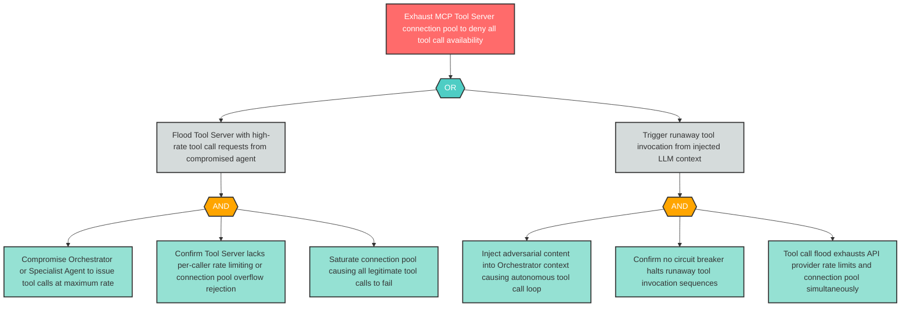

# Attack Tree: D-5 — MCP Tool Server Connection Pool Exhausted via High-Volume Tool Requests

**Finding ID**: D-5
**Risk Level**: Critical
**Component**: MCP Tool Server
**Delta Status**: UNCHANGED

