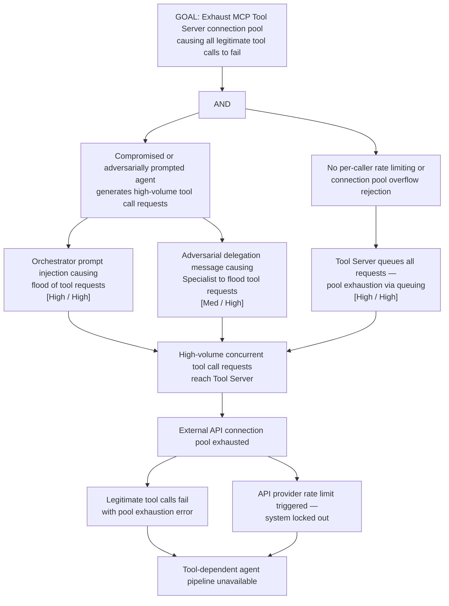

# Attack Tree: D-5 — MCP Tool Server Connection Pool Exhaustion

**Chain-breaking control**: Implement per-caller and per-tool rate limiting at the Tool Server. Enforce a connection pool limit with overflow rejection (not queuing) for requests exceeding the pool. Apply per-session tool call budgets. Use circuit breakers to isolate External API degradation.
