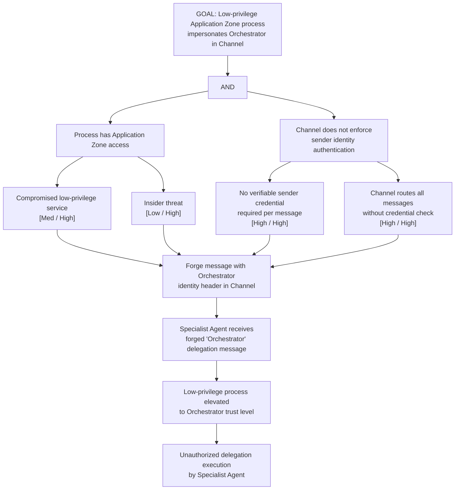

# Attack Tree: E-4 — Inter-Agent Channel Elevated Sender Identity Injection

**Chain-breaking control**: Enforce sender identity authentication at the Channel layer. All messages MUST carry a verifiable sender credential (signed token or mTLS certificate). The Channel MUST reject messages whose sender credentials cannot be verified before routing.
