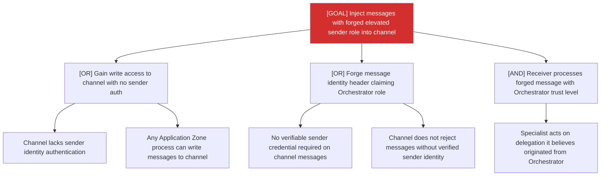

# Attack Tree: E-4 — Inter-Agent Communication Channel

**Risk Level**: Critical
**Component**: Inter-Agent Communication Channel
**Threat**: Forged sender identity injects messages with elevated trust level

