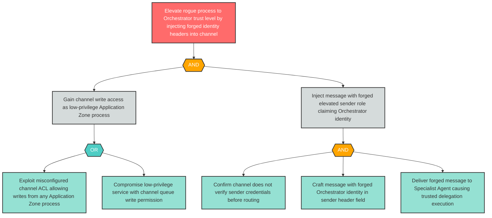

# Attack Tree: E-4 — Forged Elevated Sender Identity Injected into Inter-Agent Channel

**Finding ID**: E-4
**Risk Level**: Critical
**Component**: Inter-Agent Communication Channel
**Delta Status**: UNCHANGED

