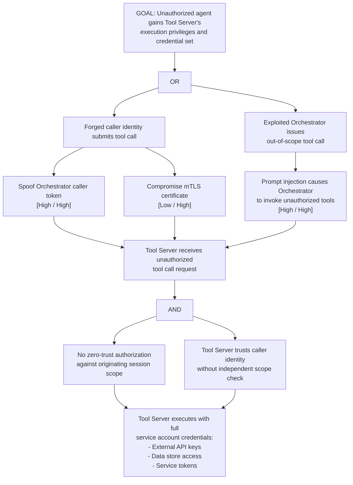

# Attack Tree: E-5 — MCP Tool Server Credential Privilege Escalation

**Chain-breaking control**: Implement zero-trust authorization at the Tool Server: each tool invocation MUST be authorized against the originating session's scope, independent of the caller's identity. Apply the principle of least-privilege for tool execution: tool-specific service accounts with minimum necessary external permissions.
