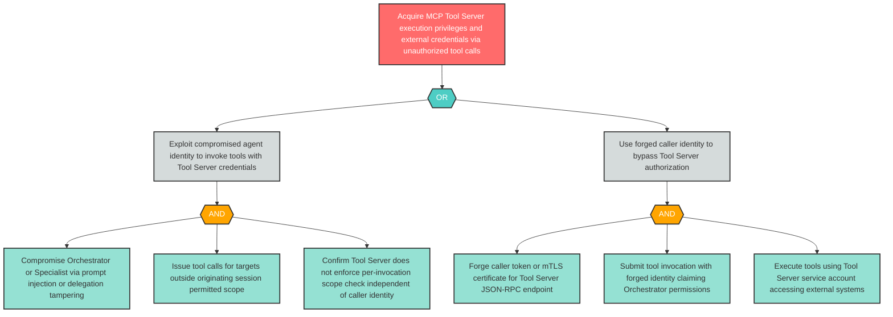

# Attack Tree: E-5 — Unauthorized Tool Calls Gain MCP Tool Server Execution Privileges

**Finding ID**: E-5
**Risk Level**: Critical
**Component**: MCP Tool Server
**Delta Status**: UNCHANGED

```mermaid
flowchart TD
    E5_root["Acquire MCP Tool Server execution privileges and external credentials via unauthorized tool calls"]
    E5_or1{{"OR"}}
    E5_sub1["Exploit compromised agent identity to invoke tools with Tool Server credentials"]
    E5_sub2["Use forged caller identity to bypass Tool Server authorization"]
    E5_and1{{"AND"}}
    E5_leaf1["Compromise Orchestrator or Specialist via prompt injection or delegation tampering"]
    E5_leaf2["Issue tool calls for targets outside originating session permitted scope"]
    E5_leaf3["Confirm Tool Server does not enforce per-invocation scope check independent of caller identity"]
    E5_and2{{"AND"}}
    E5_leaf4["Forge caller token or mTLS certificate for Tool Server JSON-RPC endpoint"]
    E5_leaf5["Submit tool invocation with forged identity claiming Orchestrator permissions"]
    E5_leaf6["Execute tools using Tool Server service account accessing external systems"]

    E5_root --> E5_or1
    E5_or1 --> E5_sub1
    E5_or1 --> E5_sub2
    E5_sub1 --> E5_and1
    E5_and1 --> E5_leaf1
    E5_and1 --> E5_leaf2
    E5_and1 --> E5_leaf3
    E5_sub2 --> E5_and2
    E5_and2 --> E5_leaf4
    E5_and2 --> E5_leaf5
    E5_and2 --> E5_leaf6

    classDef goal fill:#ff6b6b,stroke:#333,stroke-width:2px,color:#fff
    classDef andGate fill:#ffa500,stroke:#333,stroke-width:2px,color:#fff
    classDef orGate fill:#4ecdc4,stroke:#333,stroke-width:2px,color:#fff
    classDef subGoal fill:#d5dbdb,stroke:#333,stroke-width:2px,color:#333
    classDef leaf fill:#95e1d3,stroke:#333,stroke-width:2px,color:#333

    class E5_root goal
    class E5_or1 orGate
    class E5_and1,E5_and2 andGate
    class E5_sub1,E5_sub2 subGoal
    class E5_leaf1,E5_leaf2,E5_leaf3,E5_leaf4,E5_leaf5,E5_leaf6 leaf
```
