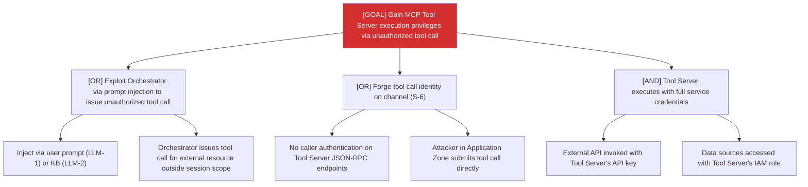

# Attack Tree: E-5 — MCP Tool Server

**Risk Level**: Critical
**Component**: MCP Tool Server
**Threat**: Unauthorized tool calls gain Tool Server execution privileges

```mermaid
graph TD
    Goal["[GOAL] Gain MCP Tool Server execution privileges via unauthorized tool call"]
    Goal --> A["[OR] Exploit Orchestrator via prompt injection to issue unauthorized tool call"]
    A --> A1["Inject via user prompt (LLM-1) or KB (LLM-2)"]
    A --> A2["Orchestrator issues tool call for external resource outside session scope"]
    Goal --> B["[OR] Forge tool call identity on channel (S-6)"]
    B --> B1["No caller authentication on Tool Server JSON-RPC endpoints"]
    B --> B2["Attacker in Application Zone submits tool call directly"]
    Goal --> C["[AND] Tool Server executes with full service credentials"]
    C --> C1["External API invoked with Tool Server's API key"]
    C --> C2["Data sources accessed with Tool Server's IAM role"]
    classDef critical fill:#d32f2f,color:#fff
    class Goal critical
```
