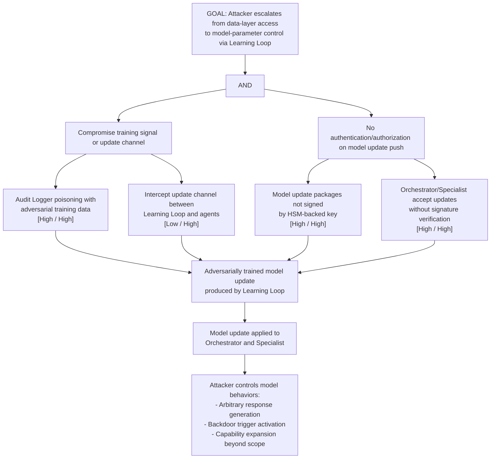

# Attack Tree: E-6 — Learning Loop Model Update Privilege Escalation

**Chain-breaking control**: Authenticate all model update pushes with HSM-backed keys. The Orchestrator and Specialist MUST verify update signatures before applying. Implement staged rollout with A/B testing and behavioral regression checks before production deployment of any model update.
