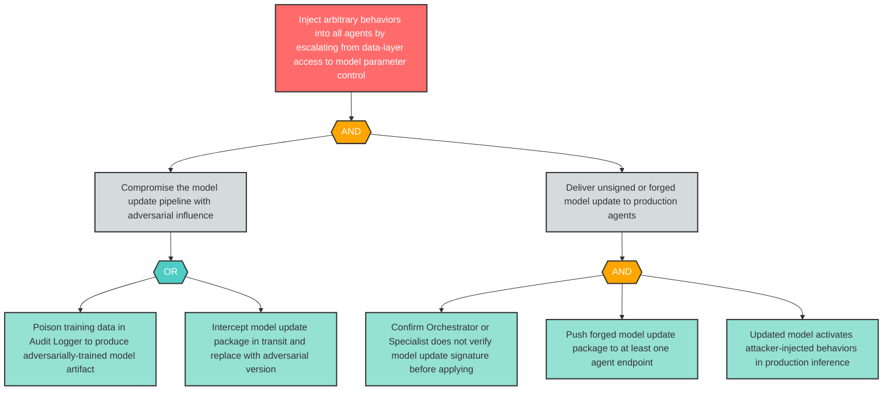

# Attack Tree: E-6 — Compromised Model Update Escalates Attacker to Model Parameter Control

**Finding ID**: E-6
**Risk Level**: Critical
**Component**: Long-Running Learning Loop
**Delta Status**: UNCHANGED

