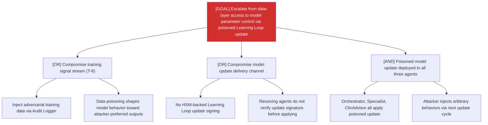

# Attack Tree: E-6 — Long-Running Learning Loop

**Risk Level**: Critical
**Component**: Long-Running Learning Loop
**Threat**: Poisoned model update escalates attacker to model parameter control

```mermaid
graph TD
    Goal["[GOAL] Escalate from data-layer access to model parameter control via poisoned Learning Loop update"]
    Goal --> A["[OR] Compromise training signal stream (T-8)"]
    A --> A1["Inject adversarial training data via Audit Logger"]
    A --> A2["Data poisoning shapes model behavior toward attacker-preferred outputs"]
    Goal --> B["[OR] Compromise model update delivery channel"]
    B --> B1["No HSM-backed Learning Loop update signing"]
    B --> B2["Receiving agents do not verify update signature before applying"]
    Goal --> C["[AND] Poisoned model update deployed to all three agents"]
    C --> C1["Orchestrator, Specialist, ClinAdvisor all apply poisoned update"]
    C --> C2["Attacker injects arbitrary behaviors via next update cycle"]
    classDef critical fill:#d32f2f,color:#fff
    class Goal critical
```
