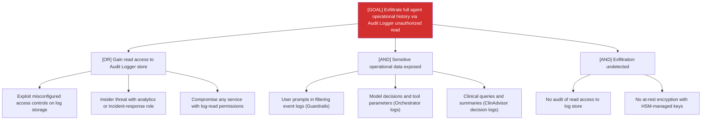

# Attack Tree: I-7 — Audit Logger

**Risk Level**: Critical
**Component**: Audit Logger
**Threat**: Unauthorized read access exposes full operational history

```mermaid
graph TD
    Goal["[GOAL] Exfiltrate full agent operational history via Audit Logger unauthorized read"]
    Goal --> A["[OR] Gain read access to Audit Logger store"]
    A --> A1["Exploit misconfigured access controls on log storage"]
    A --> A2["Insider threat with analytics or incident-response role"]
    A --> A3["Compromise any service with log-read permissions"]
    Goal --> B["[AND] Sensitive operational data exposed"]
    B --> B1["User prompts in filtering event logs (Guardrails)"]
    B --> B2["Model decisions and tool parameters (Orchestrator logs)"]
    B --> B3["Clinical queries and summaries (ClinAdvisor decision logs)"]
    Goal --> C["[AND] Exfiltration undetected"]
    C --> C1["No audit of read access to log store"]
    C --> C2["No at-rest encryption with HSM-managed keys"]
    classDef critical fill:#d32f2f,color:#fff
    class Goal critical
```
