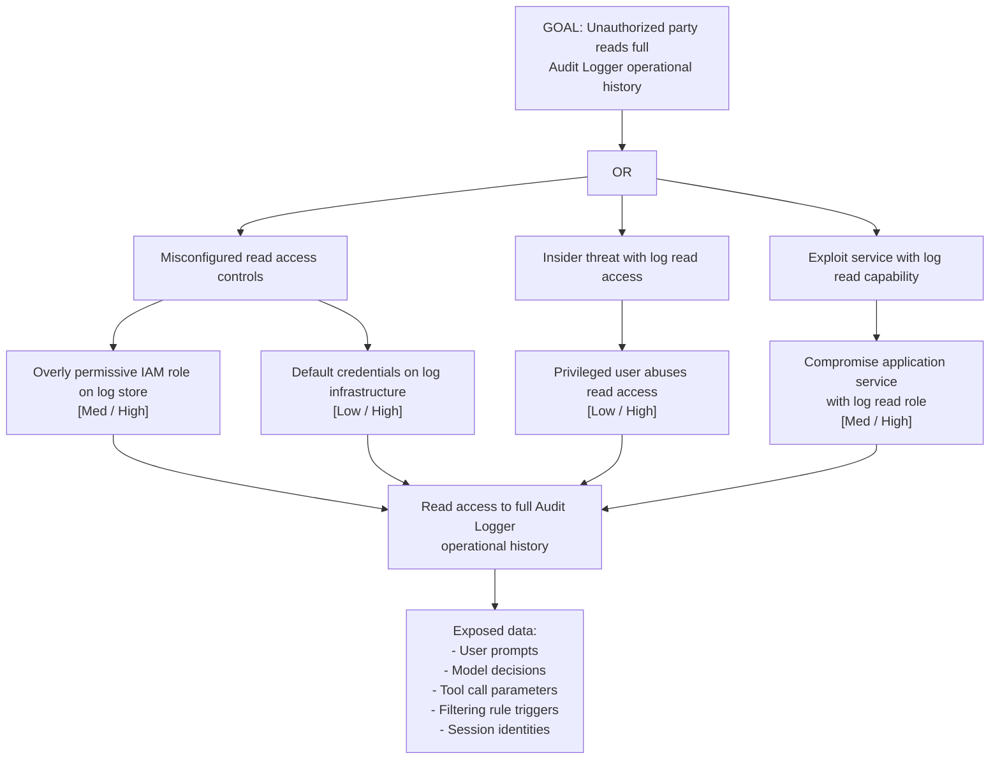

# Attack Tree: I-7 — Audit Logger Unauthorized Read Access

**Chain-breaking control**: Enforce strict read access controls on the Audit Logger: only designated incident-response and analytics service accounts should have read access. Encrypt log entries at rest with envelope encryption (per-batch keys in hardware-secured KMS). Audit all read access.
