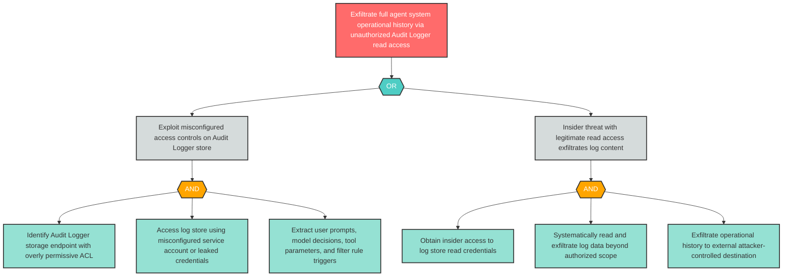

# Attack Tree: I-7 — Unauthorized Read Access to Audit Logger Exposes Full Agent Operational History

**Finding ID**: I-7
**Risk Level**: Critical
**Component**: Audit Logger
**Delta Status**: UNCHANGED

