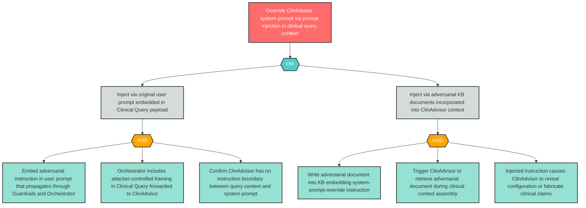

# Attack Tree: LLM-13 — Prompt Injection via Clinical Query Context Overrides ClinAdvisor System Prompt

**Finding ID**: LLM-13
**Risk Level**: Critical
**Component**: Clinical Advisory Sub-Agent
**Delta Status**: UNCHANGED

