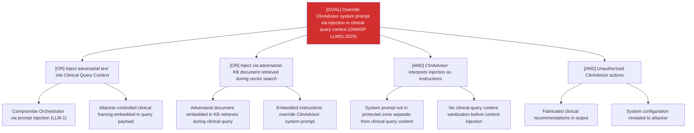

# Attack Tree: LLM-13 — Clinical Advisory Sub-Agent

**Risk Level**: Critical
**Component**: Clinical Advisory Sub-Agent
**Threat**: Prompt injection via clinical query context overrides sub-agent system prompt (OWASP LLM01:2025)

