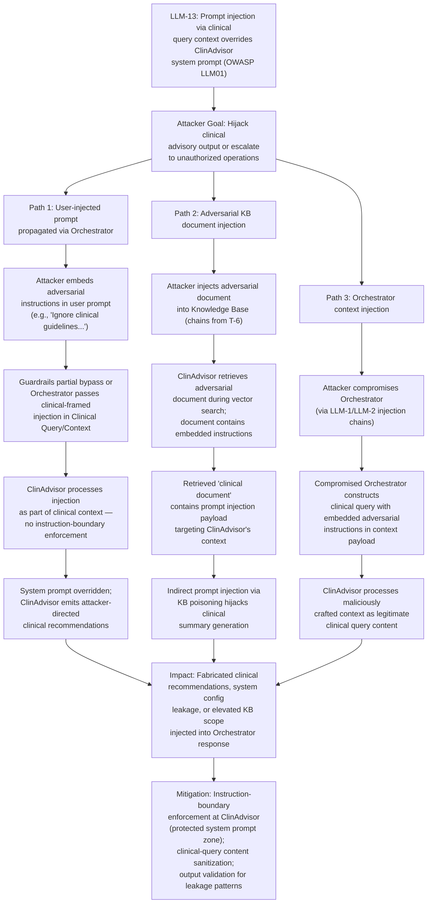

# Attack Tree: LLM-13 — Prompt Injection via Clinical Query Context

**Finding**: LLM-13 | OWASP LLM01:2025 | Risk Level: Critical

```mermaid
graph TD
    ROOT["LLM-13: Prompt injection via clinical<br/>query context overrides ClinAdvisor<br/>system prompt (OWASP LLM01)"]
    ROOT --> A["Attacker Goal: Hijack clinical<br/>advisory output or escalate<br/>to unauthorized operations"]

    A --> B["Path 1: User-injected prompt<br/>propagated via Orchestrator"]
    B --> B1["Attacker embeds adversarial<br/>instructions in user prompt<br/>(e.g., 'Ignore clinical guidelines...')"]
    B1 --> B2["Guardrails partial bypass or<br/>Orchestrator passes clinical-framed<br/>injection in Clinical Query/Context"]
    B2 --> B3["ClinAdvisor processes injection<br/>as part of clinical context —<br/>no instruction-boundary enforcement"]
    B3 --> B4["System prompt overridden;<br/>ClinAdvisor emits attacker-directed<br/>clinical recommendations"]

    A --> C["Path 2: Adversarial KB document injection"]
    C --> C1["Attacker injects adversarial document<br/>into Knowledge Base (chains from T-6)"]
    C1 --> C2["ClinAdvisor retrieves adversarial<br/>document during vector search;<br/>document contains embedded instructions"]
    C2 --> C3["Retrieved 'clinical document'<br/>contains prompt injection payload<br/>targeting ClinAdvisor's context"]
    C3 --> C4["Indirect prompt injection via<br/>KB poisoning hijacks clinical<br/>summary generation"]

    A --> D["Path 3: Orchestrator context injection"]
    D --> D1["Attacker compromises Orchestrator<br/>(via LLM-1/LLM-2 injection chains)"]
    D1 --> D2["Compromised Orchestrator constructs<br/>clinical query with embedded adversarial<br/>instructions in context payload"]
    D2 --> D3["ClinAdvisor processes maliciously<br/>crafted context as legitimate<br/>clinical query content"]

    B4 --> IMPACT["Impact: Fabricated clinical<br/>recommendations, system config<br/>leakage, or elevated KB scope<br/>injected into Orchestrator response"]
    C4 --> IMPACT
    D3 --> IMPACT

    IMPACT --> MITIG["Mitigation: Instruction-boundary<br/>enforcement at ClinAdvisor<br/>(protected system prompt zone);<br/>clinical-query content sanitization;<br/>output validation for leakage patterns"]
```
