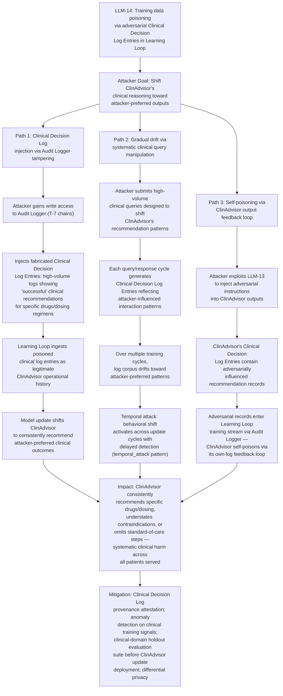

# Attack Tree: LLM-14 — Training Data Poisoning via Clinical Decision Logs

**Finding**: LLM-14 | OWASP LLM03:2025 | Risk Level: Critical

```mermaid
graph TD
    ROOT["LLM-14: Training data poisoning<br/>via adversarial Clinical Decision<br/>Log Entries in Learning Loop"]
    ROOT --> A["Attacker Goal: Shift ClinAdvisor's<br/>clinical reasoning toward<br/>attacker-preferred outputs"]

    A --> B["Path 1: Clinical Decision Log<br/>injection via Audit Logger tampering"]
    B --> B1["Attacker gains write access<br/>to Audit Logger (T-7 chains)"]
    B1 --> B2["Injects fabricated Clinical Decision<br/>Log Entries: high-volume logs showing<br/>'successful' clinical recommendations<br/>for specific drugs/dosing regimens"]
    B2 --> B3["Learning Loop ingests poisoned<br/>clinical log entries as legitimate<br/>ClinAdvisor operational history"]
    B3 --> B4["Model update shifts ClinAdvisor<br/>to consistently recommend<br/>attacker-preferred clinical outcomes"]

    A --> C["Path 2: Gradual drift via<br/>systematic clinical query manipulation"]
    C --> C1["Attacker submits high-volume<br/>clinical queries designed to shift<br/>ClinAdvisor's recommendation patterns"]
    C1 --> C2["Each query/response cycle generates<br/>Clinical Decision Log Entries reflecting<br/>attacker-influenced interaction patterns"]
    C2 --> C3["Over multiple training cycles,<br/>log corpus drifts toward<br/>attacker-preferred patterns"]
    C3 --> C4["Temporal attack: behavioral shift<br/>activates across update cycles with<br/>delayed detection (temporal_attack pattern)"]

    A --> D["Path 3: Self-poisoning via<br/>ClinAdvisor output feedback loop"]
    D --> D1["Attacker exploits LLM-13<br/>to inject adversarial instructions<br/>into ClinAdvisor outputs"]
    D1 --> D2["ClinAdvisor's Clinical Decision<br/>Log Entries contain adversarially<br/>influenced recommendation records"]
    D2 --> D3["Adversarial records enter Learning Loop<br/>training stream via Audit Logger —<br/>ClinAdvisor self-poisons via<br/>its own log feedback loop"]

    B4 --> IMPACT["Impact: ClinAdvisor consistently<br/>recommends specific drugs/dosing,<br/>understates contraindications, or<br/>omits standard-of-care steps —<br/>systematic clinical harm across<br/>all patients served"]
    C4 --> IMPACT
    D3 --> IMPACT

    IMPACT --> MITIG["Mitigation: Clinical Decision Log<br/>provenance attestation; anomaly<br/>detection on clinical training signals;<br/>clinical-domain holdout evaluation<br/>suite before ClinAdvisor update<br/>deployment; differential privacy"]
```
