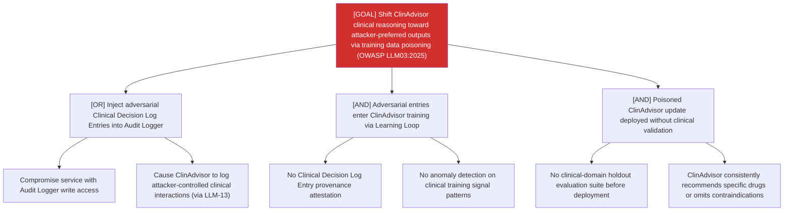

# Attack Tree: LLM-14 — Clinical Advisory Sub-Agent

**Risk Level**: Critical
**Component**: Clinical Advisory Sub-Agent
**Threat**: Training data poisoning via adversarial Clinical Decision Log Entries (OWASP LLM03:2025)

