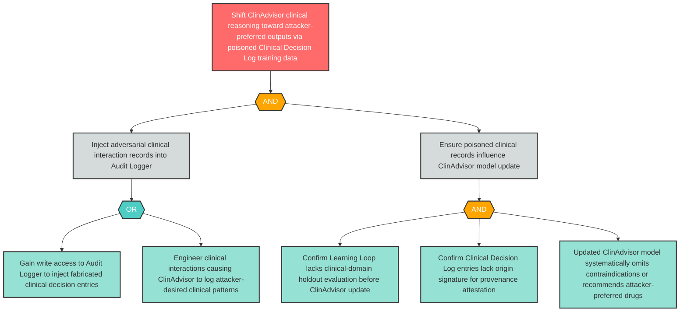

# Attack Tree: LLM-14 — Training Data Poisoning of ClinAdvisor via Adversarial Clinical Decision Log Entries

**Finding ID**: LLM-14
**Risk Level**: Critical
**Component**: Clinical Advisory Sub-Agent
**Delta Status**: UNCHANGED

