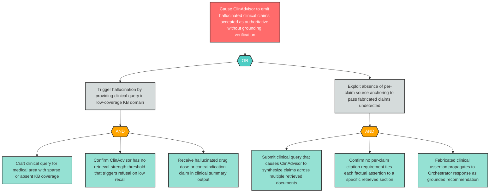

# Attack Tree: MI-1 — Ungrounded Factual Emission: Hallucinated Clinical Claims Without RAG Grounding

**Finding ID**: MI-1
**Risk Level**: Critical
**Component**: Clinical Advisory Sub-Agent
**Delta Status**: UNCHANGED

