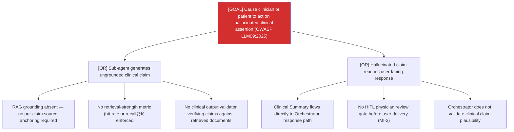

# Attack Tree: MI-1 — Clinical Advisory Sub-Agent

**Risk Level**: Critical
**Component**: Clinical Advisory Sub-Agent
**Threat**: Ungrounded factual emission: hallucinated clinical claims reach clinicians (OWASP LLM09:2025)

