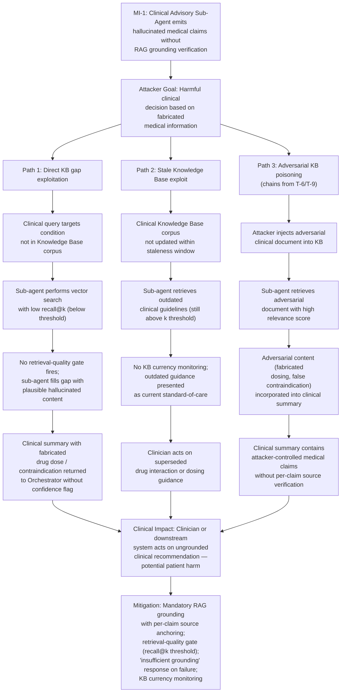

# Attack Tree: MI-1 — Ungrounded Factual Emission (Clinical Advisory Sub-Agent)

**Finding**: MI-1 | OWASP LLM09:2025 | Risk Level: Critical

```mermaid
graph TD
    ROOT["MI-1: Clinical Advisory Sub-Agent emits<br/>hallucinated medical claims without<br/>RAG grounding verification"]
    ROOT --> A["Attacker Goal: Harmful clinical<br/>decision based on fabricated<br/>medical information"]

    A --> B["Path 1: Direct KB gap exploitation"]
    B --> B1["Clinical query targets condition<br/>not in Knowledge Base corpus"]
    B1 --> B2["Sub-agent performs vector search<br/>with low recall@k (below threshold)"]
    B2 --> B3["No retrieval-quality gate fires;<br/>sub-agent fills gap with<br/>plausible hallucinated content"]
    B3 --> B4["Clinical summary with fabricated<br/>drug dose / contraindication returned<br/>to Orchestrator without confidence flag"]

    A --> C["Path 2: Stale Knowledge Base exploit"]
    C --> C1["Clinical Knowledge Base corpus<br/>not updated within staleness window"]
    C1 --> C2["Sub-agent retrieves outdated<br/>clinical guidelines (still above k threshold)"]
    C2 --> C3["No KB currency monitoring;<br/>outdated guidance presented<br/>as current standard-of-care"]
    C3 --> C4["Clinician acts on superseded<br/>drug interaction or dosing guidance"]

    A --> D["Path 3: Adversarial KB poisoning<br/>(chains from T-6/T-9)"]
    D --> D1["Attacker injects adversarial<br/>clinical document into KB"]
    D1 --> D2["Sub-agent retrieves adversarial<br/>document with high relevance score"]
    D2 --> D3["Adversarial content (fabricated<br/>dosing, false contraindication)<br/>incorporated into clinical summary"]
    D3 --> D4["Clinical summary contains<br/>attacker-controlled medical claims<br/>without per-claim source verification"]

    B4 --> IMPACT["Clinical Impact: Clinician or downstream<br/>system acts on ungrounded<br/>clinical recommendation —<br/>potential patient harm"]
    C4 --> IMPACT
    D4 --> IMPACT

    IMPACT --> MITIG["Mitigation: Mandatory RAG grounding<br/>with per-claim source anchoring;<br/>retrieval-quality gate (recall@k threshold);<br/>'insufficient grounding' response on failure;<br/>KB currency monitoring"]
```
