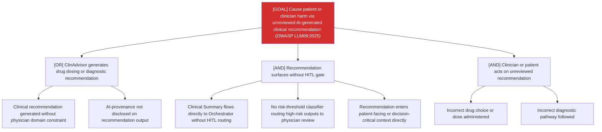

# Attack Tree: MI-2 — Clinical Advisory Sub-Agent

**Risk Level**: Critical
**Component**: Clinical Advisory Sub-Agent
**Threat**: Overreliance/Missing HITL: clinical recommendations surface without physician sign-off (OWASP LLM09:2025)

