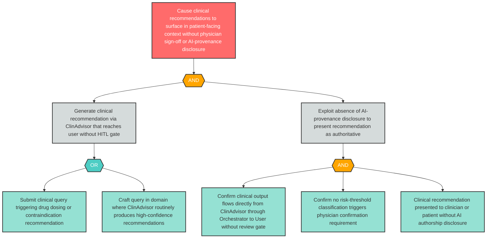

# Attack Tree: MI-2 — Overreliance / Missing HITL Gate on Decision-Critical Clinical Output

**Finding ID**: MI-2
**Risk Level**: Critical
**Component**: Clinical Advisory Sub-Agent
**Delta Status**: UNCHANGED

