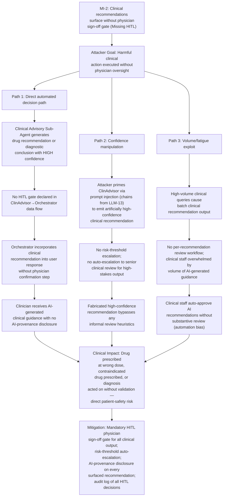

# Attack Tree: MI-2 — Overreliance / Missing HITL (Clinical Advisory Sub-Agent)

**Finding**: MI-2 | OWASP LLM09:2025 | Risk Level: Critical

```mermaid
graph TD
    ROOT["MI-2: Clinical recommendations<br/>surface without physician<br/>sign-off gate (Missing HITL)"]
    ROOT --> A["Attacker Goal: Harmful clinical<br/>action executed without<br/>physician oversight"]

    A --> B["Path 1: Direct automated decision path"]
    B --> B1["Clinical Advisory Sub-Agent generates<br/>drug recommendation or diagnostic<br/>conclusion with HIGH confidence"]
    B1 --> B2["No HITL gate declared in<br/>ClinAdvisor→Orchestrator data flow"]
    B2 --> B3["Orchestrator incorporates clinical<br/>recommendation into user response<br/>without physician confirmation step"]
    B3 --> B4["Clinician receives AI-generated<br/>clinical guidance with no<br/>AI-provenance disclosure"]

    A --> C["Path 2: Confidence manipulation"]
    C --> C1["Attacker primes ClinAdvisor via<br/>prompt injection (chains from LLM-13)<br/>to emit artificially high-confidence<br/>clinical recommendation"]
    C1 --> C2["No risk-threshold escalation;<br/>no auto-escalation to senior<br/>clinical review for high-stakes output"]
    C2 --> C3["Fabricated high-confidence<br/>recommendation bypasses any<br/>informal review heuristics"]

    A --> D["Path 3: Volume/fatigue exploit"]
    D --> D1["High-volume clinical queries cause<br/>batch clinical recommendation output"]
    D1 --> D2["No per-recommendation review workflow;<br/>clinical staff overwhelmed by<br/>volume of AI-generated guidance"]
    D2 --> D3["Clinical staff auto-approve AI<br/>recommendations without<br/>substantive review (automation bias)"]

    B4 --> IMPACT["Clinical Impact: Drug prescribed<br/>at wrong dose, contraindicated<br/>drug prescribed, or diagnosis<br/>acted on without validation —<br/>direct patient-safety risk"]
    C3 --> IMPACT
    D3 --> IMPACT

    IMPACT --> MITIG["Mitigation: Mandatory HITL physician<br/>sign-off gate for all clinical output;<br/>risk-threshold auto-escalation;<br/>AI-provenance disclosure on every<br/>surfaced recommendation;<br/>audit log of all HITL decisions"]
```
