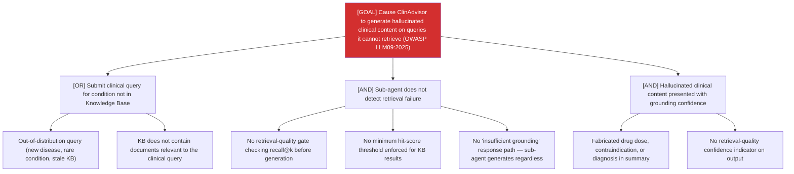

# Attack Tree: MI-3 — Clinical Advisory Sub-Agent

**Risk Level**: Critical
**Component**: Clinical Advisory Sub-Agent
**Threat**: Retrieval-grounding gap causes hallucinated clinical content on out-of-distribution queries (OWASP LLM09:2025)

