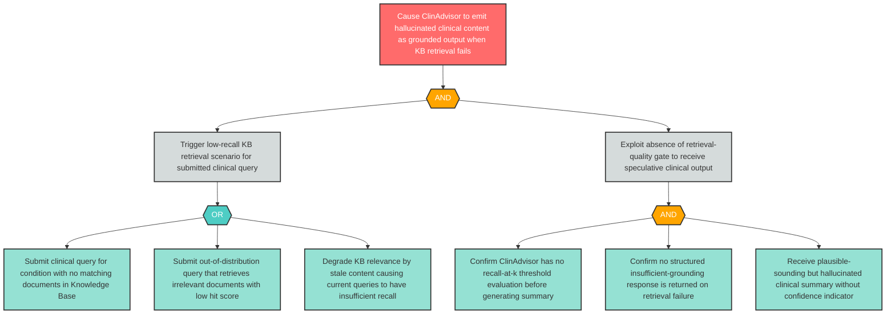

# Attack Tree: MI-3 — Retrieval-Grounding Gap Causes Fabricated Clinical Content on Low-Recall Queries

**Finding ID**: MI-3
**Risk Level**: Critical
**Component**: Clinical Advisory Sub-Agent
**Delta Status**: UNCHANGED

