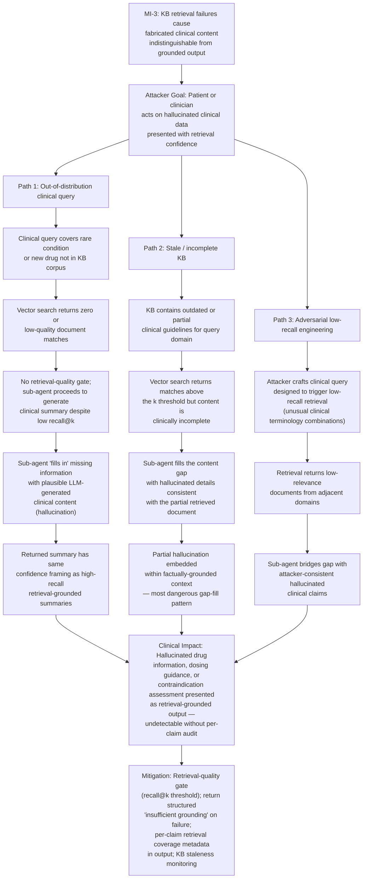

# Attack Tree: MI-3 — Retrieval-Grounding Gap (Clinical Advisory Sub-Agent)

**Finding**: MI-3 | OWASP LLM09:2025 | Risk Level: Critical

```mermaid
graph TD
    ROOT["MI-3: KB retrieval failures cause<br/>fabricated clinical content<br/>indistinguishable from grounded output"]
    ROOT --> A["Attacker Goal: Patient or clinician<br/>acts on hallucinated clinical data<br/>presented with retrieval confidence"]

    A --> B["Path 1: Out-of-distribution clinical query"]
    B --> B1["Clinical query covers rare condition<br/>or new drug not in KB corpus"]
    B1 --> B2["Vector search returns zero or<br/>low-quality document matches"]
    B2 --> B3["No retrieval-quality gate;<br/>sub-agent proceeds to generate<br/>clinical summary despite low recall@k"]
    B3 --> B4["Sub-agent 'fills in' missing information<br/>with plausible LLM-generated<br/>clinical content (hallucination)"]
    B4 --> B5["Returned summary has same<br/>confidence framing as high-recall<br/>retrieval-grounded summaries"]

    A --> C["Path 2: Stale / incomplete KB"]
    C --> C1["KB contains outdated or partial<br/>clinical guidelines for query domain"]
    C1 --> C2["Vector search returns matches above<br/>the k threshold but content is<br/>clinically incomplete"]
    C2 --> C3["Sub-agent fills the content gap<br/>with hallucinated details consistent<br/>with the partial retrieved document"]
    C3 --> C4["Partial hallucination embedded<br/>within factually-grounded context<br/>— most dangerous gap-fill pattern"]

    A --> D["Path 3: Adversarial low-recall engineering"]
    D --> D1["Attacker crafts clinical query<br/>designed to trigger low-recall retrieval<br/>(unusual clinical terminology combinations)"]
    D1 --> D2["Retrieval returns low-relevance<br/>documents from adjacent domains"]
    D2 --> D3["Sub-agent bridges gap with<br/>attacker-consistent hallucinated<br/>clinical claims"]

    B5 --> IMPACT["Clinical Impact: Hallucinated drug<br/>information, dosing guidance, or<br/>contraindication assessment presented<br/>as retrieval-grounded output —<br/>undetectable without per-claim audit"]
    C4 --> IMPACT
    D3 --> IMPACT

    IMPACT --> MITIG["Mitigation: Retrieval-quality gate<br/>(recall@k threshold); return structured<br/>'insufficient grounding' on failure;<br/>per-claim retrieval coverage metadata<br/>in output; KB staleness monitoring"]
```
